# ABX_Guide

## Page 1

AmpPuorericin B CHOLESTERYL SULFATE ComPLEX (ABCD)

involving a total of 79 patients with pneumococcal meningitis treated with either penicillin plus tetracyclines or penicillin monotherapy there was a higher mortality rate (79-85%) in the combination therapy compared to penicillin monotherapy (30-33%). (Arch Intern Med 1951:88:489, Ann Intern Med 1961; 55:545). However there was not a difference in mortality between penicillin monotherapy and penicillin plus tetracycline in the treatment of pneumococcal pneumonia. (Arch Intern Med 1953; 91:197).

PREGNANCY Risk: B-In surveillance study of Michigan Medicaid recipients, 556 newborns were exposed to clavulanate/penicillin during the first trimester; there were no associations between birth defects and clavulanate/penicillin.

Breast FEEDING: No studies with clavulanate.

ComMENTS: Oral betalactam w/ activity against common bacteria that produce beta- lactamases: e.g., H. influenzae, MSSA, Moraxella and all PCN-resistant anaerobes. Diarrhea is common due to both clavulanate & amoxicillin. The IDSA recommends amox/ clay if anaerobes or H. influenzae are suspected [CID 2000; 31:347]. No advantage using Augmentin XR over amox 1g PO tid for intermediately-resistant S. pneumoniae.

FORMS ( DENOTES AVAILABLE GENERICALLY)

Brand name | Preparation | Mfr. | Route | Form Strength Cost (AWP)

Augmentin | Amoxicillin+ | GlaxoSmithK- | PO chew tab 125:31 ; 250:62 | $1.51; $2.88 Clavulanate | line | PO susp 125mg/ $1.51 per Sml; 3] ling pe $2.88 per Sm 5m; 250mg/ 62.5mg per Sml | PO tab 250:125; $3.20; $4.71; 500:125; $6.28 875:125

Augmentin ES | Amoxicillin + | GlaxoSmithKline | PO tab 600mg/42.9mg | $2.68 per SmL Clavulanate | per 5m

Augmentin XR} amoxicillin+ | GlaxoSmithKline | PO tab, ER 1000mg/ $3.01 clavulanate 62.5mg

SELECTED READINGS R Dagan, et al. Bacteriologic and Clinical Efficacy of Amoxicillin/Clavulanate vs Azithromycin in Acute

Otitis Media. Ped Infect Dis J 2000;19:95

A. Freifeld et al. A Double-Blind Comparison of Empiric Oral and Intravenous Antibiotic Therapy for Loss Risk Febrile Patients with Neutropenia During Cancer Chemotherapy. NEJM 1999;341:305

AMPHOTERICIN B CHOLESTERYL SULFATE COMPLEX (ABCD) FDA Inpications

¢ Invasive aspergillosis in patients who are refractory to or intolerant of amphotericin B deoxycholate therapy

Usuat Aoutt Dosine: 3-4mg/kg/day

Dosing Adjustments GFR 50-80 mL/min: Usual 3 GFR 10-50 mL/min: Usual GFR<10 mL/min: Usual Hemodialysis: Not removed in dialysis, no supplement needed post HD. Usual dose. Peritoneal Dialysis: Usual

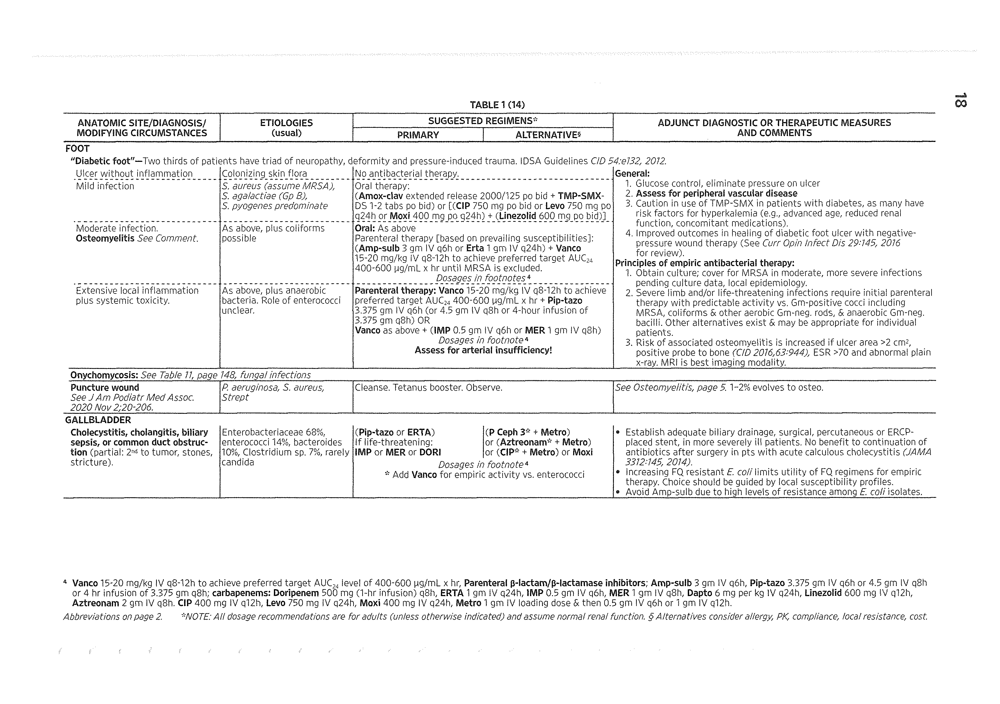

## Page 2

Anti-INFECTIVES

Apverse Druc REACTIONS: Frequent: Fever, chills & rigor (worse than conventional AmB & other lipid ampho formulations); anemia; phlebitis & pain at infusion site. Occasional: Serum creatinine increase; hypokalemia; hypomagnesemia; hypocalcemia; hypotension; wv; metallic taste; h/a.

Dru INTERACTIONS

Digoxin: Potential increase in digitalis toxicity secondary to ampho-induced potassium

depletion. Monitor potassium, supplementation may be needed. Diuretics and steroids: May increase risk of hypokalemia.

PREGNANCY RISK: B- There is limited data on the use of amphotericin B cholesteryl sulfate complex in pregnancy, therefore the use should be limited to patients where the benefit outweighs the risk.

Breast FEEDING: No data available.

Comments: Parenteral lipid amphotericin that is the least expensive of all lipid formulations, but with increased incidence of infusion-related side effects compared to standard amphotericin B and other lipid amphotericin formulations.

Forms

Brand name | Preparation | Mfr. Route | Form Strength Cost (AWP) Amphotec Amphotericin | Intermune \V vial 50mg; 100mg | $93.33; $160 per B cholesteryl vial sulfate com- | plex (ABCD) |

SELECTED READINGS JD Sobel, et al. Practice Guidelines for the Treatment of Fungal Infections. CID 2000; 30:652

White MH, et al. Randomized, double-blind clinical trial of amphotericin B colloidal dispersion vs. amphotericin B in the empirical treatment of fever and neutropenia . Clin Infect Dis 1998 Aug;27 (2):296-802

Bowden R et al. A Double-Blind, Randomized, Controlled Trial of Amphotericin B Colloidal Dispersion versus Amphotericin B for Treatment of Invasive Aspergillosis in Immunocompromised Patients. CID 2002;35:359

AMPHOTERICIN B DEOXYCHOLATE

FDA Inpications

¢ Aspergillosis

¢ Blastomycosis

¢ Disseminated candidiasis

¢ Leishmaniasis

¢ Cryptococcosis

¢ Histoplasmosis

* Cryptococcal meningitis (treatment and suppression)

* Meningitis caused by organisms such as Coccidioides immitis, candida species, Sporothrix schenckii, and aspergillus species.

* Coccidioidomycosis

¢ Disseminated sporotrichosis

Usuat Aoutt Dosine: Systemic fungal infections: 0.5-1.5 mg/kg/d over 2-4 hrs w/ pre and post hydration. Candida esophagitis: 0.3-0.5 mg/kg/day IV. Cryptococcal meningitis: 0.7mg/kg IV qd (+/- 5FC) x 10-14 d followed by fluconazole.

Dosing Adjustments GFR 50-80 mL/min: Usual

12 =

## Page 3

Ampxotericin B uipip compLex (ABLC)

GFR 10-50 mL/min: Usual GFR<10 mL/min: Usual Hemodialysis: Usual dose, no supplement needed post HD. Peritoneal Dialysis: Usual

Apverst Druc REACTIONS: Frequent: Nephrotoxicity; renal tubular acidosis; fever & chills; hypokalemia; anemia; phlebitis (improved with addition of 1000 units heparin to infusion). Occasional: Hypomagnesemia; hypocalcemia; hypotension; n/v (reduce w/ compazine), metallic taste; H/A.

Dru INTERACTIONS

Digoxin: Potential increase in digitalis toxicity secondary to ampho-induced potassium depletion. Diuretics and steroids: May increase risk of hypokalemia. Nephrotoxic agents (Foscarnet, aminoglycosides, IV contrast, etc.): additive nephrotoxicity.

PREGNANCY Risk: B-A Collaborative Perinatal Project identified 9 first-trimester exposures to amphotericin and found no adverse fetal effects. Animal studies demonstrated amphotericin to be harmless in pregnancy.

Breast FEEDING: No data available.

CommeENTS: Parenteral use is complicated by high rate of infusion related reactions, anemia, electrolyte imbalance and renal failure. A switch to the lipid formulation is often not recommended until the creatinine is elevated to an arbitrary threshold (Scr >2.5 used at Hopkins). Infusion related side effects is worst with Amphotec [CID 2002; 35: 359]

Forms (@ DENOTES AVAILABLE GENERICALLY)

Brand name | Preparation | Mfr. Route | Form Strength Cost (AWP)

Amphotericin poe @ Abbott V vial 50mg $11.64 per vial B

SELECTED READINGS

van der Horst CM, Saag MS, Cloud GA, et al. Treatment of cryptococcal meningitis associated with the acquired immunodeficiency syndrome. N Engl J Med 1997 Jul 3;337(1):15-21

Patterson TF, et al. Invasive Aspergillosis: Disease Spectrum, Treatment Practices, and Outcomes. Medicine 2000; 79: 250

JD Sobel, et al. Practice Guidelines for the Treatment of Fungal Infections. CID 2000; 30:652

AMPHOTERICIN B LIPID COMPLEX (ABLC) FDA Inpications

¢ Aspergillosis infections in patients who are refractory to or intolerant of conventional amphotericin B therapy

Usuat Apuit Dosine: 5mg/kg/day

Dosing Adjustments GFR 50-80 mL/min: Usual GFR 10-50 mL/min: Usual GFR<10 mL/min: Usual » Hemodialysis: Not removed in dialysis, no supplement needed post HD. Usual dose. Peritoneal Dialysis: Usual

Apverst Druc REACTIONS: Frequent: Fever & chills; anemia; phlebitis & pain at infusion site. Occasional: Creatinine increase; hypokalemia; hypomagnesemia; hypocalcemia;

13

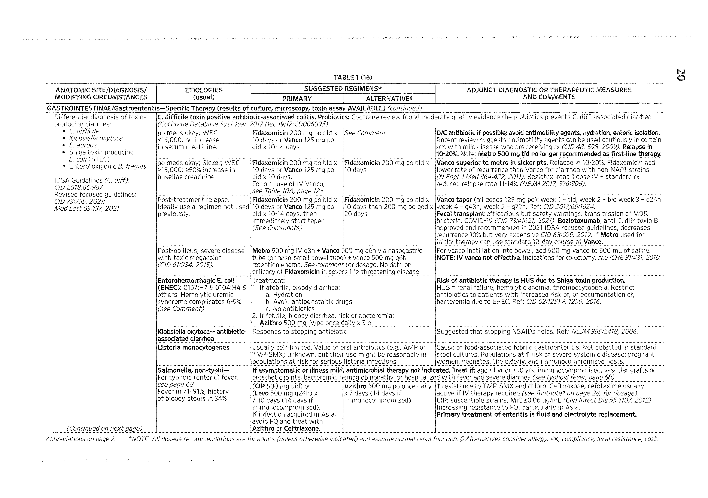

## Page 4

Anti-INFECTIVES

hypotension; nausea, vomiting, metallic taste; headache; increased LFTs; increased bilirubin (1.5x).

Druc INTERACTIONS Digoxin: Potential increase in digitalis toxicity secondary to ampho-induced potassium depletion. Monitor potassium, supplementation may be needed. Diuretics and steroids: May increase risk of hypokalemia.

PREGNANCY Risk: B- There is limited data on the use of Amphotericin B lipid complex in pregnancy therefore the use should be limited to patients where the benefit outweighs the risk.

Breast FEepInG: No data available.

CommeENTS: Abelcet has comparable cost to Amphotec but generally better tolerated with less infusion related reactions. Compared to Ambisome, Abelcet resulted in a higher incidence of nephrotoxicity and infusion related side effects.

Forms

Abelcet Amphotericin | Enzon V vial 5mg/mL $240 per vial B lipid com- plex (ABLC)

SeLecteD READINGS

Sharkey PK, et al. Amphotericin B lipid complex compared with amphotericin B in the treatment of cryptococcal meningitis in patients with AIDS . Clin Infect Dis 1996 Feb;22(2):315-21

JD Sobel. Practice Guidelines for the Treatment of Fungal Infections. CID 2000; 30:652

John R. Wingard et al. A Randomized, Double-Blind Comparative Trial Evaluating the Safety of Liposomal Amphotericin B vs. Amphotericin B Lipid Complex in the Empirical Treatment of Febrile Neutropenia. CID 2000; 31:1155-63

Fleming RV et al. Comparison of ABLC vs. Ambisome in the Treatment of Suspected or Documented Fungal Infection in Patients with Leukemia. Leukemia and Lymphoma 2001; 405: 511

AMPHOTERICIN B LIPOSOMAL

FDA Inpications

¢ Aspergillosis (in patients refractory to or intolerant of amphotericin B deoxycholate)

¢ Candidiasis (in patients refractory to or intolerant of amphotericin B deoxycholate)

¢ Empiric therapy for presumed fungal infection in patients with febrile neutropenia

e Visceral leishmaniasis

Dosing Adjustments GFR 50-80 mL/min: Usual GFR 10-50 mL/min: Usual GFR<10 mL/min: Usual ;

14

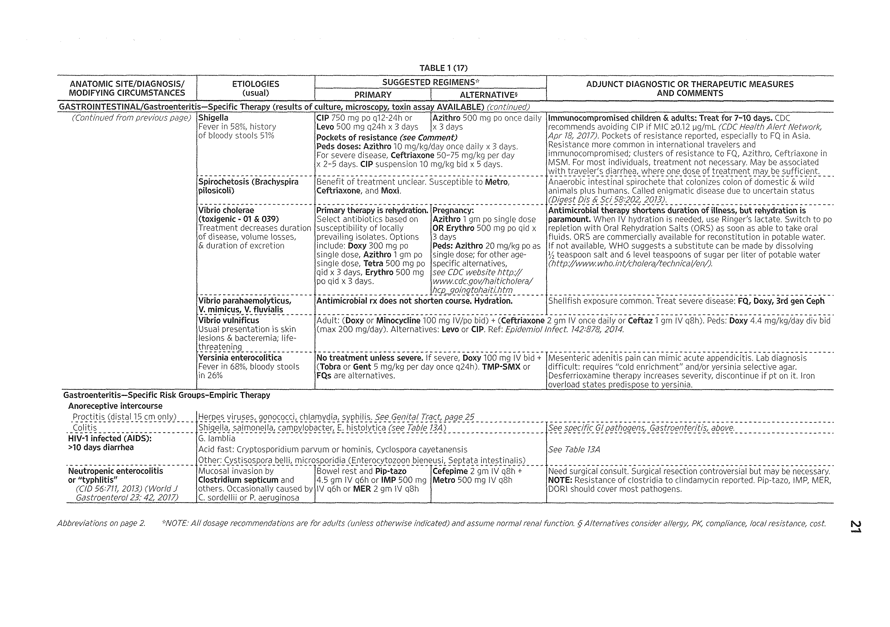

## Page 5

AMPICILLIN

Druc INTERACTIONS Digoxin: Potential increase in digitalis toxicity secondary to ampho-induced potassium depletion. Monitor potassium, supplementation may be needed. Diuretics and steroids: May increase risk of hypokalemia.

PREGNANCY Risk: B- There is limited data on the use of Amphotericin B liposomal complex in pregnancy therefore the use should be limited to patients where the benefit outweighs the risk.

Breast FEEDING: No data available

COMMENTS: The only truly liposomal amphotericin that is also the most expensive of the lipid formulations (but cost will vary between institutions). Compared to Abelcet, Ambisome resulted in less nephrotoxicity and fewer infusion related side effects. No difference in efficacy compared to conventional amphoB, w/ the possible exception of disseminated histo in AIDS pts (Ann Intern Med 2002; 137:105-9).

Forms | Brand name | Preparation | Mfr. Route | Form Strength Cost (AWP) AmBisome Amphotericin | Astellas V vial 50mg $188.40 per vial B liposomal

SELECTED READINGS

Sobel JD, et al. Practice Guidelines for the Treatment of Fungal Infections. Clin Infect Dis. 2000 Apr;30 (4):652

Leenders AC, et al. Liposomal amphotericin B compared with amphotericin B deoxycholate in the treatment of documented and suspected neutropenia-associated invasive fungal infections. Br J” Haematol 1998 Oct;103(1):205-12

Leenders AC, et al. Liposomal amphotericin B (AmBisome) compared with amphotericin B both followed by oral fluconazole in the treatment of AIDS-associated cryptococcal meningitis . AIDS 1997 Oct;11(12):1463-71

Tollemar J, et al. Liposomal amphotericin B prevents invasive fungal infections in liver transplant recipients. A randomized, placebo-controlled study . Transplantation 1995 Jan 15;59(1):45-50

Philip CJ, Wheat LJ, Cloud GA et al. Safety and Efficacy of Liposomal Amphotericin B Compared with Conventional Amphotericin B for Histoplasmosis. Annals of Internal Med. 2002; 137:105

AMPICILLIN FDA Inpications

¢ Diverticulitis (in combination with metronidazole)

¢ Gonorrhea (in combination with probenecid, however currently not recommended due

to high failure rate)

¢ Streptococcal infections (Group A streptococcal pharyngitis, Group B streptococci)

* Otitis media (Haemophilus influenzae due to beta-lactamase negative strains)

¢ Enteric infections (Proteus mirabilis infections, salmonellosis, shigellosis)

¢ Urinary tract infections

¢ Bacterial vaginosis

Usuat Aputt Dosine: 250-500mg PO qid; 1-2¢ IV q4-6h

Dosing Adjustments GFR 50-80 mL/min: Usual dose GFR 10-50 mL/min: 1g-2g IV q8h; no dose adjustment needed for oral administration GFR<10 mL/min: 1g-2g IV q12h; no dose adjustment needed for oral administration. Hemodialysis: 1g-2g TV q12h. On HD days, give post HD.

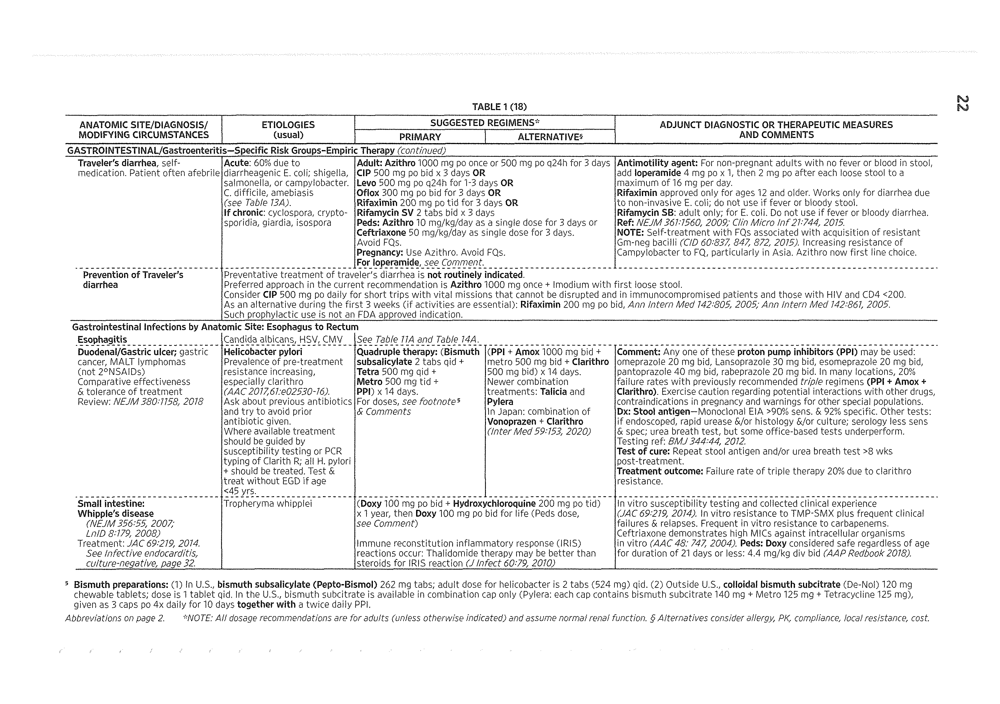

## Page 6

Anti-INFECTIVES

Peritoneal Dialysis: 250mg q12h

Apverst Druc REACTIONS: Frequent: GI intolerance & diarrhea (more common than amox) incl. C. difficile; hypersensitivity mms; maculopapular rash esp w/ primary EBV (not urticarial). Rare: Drug fever; Coombs' test +, hemolytic anemia; Jarisch-Herxheimer rxn w/ spirochetal dz.

Druc INTERACTIONS Allopurinol: Incidence of skin rash increased to 14-22% when the two are co-administered compared to 6-8% with ampicillin when administered alone or 2% when allopurinol is administered alone. Use alternative therapy if possible, if not beware of the increased incidence of rash when ampicillin and allopurinolare co-administered. Tetracyclines: In vitro antagonism when co-administered. Bactericidal effect of penicillins may be diminished in vivo. Avoid concurrent administration. In two studies involving a total of 79 patients with pneumococcal meningitis treated with either penicillin plus tetracyclines or penicillin monotherapy there was a higher mortality rate (79-85%) in the combination therapy compared to penicillin monotherapy (30-83%). (Arch Intern Med 1951:88:489, Ann Intern Med 1961; 55:545). However there was not a difference in mortality between penicillin monotherapy and penicillin plus tetracycline in the treatment of pneumococcal pneumonia. (Arch Intern Med 1953; 91:197).

PREGNANCY Risk: B-Several collaborative perinatal project reports involving over 12,000 exposures to penicillin derivatives during the first trimester indicated no association between penicillin derivative drugs and birth defects.

Breast FEEDING: Excreted in breast milk at low concentrations.

Comments: Oral and parenteral betalactam. Due to inferior absorption of ampicillin, amoxicillin has replaced oral ampicillin for all infections except shigellosis. IV ampicillin is the drug of choice for infections involving ampicillin sensitive enterococci.

Forms (@ DENOTES AVAILABLE GENERICALLY)

Brand name | Preparation | Mfr. Route | Form Strength Cost (AWP)

Ampicillin ampicillin Sandoz \V vial 2g $20.10

' [PO | cop | 250mg; 500mg | $0.23; $0.40

Ampicillin ampicillin  Stada PO susp 125mg/5ml; | $0.25 per 5mL; | 250mg/5mL $0.35 per 5mL

SeLecTED READINGS Bennish ML; Salam MA; Haider R; Barza M . Therapy for shigellosis. II. Randomized, double-blind comparison of ciprofloxacin and ampicillin. J Infect Dis 1990 Sep;162(3):711-6

AMPICILLIN + SULBACTAM

FDA Inpications

¢ Gynecologic infections

¢ Intra-abdominal infections

¢ Skin and soft tissue infections

Usuat Aoutt DosinG: Mild to moderate infections: 1.5g (1g ampicillin/0.5g sulbactam) IV q6h. Moderate to severe infections: 3g (2g ampicillin/1g sulbactam) IV q6h

Dosing Adjustments GFR 50-80 mL/min: 1g-2g q8h GFR 10-50 mL/min: 1g-2g q8h GFR<10 mL/min: 1g-2g ql2h Hemodialysis: 1g q12h with 2g ampicillin post dialysis. Peritoneal Dialysis: Usual regimen

16

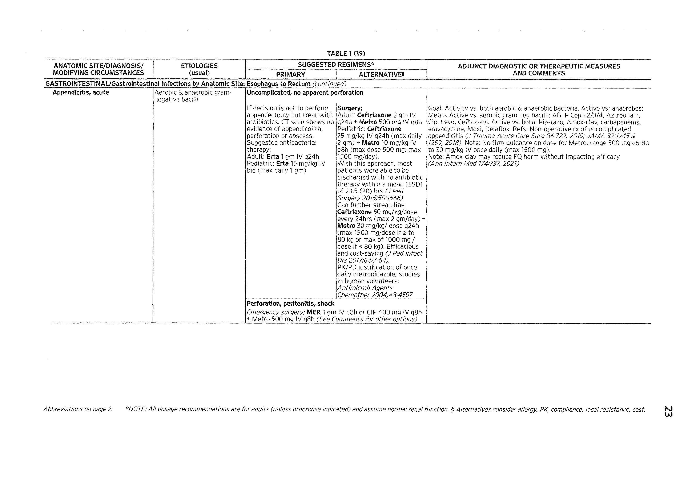

## Page 7

Amprenavir (APV)

Apverse Druc REACTIONS: Occasional: Hypersensitivity reaction, maculopapular rash (not urticarial); GI intolerance; phlebitis at infusion sites and sterile abscesses at IM sites. Rare: Drug fever; Coomb's test positive; Jarisch-Herxheimer reaction.

Dru INTERACTIONS Allopurinol: Incidence of skin rash increased to 14-22% when the two are co-administered compared to 6-8% with ampicillin when administered alone or 2% when allopurinol is administered alone. Use alternative therapy if possible, if not beware of the increased incidence of rash when ampicillin and allopurinolare co-administered. Tetracyclines: In vitro antagonism when co-administered. Bactericidal effect of penicillins may be diminished in vivo. Avoid concurrent administration. In two studies involving a total of 79 patients with pneumococcal meningitis treated with either penicillin plus tetracyclines or penicillin monotherapy there was a higher mortality rate (79-85%) in the combination therapy compared to penicillin monotherapy (30-83%). (Arch Intern Med 1951:88:489, Ann Intern Med 1961; 55:545). However there was not a difference in mortality between penicillin monotherapy and penicillin plus tetracycline in the treatment of pneumococcal pneumonia. (Arch Intern Med 1953; 91:197).

PREGNANCY Risk: B-Several collaborative perinatal project reports involving over 12,000 exposures to penicillin derivatives during the first trimester indicated no association between penicillin derivative drugs and birth defects. The safety of sulbactam has not been evaluated in humans. There was no adverse effect reported in animal data.

Breast FEEDING: Excreted in breast milk at low concentrations.

ComMENTS: Parenteral betalactam/betalactamase inhibitor. Sulbactam increases the activity of ampicillin, but inducible chromosomal B-lactamases produced by Citrobacter, Enterobacter, Proteus, Pseudomonas, & Serratia are not generally inhibited by sulbactam. Active vs. H. influenzae, MSSA, most anaerobes and many GNB. Sulbactam is active against most strains of Acinetobacter. Contains Na+ 5 Meq/1.5 g

Forms (@ DENOTES AVAILABLE GENERICALLY)

Brand name | Preparation | Mfr. Route | Form Strength Cost (AWP)

Unasyn Ampicillin+ | Pfizer V vial 1g:0.5g; 2g:1g | $9.50; $16.86 Sulbactam

SELECTED READINGS

Talan DA, et al. Ampicillin/Sulbactam and Cefoxitin in the Treatment of Cutaneous and Other Soft- Tissue Abscesses in patients With or Without Histories of Injection Drug Abuse . CID 2000;31:464

AMPRENAVIR (APY) FDA Inpications

¢ HIV infection (in combination with other antiretrovirals)

Usuat Aputt Dosinc: Amprenavir liquid (only form available in US) APV 1200mg PO bid; liquid APV 1400mg PO BID. Combination dosing: APV 1200mg qd w/ RTV 200mg qd. APV 600mg bid + RTV 100mg bid + EFV 600mg qhs. LPV-r 533/100mg bid + APV 750mg bid.

Dosing Adjustments GFR 50-80 mL/min: Usual dose GFR 10-50 mL/min: Usual dose likely GFR<10 mL/min: Usual dose likely. Avoid liquid formulation. - Hemodialysis: No data, usual dose likely Peritoneal Dialysis: No data, usual dose likely | Hepatic Function: Some recommend 450mg bid with liver disease and 300mg bid with severe cirrhosis based on PK data but this has not been evaluated in clinical trials

17

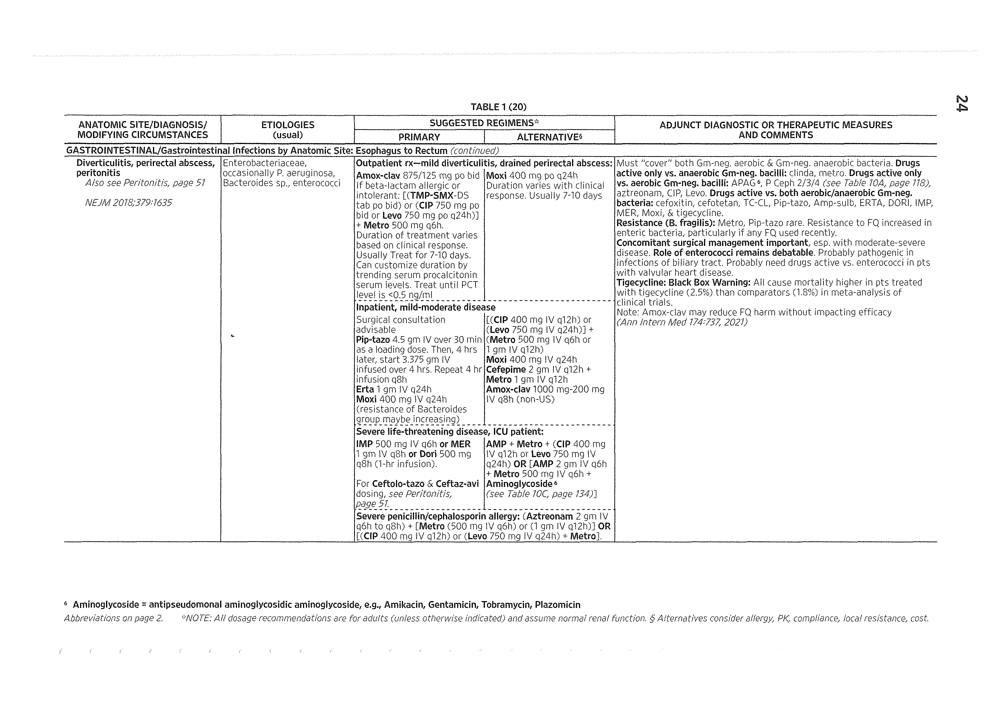

## Page 8

Anti-INFECTIVES

Apverse Druc REACTIONS: GI intolerance most common (N/V/D); oral paresthesias; headache; rash (11%); lipodystrophy syndrome; hyperglycemia; increased triglycerides and/or cholesterol; transaminase elevation. TOXICITY FROM PROPYLENE GLYCOL IN THE ORAL SOLUTION.

Druc INTERACTIONS

Substrate, inhibitor, and likely inducer of CYP3A4. CYP3A4 inhibitors may increase APV serum levels. CYP3A4 inducers may decrease APV serum levels. APV may increase or decrease serum levels of CYP3A4 substrates. Contraindicated with: terfenadine, astemizole, cisapride, ergot alkaloid, rifampin,

bepridil, pimozide, flecainide, propafanone, St. Johns Wort, midazolam and triazolam.

PREGNANCY Risk: C-Placental passage unknown. Rat studies using half the human dose, resulted in thymic elongation and incomplete ossification of bones. Rabbit studies using one-twentieth of human therapeutic doses were associated with abortions and skeletal abnormalities. }

Breast FEEDING: No human data, breast milk excretion in animal studies. Breast feeding is not recommended in the U.S. in order to avoid post-natal transmission of HIV to the child, who may not yet be infected.

Comments: Avoid long term use of APV oral solution due to propylene glycol content. Fosamprenavir is the preferred formulation due to lower pill burden and better bioavailability.

Forms

Brand name | Preparation | Mfr. Route | Form Strength | Cost (AWP)

Agenerase Amprenavir | GlaxoSmithKline | PO cap 50mg $0.54 PO sol 15mg/mL $0.80 per 5mL

ATAZANAVIR (ATV)

FDA Inpications

¢ Indicated for the treatment of HIV-1 infection in combination with other antiretroviral

agents.

Usuat Aputt Dosinc: ATV 400mg qd w/ food (FDA-approved dose--use in PI-naive pts only) ATV300mg/RTV100mg qd w/ food (author's preferred dose, especially for Pl-experienced patients). When co-administered with EFV 600mg qhs dose ATV300mg/RTV 100mg qd.

Dosing Adjustments GFR 50-80 mL/min: No data. Usual dose likely. GFR 10-50 mL/min: No data. Usual dose likely. GFR<10 mL/min: No data. Usual dose likely. Hemodialysis: No data. Usual dose likely.

| Hepatic Function: ATV AUC increased by 45% w/ mild to mod hepatic insuf. Consider decrease. ATV to 300mg/day in those subjects (but no clinical data), No human data.

Apverse Druc REACTIONS: Common: Reversible benign hyperbilirubinemia (grade 3-4 occurring in 35-47% of patients), jaundice, and scleral icterus. Occasional: Nausea, vomiting, abdominal pain, lipodystrophy, rash, h/a, and mild transaminase elevation (unrelated to UGT 1A1 inhibition).

Druc INTERACTIONS Substrate and inhibitor of CYP3A4. Weak inhibitor of CYP1A2 and CYP2C9 in vitro but clinical significance unknown. Inhibitor of phase II conjugation (UGTIA1). CYP3A4 inhibitors may increase ATV levels, CYP8A4 inducers may decrease ATV levels. ATV may increase levels of CYP3A4 substrates.

18

## Page 9

ATOVAQUONE

Contraindicated with: rifampin, irinotecan, ergot Alkaloid, cisapride, St. Johns wort, midazolam, triazolam, bepridil, pimozide, simvastatin, lovastatin, indinavir, and all proton pump-inhibitors.

PREGNANCY Risk: B No human data. In animal studies, ATV did not result in embryonic or fetal toxicity when given maternally toxic doses.

Breast FEEDING: No data

CoMMENTS: The benefit in terms of lipid profile is consistently shown. This may offer a distinct advantage to patients with established CV disease risks, high lipid levels at baseline or high levels post-therapy with other PIs. Benign increase in indirect bilirubin may be bothersome to some pts.

Forms

Brand name | Preparation | Mfr. Route | Form Strength Cost (AWP)

Reyataz Atazanavir | Bristol-Myers PO cap 200mg; 100mg; | $14.29: $14.29; Squibb 150mg $14.29

SELECTED READINGS

Murphy R, Pokrovsky V, Rozenbaum W, et al. Long-term efficacy and safety of atazanavir with stavudine and lamivudine in patients previously treated with nelfinavir or ATV: 180 weeks results of BMS study 008/044. 10th CROI, Boston, 2/03, Abstract 555

Squires K, Thiry A, Giordano M. Atazanavir (ATV) qd and efavirenz (EFV) qd with fixed dose ZDV- 3TC. 42nd ICAAG, San Diego, 2002, Abstract H1076

ATOVAQUONE FDA Inpications

¢ Prevention of Pneumocystis jiroveci pneumonia (patients intolerant to TMP-SMX)

¢ Treatment of mild-to-moderate Pneumocystis jiroveci pneumonia.

¢ Prevention and treatment of malaria due to Plasmodium falciparum (including chloroquine-resistant strains) in adults and pediatric patients weighing 5-11 kg (in combination with proguanil [Malarone]) .

Usuat Aputt Dosinc: PCP prophylaxis 750mg PO bid or 1500mg PO qd with food. P. falciparum treatment: Malarone 4 tabs/d (1000mg/400mg) x 3 d with food. Malaria prophylaxis: Malarone 1 tab (250mg/100 mg) qd with food ( 1-2d before and ending lwk after travel).

Dosing Adjustments GFR 50-80 mL/min: Usual dose GFR 10-50 mL/min: Usual dose GFR<10 mL/min: Usual dose Hemodialysis: Usual dose Peritoneal Dialysis: Usual dose *

Apverst Druc REACTIONS: Common: Rash; GI intolerance (diarrhea), Rare; Stevens-Johnson syndrome was reported with malarone (CID 2003;37:E5-7)

Druc INTERACTIONS Metoclopromide: may decrease atovaquone levels. Rifampin and rifabutin: May decrease atovaquone serum level. Avoid co-administration. Tetracyline: decreases atovaquone by 40%. Avoid co-administration.

PREGNANCY Risk: C-Not teratogenic in animal studies; no studies in humans.

Breast FeepInc: No human data, breast milk excretion in animal studies.

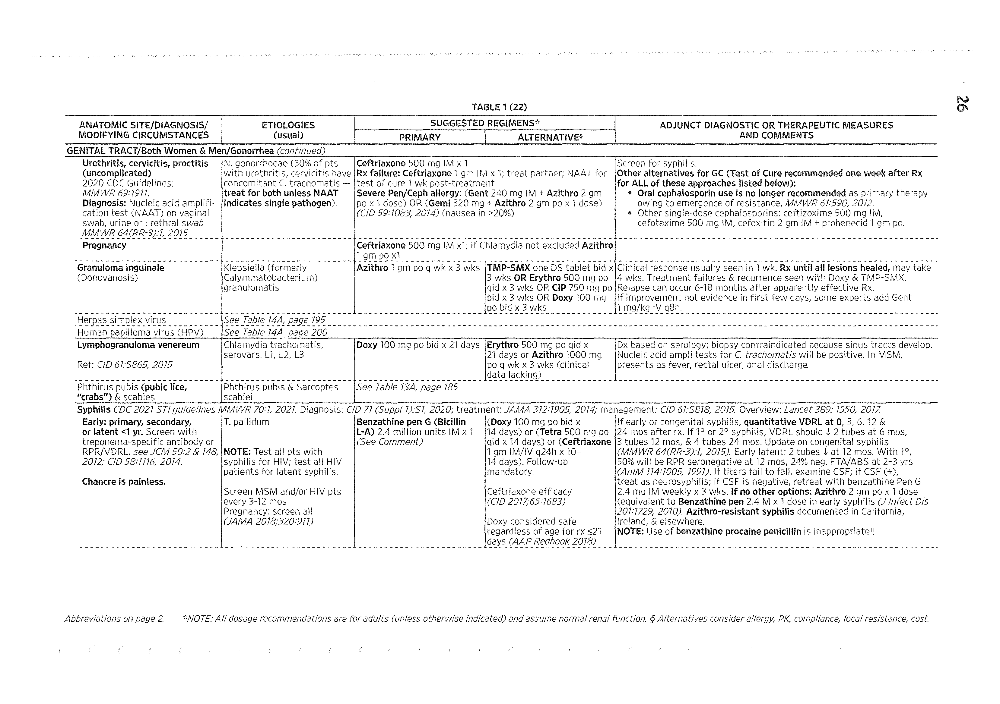

## Page 10

Anti-INFECTIVES

Comments: High cost and GI distress make dapsone a better second line agent for PCP prophylaxis. Weekly mefloquine is more convenient, less expensive yet equivalent to daily atovaquone/proguanil for malaria prophylaxis. FDA approved for treatment of mild-to- moderately severe PCP, but generally not recommended since it is inferior to TMP/SMX. Must be taken with food for absorption.

Forms

Brand name | Preparation | Mfr. Route | Form | Strength Cost (AWP) Mepron Atovaquone | GlaxoSmithKline | PO susp | 750mg/SmL $18.54 per 5mL

Malarone Atovaquone/ | GlaxoSmithKline | PO tab 62.5mg/125mg;| $2; $5 Chloro- 250mg/100mg quanide

SELECTED READINGS Krause PJ, et: al. Atovaquone and Azithromycin for the Treatment of Babesiosis. NEJM 2000;343:1454

Hughes W, Leoung G, Kramer F, Comparison of atovaquone (566C80) with trimethoprim- sulfamethoxazole to treat Pneumocystis carinii pneumonia in patients with AIDS . NEJM 1993; 329(16):

1207

Chirgwin K et al. Randomized Phase II Trial of Atovaquone with Pyrimethamine or Sulfadiazine for Treatment of Toxoplasmic Encephalitis in Patients with Acquired Immunodeficiency Syndrome: ACTG 237/ANRS 039 Study. Clin Infect Dis 2002;34:1243

ATOVAQUONE + PROGUANIL

FDA INpications

e P. falciparum malaria prophylaxis and treatment

Usuat Aout Dosinc: Treatment of acute malaria: atovaquone 1000mg/proguanil 400mg (4 tabs, single dose) qd x 3 d. Prevention of malaria: atovaquone 250mg/proguanil 100mg (1 tab) qd beginning 1-2d before travel and continuing for 1 wk after leaving endemic area.

Dosing Adjustments GFR 50-80 mL/min: Usual dose GFR<10 mL/min: No data: may need to be decreased. Hemodialysis: No data: unlikely to be removed. Peritoneal Dialysis: No data: unlikely to be removed.

| Hepatic Function: No data: may need to be decreased with severe hepatic dysfunction.

Apverse Druc REACTIONS: Malarone side effect profile comparable to the placebo in studies. Abdominal pain, n/v/d, headache, asthenia, anorexia & dizziness can occur with treatment doses. Reversible elevation LFTs. Stevens-Johnson syndrome reported [CID 2003;37;E5].

Dru INTERACTIONS Atovaquone: Tetracycline (decreased atovaquone by 40%). Metoclopramide: Decreased atovaquone level. Proguanil component: No significant interactions noted. Rifampin: Decreased atovaquone by 50%; rifabutin decreases atovaquopne by 34%.

PREGNANCY Risk: C- atovaquone not teratogenic in rat studies. Maternal and fetal toxicities (decreased fetal weight, early fetal resorption and post-implantation fetal loss) reported in rabbits. No human data. Proguanil: not teratogenic in rat studies. In a study of 200 pregnant Nigerian women in the first two trimesters, proguanil 100mg/day resulted in reduction of parasitemia from 35% to 2%, reduction of anemia from 18% to 3% and increases in mean birth weights by 132g. [Lancet 1990; 335(8680):45].

Breast FEEDING: No data

20

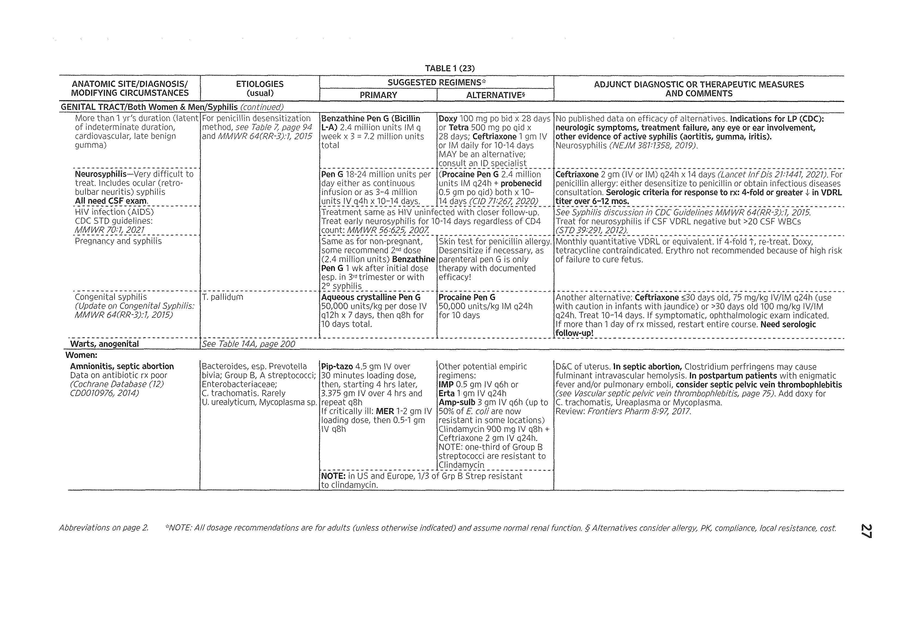

## Page 11

AZITHROMYCIN

ComMENTS: Malarone offers a well-tolerated alternative to mefloquine for the treatment and prevention of chloroquine-resistant P. falciparum. Disadvantages of Malarone include a higher price and the need for daily administration.

Forms

Brand name | Preparation | Mfr. Route | Form Strength | Cost (AWP) Malarone atovaquone/ | Glaxo Wellcome | PO tab 62.5mg/25mg; | $1.83; $4.94 proguanil | zi 250mg/100mg_|

Sevectep READINGS

Camus D, Djossou F, Schilthuis HJ et al. Atovaquone-proguanil versus chloroquine-proguanil for malaria prophylaxis in nonimmune pediatric travelers: results of an international, randomized, open-label

study. Clin Infect Dis. 2004;38:1716-23

Borrmann §, Faucher JF, Bagaphou T et al. Atovaquone and proguanil versus amodiaquine for the treatment of Plasmodium falciparum malaria in African infants and young children. Clin Infect Dis. 2003;37:1441-7

Schlagenhauf P, Tschopp A, Johnson R, et al. Tolerability of malaria chemoprophylaxis in non-immune

travellers to sub-Saharan Africa: multicentre, randomised, double blind, four arm study. BMJ, 2003;327 (7423):1078,

Petersen E. The safety of atovaquone/proguanil in long-term malaria prophylaxis of nonimmune

adults. J Travel Med. 2003;10 Suppl 1:S13-5; discussion $21

van Vugt M, Leonardi E, Phaipun L et al. Treatment of uncomplicated multidrug-resistant falciparum malaria with artesunate-atovaquone-proguanil . Clin Infect Dis. 2002;35:1498-1504

AZITHROMYCIN FDA Inpications

¢ Acute bacterial exacerbations of chronic obstructive pulmonary disease (ZPAK and

TRI-PAK).

¢ Pharyngitis/tonsillitis

¢ Uncomplicated Skin and skin structure infections

¢ Urethritis and cervicitis (GC and non-GC)

¢ Genital ulcer disease caused by H. ducreyi

¢ Community-acquired pneumonia

¢ Treatment and prophylaxis of disseminated M. avium infection (treatment requires co-

administration with ethambutol)

¢ Acute otitis media

* PID (due to C. trachomatis)

Usuat Aputt Dosinc: CAP: 500mg/d, then 250mg qd PO x 4d (ZPAK); 500mg IV qd. AECB: 500mg PO x 3d (TRI-PAK, only indication FDA approved). MAC prophylaxis: 1200mg PO q aa MAC Rx: 600mg PO qd + ethambutol 15mg/kg/d. Non-GC urethritis/cervicitis: 1g PO xh

Dosing Adjustments GFR 50-80 mL/min: Usual dose GFR 10-50 mL/nin: No data, but usual dose likely due to high biliary excretion. GFR<10 mL/min: No data, but usual dose likely due to high biliary excretion. Hemodialysis: No data, usual dose likely. Peritoneal Dialysis: Usual regimen

| Hepatic Function: No dose adjustment [Mazzei. JAC 1993; 31(Suppl E): 57]

21

## Page 12

Anti-INrectives

Apverse Druc REACTIONS: Occasional: GI intolerance (in 4% of patients, but better tolerated than erythromycin); diarrhea, nausea, abdominal pain; vaginitis; reversible hearing loss in 5% of pts with mean exposure of 59g.

Druc INTERACTIONS Cyclosporin: Azithromycin may (in one case report) interfere with the metabolism of cyclosporin therefore increasing the level of cyclosporin. Increase in cyclosporin level may increase risk nephrotoxicity and neurotoxicity. With concurrent administration, close monitoring of cyclosporin level is indicated with dose adjustment when needed. Azithromycin did not affect cyclosporin levels in a report involving 6 patients. (Nephron 1996:73:724). Pimozide: Possible increased in pimozide concentration, which may result in QT prolongation and cardiac arrhythmia. Contraindicated by manufacturer. Do not co- administer.

PREGNANCY Risk: B - animal studies show no harm to the fetus. No human data available

Breast FeepING: Accumulates in breast milk. The American Academy of Pediatrics considers erythromycin compatible with breast feeding.

ComMeENTs: An oral and parenteral macrolide with convenient once daily dosing (half-life of 68 hrs). Expanded spectrum includes improved activity against H. influenzae compared to erythromycin. In contrast to other macrolides, azithromycin is not likely to interact with drugs metabolized by CYP3A4.

Forms

SeLecteD READINGS Stamm WE, Hicks CB, Martin DH, et al. Azithromycin for empirical treatment of the nongonococcal

urethritis syndrome in men. A randomized double-blind study . JAMA 1995 Aug 16;274(7):545-9

Martin DH, Sargent SJ, Wendel GD Jr, et al. Comparison of azithromycin and ceftriaxone for the treatment of chancroid. Clin Infect Dis. 1995 Aug;21(2):409-14

Luft BJ; Dattwyler RJ; Johnson RC, et al. Azithromycin compared with amoxicillin in the treatment of erythema migrans. A double-blind, randomized, controlled trial. Ann Intern Med. 1996 May 1;124 (9):785-91

Kinasewitz G, Wood RG, et al. Azithromycin versus cefaclor in the treatment of acute bacterial pneumonia . Eur J Clin Microbiol Infect Dis 1991 Oct;10(10):872-7

Hoepelman IM; Mollers MJ; van Schie MH, et al. A short (3-day) course of azithromycin tablets versus a 10-day course of amoxycillin-clavulanic acid (co-amoxiclav) in the treatment of adults with lower respiratory tract infections. Int J Antimicrob Agents 1997 Jan;9(3):141-6

AZTREONAM \~—

FDA INpications

¢ Gram-negative bacterial pneumonia

¢ Skin and soft tissue infections

22

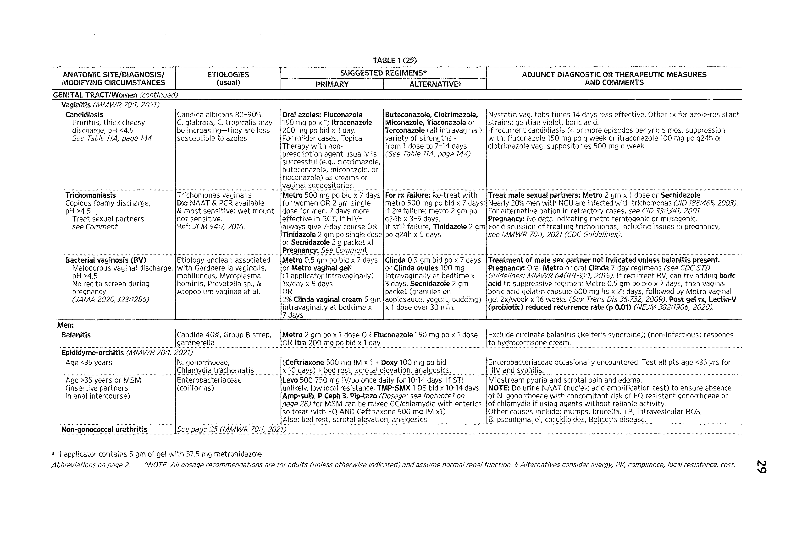

## Page 13

BACITRACIN

¢ Complicated and uncomplicated urinary tract infections

¢ Intra-abdominal infections (in combination with clindamycin)

¢ Septicemia

¢ Gynecologic infections

Usuat Anutt Dosinc: Gram-negative infections: 1-2g IV q8h. UTI: 0.5-1g IV q12h-q8h. Serious infections and meningitis: 2.0g IV q8-6h.

Dosing Adjustments GFR 50-80 mL/min: 1g-2g q8-12h GFR 10-50 mL/min: 1g-2g q12-18h GFR<10 mL/min: 1g-2g q24h. Hemodialysis: 250mg post-dialysis Peritoneal Dialysis: 1-2g loading dose, then 250-500mg q8h. May be given

intraperitoneal: loading dose of 1g, then 250mg per liter exchange. | Hepatic Function: Some recommend dose reduction of 20-25%

Apverst Druc REACTIONS: Frequent: LFTs elevation; transient eosinophilia (can be used in PCN allergic patients). Occasional: Phlebitis at infusion site; rash; diarrhea; nausea

Dru InTeRACTIONS No significant interactions noted.

PREGNANCY RISK: B-animal studies show no harm to the fetus. No human data available.

Breast Feevinc: Excreted in breast milk at low concentration. The American Academy of Pediatrics considers aztreonam to be compatible with breast feeding.

COMMENTS: A parenteral monobactam for infections caused by gram-negative bacteria that can be used in penicillin-allergic patients. Isolated cross-reactivity described in ceftazidime-allergic patients. Spectrum of activity includes Pseudomonas but no reliable activity against gram-positive bacteria or anaerobes.

Forms | Brand name | Preparation | Mfr. | Route | Form | Strength | Cost (AWP) Azoctam Aztreonam | Elan Vv vial 500mg; $12.55; $25.18; 1000mg; $50.44 2000mg

Sevectep READINGS

Murase T. Aztreonam or gentamicin combined with piperacillin as empiric antibiotic therapy during neutropenia of patients with hematologic diseases . Kansenshogaku Zasshi 1992 Feb;66(2):121-6

Conrad DA; Williams RR; Couchman TL; et al. Efficacy of aztreonam in the treatment of skeletal infections due to Pseudomonas aeruginosa. Rev Infect Dis 1991 May-Jun;13 Suppl 7:S634-9

Bosso JA; Black PG. Controlled trial of aztreonam vs. tobramycin and azlocillin for acute pulmonary exacerbations of cystic fibrosis. Pediatr Infect Dis J 1988 Mar;7(8):171-6

BACITRACIN FDA INpications

¢ Prevention of infection in minor cuts, scrapes, and burns.

Usuai Apuit Dosinc: 10,000-25,000 units IM q6h (painful injection); 25,000 units PO q6h (C. difficile colitis), topical administration to affected area 1-5 times/day.

Dosing Adjustments GFR 50-80 mL/min: avoid systemic use GFR 10-50 mL/min: avoid systemic use

23

## Page 14

Anrti-INFECTIVES

GFR<10 mL/min: avoid systemic use.

Apverse Dru REAcTIONS: Frequent: Nephrotoxicity with IM use (proteinuria; oliguria; azotemia); pain with IM use

Dru INTERACTIONS Nondepolarizing muscle relaxants (atracurium, vecuronium, pancuronium, tubocurarine): Neuromuscular blockade may be enhanced with IM use. Avoid co- administration, if concurrent administration is needed titrate the nondepolarizing muscle relaxant slowly and monitor neuromuscular function closely.

PREGNANCY Risk: C-One report listed 18 patients exposed to bacitracin (route was not specified) during the first trimester; there was no association with malformation found.

Breast FEEDING: No data available

Comments: Bacitracin 25,000 units q6h is a cost-effective alternative to oral vancomycin or metronidazole in the treatment of C. difficile, but has not been as well studied as either drug. Often used for topical therapy of wounds, but most authorities are unconvinced that topical antibiotics have established merit in promoting wound healing, preventing infection or treating infection.

Forms (@ DENOTES AVAILABLE GENERICALLY)

Brand name | Preparation | Mfr. Route | Form Strength Cost (AWP)

Bacitracin Bacitracin @ Pharmacia IM vial 50,000U $11.40

Bacitracin Bacitracin @ Fougera oph- | oint 500U/g $4.75 per 3.5g thalmic

topical | oint 500U/g $2.90 per 15g; $4.24 per 30g

SELECTED READINGS Leyden JJ; Bartelt NM. Oral bacitracin vs vancomycin therapy for Clostridium difficile-induced diarrhea. A randomized double-blind trial. Arch Intern Med 1986 Jun;146(6):1101-4

Dudley MN; McLaughlin JC; Carrington G et al. Oral bacitracin vs vancomycin therapy for Clostridium difficile-induced diarrhea. A randomized double-blind trial. Arch Intern Med 1986 Jun;146(6):1101-4

Leyden JJ; Bartelt NM. Comparison of topical antibiotic ointments, a wound protectant, and antiseptics

for the treatment of human blister wounds contaminated with Staphylococcus aureus. J Fam Pract 1987 Jun;24(6):601-4

CARBENICILLIN INDANYL SODIUM

FDA INpications

¢ Upper and lower UTI caused by Enterobacter, Escherichia coli, Proteus (indole positive infections), P. aeruginosa

¢ Prostatitis

Usuat Aputt Dosinc: Uncomplicated UTI: 382-764mg PO q6h

Dosing Adjustments GFR 50-80 mL/min: Usual dose GFR 10-50 mL/min: 0.5g-1g q8h GFR<10 mL/min: Avoid use Hemodialysis: 0.75-2g post-dialysis Peritoneal Dialysis: 2g q 6-12h | Hepatic Function: Maximum dose is 2g/day for patients with severe h —

24

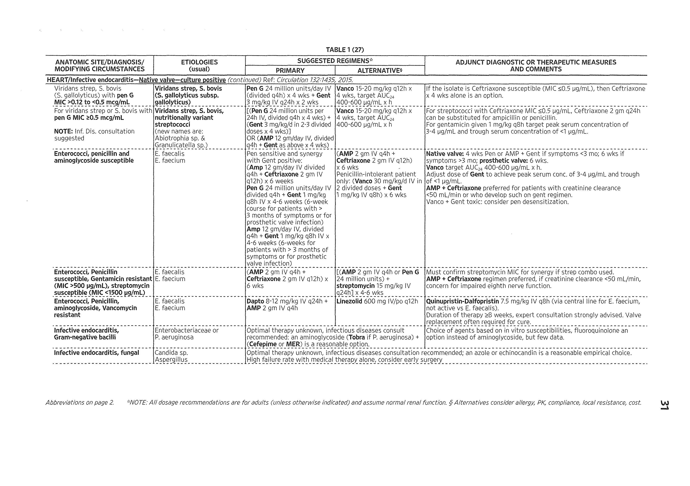

## Page 15

CASPOFUNGIN ACETATE

Brand name | Preparation | Mfr. Route | Form Strength Cost (AWP)

Geocillin Carbenicillin | Pfizer PO tab 382mg $2.53 indanyl sodi- um

¢ Invasive aspergillosis in patients who are refractory or intolerant to other anti-fungal therapy.

¢ Candidemia and the following Candida infections: intra-abdominal abscesses, peritonitis and pleural space infections.

¢ Esophageal candidiasis (author's opinion: would reserve caspofungin for azole- resistant cases)

¢ Empiric treatment of presumed fungal infections in febrile neutropenic patients

Dosing Adjustments GFR 50-80 mL/min: Usual dose GFR 10-50 mL/min: Usual dose GFR<10 mL/min: Usual dose Hemodialysis: Not dialyzable, thus no supplemental doses needed post dialysis. Usual

dose. Peritoneal Dialysis: No data, usual dose likely { Hepatic Function: For Child-Pugh score of 7-9, after initial 70mg load on day 1, decrease daily dose to 35mg qd.

25

## Page 16

Anti-InFectives

Apverst Druc REACTIONS: Generally well tolerated. Occasional: Histamine-mediated sx including rash, facial swelling, pruritus & sensation of warmth (consider antihistamine). Rare: Fever, phlebitis, nausea, vomiting, headache, eosinophilia, proteinuria, increased alk phos & hypokalemia.

Druc INTERACTIONS Cyclosporin: Increased caspofugin AUC by 35%. Co-administration not recommended, close monitoring of liver enzyme recommended with co-administration. Tacrolimus: AUC decreased by 20% with caspofugin co-administration. Monitor tacrolimus levels closely.

PREGNANCY Risk: C No human data. Animal data with exposure similar to a 70mg-dose in human resulted in incomplete ossification of skull, torso, cervical ribs and talus/ calcaneous.

Breast Feepinc: No data

Forms Brand name | Preparation | Mfr. | Route | Form | Strength Cost (AWP) Cancidas Caspofungin | Merck WV vial 50mg; 70mg $395.36; Acetate $509.33

SELECTED READINGS Walsh TJ, Teppler H, Donowitz GR et al. Caspofungin versus liposomal amphotericin B for empirical antifungal therapy in patients with persistent fever and neutropenia . N Engl J Med. 2004;351(14):1391- 402

Mora-Duarte J et al. Comparison of caspofungin and amphotericin B for invasive candidiasis . N Engl J Med 2002;347:2020

CEFACLOR FDA Inpications

e Skin and skin-structure infections (impetigo, cellulitis, pyoderma, skin ulcers)

¢ Streptococcal tonsillitis

¢ Upper respiratory tract infections (otitis media, pharyngitis)

¢ Lower respiratory tract infections

¢ Urinary tract infections (cystitis, pyelonephritis)

Dosing Adjustments GFR 50-80 mL/min: Usual dose GFR 10-50 mL/min: Usual dose GFR<10 mL/min: Usual dose Hemodialysis: 500mg post-dialysis Peritoneal Dialysis: Usual regimen

Apverst DruG REACTIONS: Occasional: Allergic reactions; diarrhea and C. difficile colitis; eosinophilia; positive Coombs' test. Rare: Anaphylaxis rare; hemolytic anemia; serum sickness (0.1-0.5%)

26

## Page 17

CEFADROXIL

Dru INTERACTIONS Probenecid: Increase in cephalosporin serum concentration due to inhibition of tubular secretion by probenecid. Monitor for potential cephalosporin toxicity, interaction may be beneficial if high serum concentration is desired.

PREGNANCY Risk: B-Cephalosporins are usually considered safe to use during pregnancy.

Breast FEEDING: Excreted in breast milk at low concentrations. The American Academy of Pediatrics classifies cephalosporin antibiotics as compatible with breast feeding.

Comments: Oral 2nd generation cephalosporin that has poor activity against S. pneumoniae, and therefore is not an ideal agent in the treatment of respiratory tract infections. This drug is a favorite for pediatricians because it wins the taste test. Higher rate of serum sickness reported compared to the other cephalosporins. Cefaclor CD should be taken with food.

FORMS (@ DENOTES AVAILABLE GENERICALLY)

Brand name | Preparation | Mfr. Route | Form Strength Cost (AWP)

Ceclor Cefaclor Eli Lilly PO pulvules 250mg; 500mg | $2.33; $4.65

PO susp 125mg/5ml; | $1.04 per 5ml; 187mg/5mL; $1.56 per 5mL; 250mg/Sml; | $1.88 per 5ml; 375mg/5mL $2.82 per 5mL

Raniclor cefaclor Ranbaxy PO tab, chew- | 125mg; 187mg; | $1; $1.60; $1.90; able 250mg; 375mg | $2.90

CEFADROXIL FDA Inpications

¢ Streptococcal pharyngitis and tonsillitis.

¢ Skin and soft tissue infections

¢ Urinary tract infections

Usuat Aputt Dosine: Soft tissue infection: 0.5g PO bid or 1g PO qd. Pharyngitis: 0.5 PO bid or 1g PO qd x 10 days. UTI: 1g PO qd or 1g PO bid.

Dosing Adjustments GFR 50-80 mL/min: Usual dose GFR 10-50 mL/min: ().5g q12-24h GFR<10 mL/min: 0.5g q36h Hemodialysis: 0.5-1.0g post-dialysis Peritoneal Dialysis: 0.5g/day

Apverst Druc REACTIONS: Occasional: Allergic reactions (anaphylaxis rare); diarrhea and C. difficile colitis; eosinophilia; positive Coombs' test

Druc INTERACTIONS Probenecid: Increase in cephalosporin serum concentration due to inhibition of tubular secretion by probenecid. Monitor for potential cephalosporin toxicity, interaction may be beneficial if high serum concentration is desired.

PreGNancy Risk: B-Cephalosporins are usually considered safe to use during pregnancy.

Breast FeepinG: Excreted in breast milk at low concentrations. The American Academy of Pediatrics classifies cephalosporin antibiotics as compatible with breast feeding.

ComMENTS: Oral Ist generation cephalosporin with good oral bioavailability and long half- life allowing for once or twice a day dosing, but more expensive than comparable agents (i.e., cephalexin)

27

## Page 18

Anrti-INFECTIVES

FORMS ( DENOTES AVAILABLE GENERICALLY)

Brand name | Preparation | Mfr. Route | Form Strength | Cost (AWP) Duricef Cefadroxil Wie Chilcott) PO cap 500mg | $9.48

PO tab | 1000mg | $17.84

SELECTED READINGS Bucko AD, Hunt BJ, Kidd SL et al. Randomized, double-blind, multicenter comparison of oral cefditoren 200 or 400mg BID with either cefuroxime 250mg BID or cefadroxil 500mg BID for the treatment of uncomplicated Skin and skin-structure infections. Clin Ther. 2002;24(7):1184-47,

CEFAMANDOLE FDA Inpications

¢ Bone and joint infections Lower respiratory infections

¢ Peritonitis

¢ Pneumonia

¢ Surgical prophylaxis

¢ Urinary tract infections

Usuat Aputt Dosine: 0.5-3.0g IM or IV q4-6h (up to 12g per day)

Dosing Adjustments GFR 50-80 mL/min: 0.5g-2.0g q6h GFR 10-50 mL/min: 1g-2g q8h GFR<10 mL/min: 0.5g-0.75g ql2h Hemodialysis: 1-2g post-dialysis Peritoneal Dialysis: 0.5-1.0g ql2h

Apverse Druc REACTIONS: Frequent: Phlebitis at infusion sites. Occasional: Allergic reactions (anaphylaxis rare); hypoprothrombinemia; diarrhea and ©. difficile colitis; eosinophilia; positive Coombs' test

Dru INTERACTIONS Ethanol: Methyltetrazolethiol moiety inhibits aldehyde dehydrogenase resulting in acetaldehyde accumulation and disulfiram-like reactions. Avoid ethanol consumption while on cephalosporins with the methyltetrazolethiol moiety. Probenecid: Increase in cephalosporin serum concentration due to inhibition of tubular secretion by probenecid. Monitor for potential cephalosporin toxicity, interaction may be beneficial if high serum concentration is desired. Warfarin: Warfarin anticoagulation effect may be enhanced. Monitor INR closely and adjust warfarin dose accordingly.

PreGNancy Risk: B-Cephalosporins are usually considered safe to use during pregnancy.

Breast FEEDING: Excreted in breast milk at low concentrations. The American Academy of Pediatrics classifies cephalosporin antibiotics as compatible with breast feeding.

ComMENTS: Parenteral second-generation cephalosporin with broad activity against most common respiratory pathogens. Contains the N-methylthiotetrazole (NMTT) side chain, may result in prolongation of prothrombin time and disulfiram-like reaction. Alternative second-generation cephalosporins with a more favorable safety profile are often preferred.

28

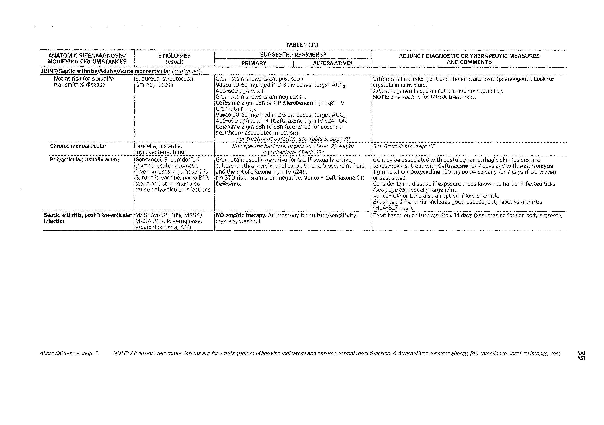

## Page 19

CEFAZOLIN

Forms

Brand name | Preparation | Mfr. Route | Form | Strength Cost (AWP) |

Mandol Cefamandole | Eli Lilly |W | vial | Ig; 2g | $9.06; $18.13 |

CEFAZOLIN FDA Inpications

¢ Bacterial infections

¢ Staphylococcal endocarditis

¢ Pneumococcal pneumonia

¢ Surgical prophylaxis (i.e., thoracic, appendectomy)

¢ Respiratory infections

¢ Skin infections (staphylococcal and streptococcal)

¢ Traumatic wound

e Urinary tract infections

Usuat Aputt Dosine: 0.5-2.0g IV q6-8h

Dosing Adjustments GFR 50-80 mL/min: 0.5g-1.5g q8h GFR 10-50 mL/min: 0.5¢-1.0g q8-12h GFR<10 mL/min: 0.25g-0.75g q18-24h Hemodialysis: HD: 1.0g post dialysis [Fogel MA et al. Am J Kidney Dis. 1998;32:401] Peritoneal Dialysis: 0.5g ql2h | Hepatic Function: No data. Usual dose likely.

Apverse Druc REACTIONS: Frequent: Minimal phlebitis at infusion sites. Occasional: Allergic reactions (anaphylaxis rare); diarrhea and C. difficile colitis; eosinophilia; positive Coombs' test

Dru INTERACTIONS Probenecid: Increase in cephalosporin serum concentration due to inhibition of tubular secretion by probenecid. Monitor for potential cephalosporin toxicity, interaction may be beneficial if high serum concentration is desired. Warfarin: Warfarin anticoagulation effect may be enhanced. Monitor INR closely and adjust warfarin dose accordingly.

PREGNANCY Risk: B-cephalosporins are usually considered safe to use during pregnancy.

Breast FeepinG: Excreted in breast milk at low concentrations. The American Academy of Pediatrics classifies cephalosporin antibiotics as compatible with breast feeding.

Comments: Parenteral first-generation cephalosporin with relatively long half-life that can be given IV or IM. This is the preferred cephalosporin for meth-sensitive S. aureus and for many forms of surgical prophylaxis with the exception of colorectal procedures.

Forms (@ DENOTES AVAILABLE GENERICALLY)

Brand name | Preparation | Mfr. Route | Form Strength Cost (AWP) Ancef Cefazolin @ Abbott WV or IM) vial Ig; 10g $5.59; $43.83 per vial

Seuectep READINGS

Bratzler DW et al. Antimicrobial prophylaxis for surgery: an advisory statement from the National Surgical Infection Prevention Project. Clin Infect Dis. 2004 Jun 15;38:1706-15

29

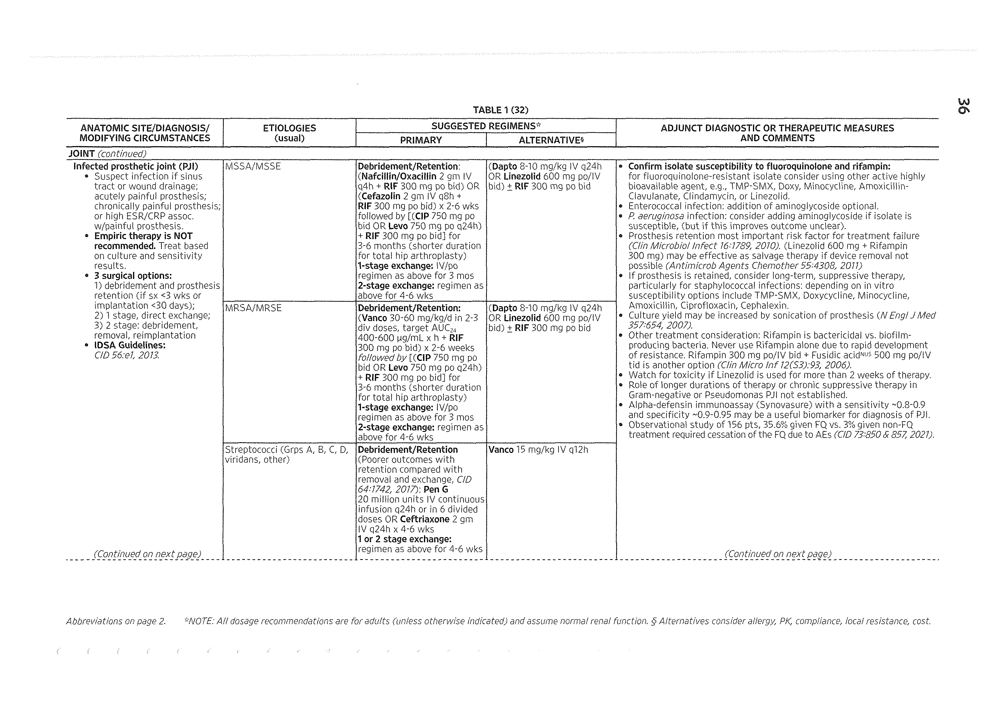

## Page 20

Anti-INFECTIVES

CEFDINIR FDA INpications

¢ Upper respiratory tract infections (otitis media, acute sinusitis, chronic sinusitis,

chronic bronchitis, pharyngitis, tonsillitis)

¢ Community-acquired pneumonia (CAP)

¢ Skin and skin structure infections

Usuat Aputt Dosinc: CAP and soft tissue infections: 300mg PO bid. Upper respiratory tract infections: 300mg PO bid or 600mg PO qd

Dosing Adjustments Hemodialysis: Remove in dialysis; dose after dialysis.

Apverse Druc REACTIONS: Occasional: Allergic reactions (anaphylaxis rare); diarrhea, C. difficile colitis; eosinophilia; positive Coombs' test

PREGNANCY Risk: B-Cephalosporins are usually considered safe to use during pregnancy,

Breast FEeDING: Excreted in breast milk at low concentrations. The American Academy of Pediatrics classifies cephalosporin antibiotics as compatible with breast feeding.

Comments: Oral 3rd generation cephalosporin that has activity against many gram-negative organisms, but not active against Enterobacter and Pseudomonas. Activity against gram- positive bacteria is good and is similar to cefpodoxime, which includes relatively good activity against S. pneumoniae.

Forms

Brand name | Preparation | Mfr. Route | Form Strength Cost (AWP)

Omnicef Cefdinir Abbott PO susp 125mg/5mL; | $3.75 per Sml; 250mg/5mL $7.32 per 5mL PO tab 300mg $4.75

SELECTED READINGS

Drehobl M, Bianchi P, Keyserling CH et al. Comparison of cefdinir and cefaclor in treatment of community-acquired pneumonia. Antimicrob Agents Chemother. 1997;41:1579-83.

Tack KJ, Littlejohn TW, Mailloux G et al. Cefdinir versus cephalexin for the treatment of Skin and skin-

structure infections. The Cefdinir Adult Skin Infection Study Group. Clin Ther. 1998;20(2);244-56.

CEFDITOREN FDA INpications

¢ Acute bacterial exacerbations of chronic bronchitis

¢ Pharyngitis/tonsillitis

¢ Uncomplicated skin and skin-structure infections

¢ Community-acquired pneumonia

Usuat Apuit Dosinc: Uncomplicated soft tissue infection: 200mg PO bid. Community- acquired pneumonia, pharyngitis, and tonsillitis: 400mg PO bid x10-14d.

Dosing Adjustments GFR 50-80 mL/min: Usual dose

30

## Page 21

CEFEPIME

GFR 10-50 mL/min: 200mg bid (max) GFR<10 mL/min: <30mL/min=200mg qd Hemodialysis: 200mg PO qd, dose post-HD on days of HD (30% removed in HD)

| Hepatic Function: Usual dose

Apverst Druc REACTIONS: Common: Nausea, abdominal pain, and diarrhea. LFT and alkaline phosphatase elevation. Occasional: Rash and mild eosinophilia; C. difficile colitis. Rare: Anaphylaxis; carnitine deficiency with prolonged therapy (monitor for muscle weakness)

Druc INTERACTIONS Antacid and H2 receptor blocker: Do not co-administer. Serum concentration of cefditoren decreased. Probenecid: Serum concentration of cefditoren increased.

PREGNANCY Risk: B Not teratogenic in animal studies. No human data.

Breast FEEDING: Excreted in breast milk. Use with caution.

ComMENTS: Oral third-generation cephalosporin with spectrum of activity similar to cefpodoxime and cefdinir that includes good activity against S. pneumoniae, H. influenzae and M. catarrhalis. A short half-life makes a twice-a-day dosing a concern for severe infections.

Forms | Brand name | Preparation | Mfr. Route | Form | Strength Cost (AWP)

Spectracef. | Cefditoren | Purdue Pharma | PO cop 200mg $2.08 pivoxil

SELECTED READINGS Roux JL, Fata L, Palo W et al. Cefditoren is Effective Treatment for Community-Acquired Pneumonia in Adults. ICCAC 2001, poster 852

Bucko AD, Hunt BJ, Kidd SL et al. Randomized, double-blind, multicenter comparison of oral cefditoren 200 or 400mg BID with either cefuroxime 250mg BID or cefadroxil 500mg BID for the treatment of uncomplicated skin and skin-structure infections. Clin Ther. 2002;24(7):1134-47.

CEFEPIME | Ka FDA INpications

¢ Pneumonia (nosocomial)

* Cellulitis

¢ Febrile neutropenia, empiric therapy

¢ Intra-abdominal infections

¢ Bronchitis

¢ Skin and skin structure infections

¢ Uncomplicated and complicated urinary tract infections (pyelonephritis)

Usuat Aputt Dosine: 1-2g IV qi2h. Pseudomonas and/or CNS infections: 1-2¢ q8h. Mild to moderate UTI: 0.5-1g IV or IM q12h.

Dosing Adjustments GFR 50-80 mL/min: 0.5g-2 q24h GFR 10-50 mL/min: 0.5g-1.0g q24h y GFR<10 mL/min: 0.25g-0.5g q24h Hemodialysis: 1-2g post-dialysis Peritoneal Dialysis: 1-2g q48h

31

