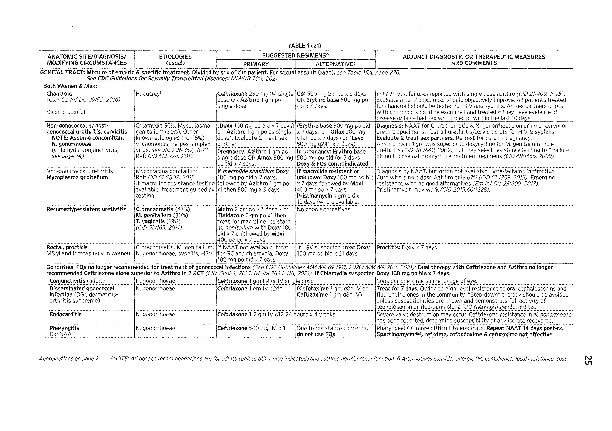
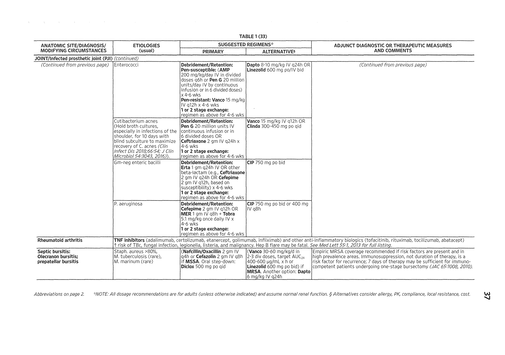

# Harrison_s_Infectious_Diseases

## Page 1

SECTION  IIntroduction to Infectious Diseases

4with specific microorganisms in detail. The challenge for the physi-cian is to recognize which patients may have an infectious disease as opposed to some other underlying disorder. This task is greatly com-plicated by the fact that infections have an infinite range of presenta-tions, from acute life-threatening conditions (e.g., meningococcemia) to chronic diseases of varying severity (e.g., H. pylori–associated peptic ulcer disease) to no symptoms at all (e.g., latent M. tubercu-losis infection). While it is impossible to generalize about a presenta-tion that encompasses all infections, common findings in the history, physical examination, and basic laboratory testing often suggest that the patient either has an infectious disease or should be more closely evaluated for one. This chapter focuses on these common findings and how they may direct the ongoing evaluation of the patient.

APPROACH TO THE PATIENT: Infectious Disease

See also Chap. 18.

HISTORY As in all of medicine, obtaining a complete and thor-ough history is paramount in the evaluation of a patient with a possible infectious disease. The history is critical for developing a focused differential diagnosis and for guiding the physical exam and initial diagnostic testing. Although detailing all the elements of a history is beyond the scope of this chapter, specific compo-nents relevant to infectious diseases require particular attention. In general, these aspects focus on two areas: (1) an exposure his-tory that may identify microorganisms with which the patient may have come into contact and (2) host-specific factors that may predispose to the development of an infection.

Exposure History History of Infections or Exposure to Drug-Resistant Microbes   Knowledge about a patient’s previous infections, with the associated microbial susceptibility profiles, is very helpful in determining possible etiologic agents. Specifically, knowing whether a patient has a history of infection with drug-resistant organisms (e.g., methicillin-resistant S. aureus, vancomycin- resistant Enterococcus species, enteric organisms that produce an extended-spectrum β-lactamase or carbapenemase) or may have been exposed to drug-resistant microbes (e.g., during a recent stay in a hospital, nursing home, or long-term acute-care facil-ity) may alter the choice of empirical antibiotics. For example, a patient presenting with sepsis who is known to have a history of invasive infection with a multidrug-resistant isolate of P. aerugi-nosa should be treated empirically with an antimicrobial regimen that will cover this strain.

Social History Although the social history taken by physicians is often limited to inquiries about a patient’s alcohol and tobacco use, a complete social history can offer a number of clues to the underlying diagnosis. Knowing whether the patient has any high-risk behaviors (e.g., unsafe sexual behaviors, IV drug use), potential hobby-associated exposures (e.g., avid gardening, with possible Sporothrix schenckii exposure), or occupational expo-sures (e.g., increased risk for M. tuberculosis exposure in funeral service workers) can facilitate diagnosis. The importance of the social history is exemplified by a case in 2009 in which a labora-tory researcher died of a Yersinia pestis infection acquired during his work; although this patient had visited both an outpatient clinic and an emergency department, his records at both sites failed to include his occupation—information that potentially could have led quickly to appropriate treatment and infection control measures.

Dietary Habits As certain pathogens are associated with specific dietary habits, inquiring about a patient’s diet can provide insight into possible exposures. For example, Shiga toxin–producing strains of Escherichia coli and Toxoplasma gondii are associated with the consumption of raw or undercooked meat; Salmonella typhimurium, Listeria monocytogenes, and Mycobacterium bovis with unpasteurized milk; Leptospira species, parasites, and enteric bacteria with unpurified water; and Vibrio species, norovirus, helminths, and protozoa with raw seafood.

Animal Exposures Because animals are often important vectors of infectious diseases, patients should be asked about exposures to any animals, including contact with their own pets, visits to petting zoos, or random encounters (e.g., home rodent infesta-tion). For example, dogs can carry ticks that serve as agents for the transmission of several infectious diseases, including Lyme disease, Rocky Mountain spotted fever, and ehrlichiosis. Cats are associated with Bartonella henselae infection, reptiles with Salmonella infection, rodents with leptospirosis, and rabbits with tularemia (Chap. 40).

Travel History Attention should be paid to both international and domestic travel. Fever in a patient who has recently returned from abroad significantly broadens the differential diagnosis (Chap. 6); even a remote history of international travel may reflect patients’ exposure to infections with pathogens such as M. tuberculosis or Strongyloides stercoralis. Similarly, domestic travel may have exposed patients to pathogens that are not normally found in their local environment and therefore may not routinely be con-sidered in the differential diagnosis. For example, a patient who has recently visited California or Martha’s Vineyard may have been exposed to Coccidioides immitis or Francisella tularensis, respectively. Beyond simply identifying locations that a patient may have visited, the physician needs to delve deeper to learn what kinds of activities and behaviors the patient engaged in dur-ing travel (e.g., the types of food and sources of water consumed, freshwater swimming, animal exposures) and whether the patient had the necessary immunizations and/or took the necessary prophylactic medications prior to travel; these additional expo-sures, which the patient may not think to report without specific prompting, are as important as exposures during a patient’s rou-tine daily living.

Host-Specific Factors Because many opportunistic infections (e.g., with Pneumocystis jirovecii, Aspergillus species, or JC virus) affect only immunocompromised patients, it is of vital impor-tance to determine the immune status of the patient. Defects in the immune system may be due to an underlying disease (e.g., malignancy, HIV infection, malnutrition), a medication (e.g., chemotherapy, glucocorticoids, monoclonal antibodies to com-ponents of the immune system), a treatment modality (e.g., total body irradiation, splenectomy), or a primary immunodeficiency. The type of infection for which the patient is at increased risk varies with the specific type of immune defect. In concert with determining whether a patient is immunocompromised for any reason, the physician should review the immunization record to ensure that the patient is adequately protected against vaccine-preventable diseases (Chap. 5).

PHYSICAL EXAMINATION Similar to the history, a thorough physi-cal examination is crucial in evaluating patients with an infec-tious disease. Some elements of the physical exam (e.g., skin, lymphatics) that are often performed in a cursory manner as a result of the ever-increasing pace of medical practice may help identify the underlying diagnosis. Moreover, serial exams are critical since new findings may appear as the illness progresses.

## Page 2

5A description of all the elements of a physical exam is beyond the scope of this chapter, but the following components have partic-ular relevance to infectious diseases.

Vital Signs Given that elevations in temperature are often a hall-mark of infection, paying close attention to the temperature may be of value in diagnosing an infectious disease. The idea that 37°C (98.6°F) is the normal human body temperature dates back to the nineteenth century and was initially based on axillary measure-ments. Rectal temperatures more accurately reflect the core body temperature and are 0.4°C (0.7°F) and 0.8°C (1.4°F) higher than oral and axillary temperatures, respectively. Although the defini-tion of fever varies greatly throughout the medical literature, the most common definition, which is based on studies defining fever of unknown origin (Chap. 13), uses a temperature ≥38.3°C (101°F). Although fever is very commonly associated with infec-tion, it is also documented in many other diseases (Chap. 11). For every 1°C (1.8°F) increase in core temperature, the heart rate typically rises by 15–20 beats/min. Table 1-1 lists infections that are associated with relative bradycardia (Faget’s sign), where patients have a lower heart rate than might be expected for a given body temperature. Although this pulse-temperature dissociation is not highly sensitive or specific for establishing a diagnosis, it is potentially useful in low-resource settings given its ready avail-ability and simplicity.

Lymphatics There are ∼600 lymph nodes throughout the body, and infections are an important cause of lymphadenopathy. A physical examination should include evaluation of lymph nodes in multiple regions (e.g., popliteal, inguinal, epitrochlear, axillary, multiple cervical regions), with notation of the location, size (nor-mal, <1 cm), presence or absence of tenderness, and consistency (soft, firm, or shotty) and of whether the nodes are matted (i.e., connected and moving together). Of note, palpable epitroch-lear nodes are always pathologic. Of patients presenting with

TABLE 1-1

CAUSES OF RELATIVE BRADYCARDIA

Infectious Causes

Intracellular organisms  Gram-negative bacteriaSalmonella typhiFrancisella tularensisBrucella spp.Coxiella burnetii (Q fever)Leptospira interrogansLegionella pneumophilaMycoplasma pneumoniae  Tick-borne organismsRickettsia spp.Orientia tsutsugamushi (scrub typhus)Babesia spp.  OtherCorynebacterium diphtheriaePlasmodium spp. (malaria)

Viruses/viral infectionsYellow fever virusDengue virusViral hemorrhagic feversaViral myocarditis

Noninfectious Causes

Drug feverBeta blocker useCentral nervous system lesionsMalignant lymphomaFactitious fever

aPrimarily early in the course of infection with Marburg or Ebola virus.

lymphadenopathy, 75% have localized findings, and the remain-ing 25% have generalized lymphadenopathy (i.e., that involving more than one anatomic region). Localized lymphadenopathy in the head and neck region is found in 55% of patients, inguinal lymphadenopathy in 14%, and axillary lymphadenopathy in 5%. Determining whether the patient has generalized versus localized lymphadenopathy can help narrow the differential diagnosis, as various infections present differently.

Skin The fact that many infections have cutaneous manifesta-tions gives the skin examination particular importance in the evaluation of patients (Chaps. 12, 14, and 26). It is important to perform a complete skin exam, with attention to both front and back. Specific rashes are often extremely helpful in narrow-ing the differential diagnosis of an infection (Chaps. 12 and 14). In numerous anecdotal instances, patients in the intensive care unit have had “fever of unknown origin” that was actually due to unrecognized pressure ulcers. Moreover, close examination of the distal extremities for splinter hemorrhages, Janeway lesions, or Osler’s nodes may yield evidence of endocarditis or other causes of septic emboli.

Foreign Bodies As previously mentioned, many infections are caused by members of the indigenous microbiota. These infec-tions typically occur when these microbes escape their normal habitat and enter a new one. Thus, maintenance of epithelial barriers is one of the most important mechanisms in protection against infection. However, hospitalization of patients is often associated with breaches of these barriers—e.g., due to placement of IV lines, surgical drains, or tubes (such as endotracheal tubes and Foley catheters) that allow microorganisms to localize in sites to which they normally would not have access (Chap. 17). Accordingly, knowing what lines, tubes, and drains are in place is helpful in ascertaining what body sites might be infected.

DIAGNOSTIC TESTING Laboratory and radiologic testing has advanced greatly over the past few decades and has become an important component in the evaluation of patients. The dramatic increase in the number of serologic diagnostics, antigen tests, and molecular diagnostics available to the physician has, in fact, revolutionized medical care. However, all of these tests should be viewed as adjuncts to the history and physical examination—not a replacement for them. The selection of initial tests should be based directly on the patient’s history and physical exam findings. Moreover, diagnostic testing should generally be limited to those conditions that are reasonably likely and treatable, important in terms of public health considerations, and/or capable of providing a definitive diagnosis that will consequently limit other testing.

White Blood Cell (WBC) Count Elevations in the WBC count are often associated with infection, though many viral infections are associated with leukopenia. It is important to assess the WBC differential, given that different classes of microbes are associated with various leukocyte types. For example, bacteria are associ-ated with an increase in polymorphonuclear neutrophils, often with elevated levels of earlier developmental forms such as bands; viruses are associated with an increase in lymphocytes; and certain parasites are associated with an increase in eosinophils. Table 1-2 lists the major infectious causes of eosinophilia.

Inflammatory Markers The erythrocyte sedimentation rate (ESR) and the C-reactive protein (CRP) level are indirect and direct measures of the acute-phase response, respectively, that can be used to assess a patient’s general level of inflammation. Moreover, these markers can be followed serially over time to monitor dis-ease progress/resolution. It is noteworthy that the ESR changes

<table border="1" class="dataframe">
  <thead>
    <tr style="text-align: right;">
      <th>Intracellular organisms</th>
      <th></th>
    </tr>
  </thead>
  <tbody>
    <tr>
      <td>Gram-negative bacteria</td>
      <td>Salmonella typhi\nFrancisella tularensis\nBrucella spp.\nCoxiella burnetii (Q fever)\nLeptospira interrogans\nLegionella pneumophila\nMycoplasma pneumoniae</td>
    </tr>
    <tr>
      <td>Tick-borne organisms</td>
      <td>Rickettsia spp.\nOrientia tsutsugamushi (scrub typhus)\nBabesia spp.</td>
    </tr>
    <tr>
      <td>Other</td>
      <td>Corynebacterium diphtheriae\nPlasmodium spp. (malaria)</td>
    </tr>
    <tr>
      <td>Viruses/viral infections</td>
      <td>Yellow fever virus\nDengue virus\nViral hemorrhagic feversa\nViral myocarditis</td>
    </tr>
  </tbody>
</table>

<table border="1" class="dataframe">
  <thead>
    <tr style="text-align: right;">
      <th></th>
      <th>Drug fever
Beta blocker use
Central nervous system lesions
Malignant lymphoma
Factitious fever</th>
    </tr>
  </thead>
  <tbody>
  </tbody>
</table>

## Page 3

SECTION  IIntroduction to Infectious Diseases

6TABLE 1-2

MAJOR INFECTIOUS CAUSES OF EOSINOPHILIAa

ORGAN INVOLVEDORGANISMEXPOSURE

GEOGRAPHIC DISTRIBUTIONDEGREE OF EOSINOPHILIAb

Central nervous

system

Angiostrongylus

Gnathostoma

Raw seafood

Raw poultry and seafood

Asia

Asia

Mild

Moderate to extreme

EyeLoa loaInsect biteAfricaModerate (expatriates), mild (patients

living in endemic areas)OnchocercaInsect biteAfricaMild (expatriates), moderate (patients

living in endemic areas)

LungChlamydia trachomatisSexual transmissionWorldwideMildStrongyloidesSoilTropicalModerate (acute), mild (chronic)Toxocara canis/Toxocara caticDogs, soilWorldwideModerate to extremeParagonimusCrabs and crayfishAsiaModerate (acute), mild (chronic)Coccidioides immitisSoilSouthwestern United StatesMild (acute), extreme (disseminated)Brugia malayiInsect biteAsiaMild to moderatePneumocystis jiroveciiAirWorldwideMild

LiverSchistosoma japonicumFreshwater swimmingAsiaModerate (acute), mild (chronic)Schistosoma mansoniFreshwater swimmingAfrica, Middle East, Latin

America

Moderate (acute), mild (chronic)

FasciolaWatercressWorldwideModerateClonorchisRaw seafoodAsiaMild to moderateOpisthorchisRaw seafoodAsiaMild to moderate

IntestinesAscarisdRaw fruits and vegetables,

contaminated water

WorldwideMild to extreme

HookwormSoilWorldwideMild to moderateTrichurisRaw fruits and vegetables,

contaminated water

TropicalMild

Cystoisospora belliContaminated water and foodWorldwideMildDientamoeba fragilisUnclear; spread via fecal-oral

route

WorldwideMild

CapillariaRaw seafoodAsiaExtremeHeterophyesRaw seafoodAsia, Middle EastMildAnisakisRaw seafoodWorldwideMildBaylisascaris procyoniseSoilNorth AmericaModerate to extremeHymenolepis nanaContaminated water, soilWorldwideMild

BladderSchistosoma haematobiumFreshwater swimmingAfrica, Middle EastModerate (acute), mild (chronic)

MuscleTrichinellaPorkWorldwideModerate to extreme

LymphaticsWuchereria bancroftidInsect biteTropicalModerate to extremef

Bartonella henselaeCatsWorldwideMild

OtherRecovery from bacterial or

viral infections

——Mild

HIVContaminated bodily fluidWorldwideMildCryptococcus neoformansSoilWorldwideModerate to extreme (disseminated)

aThere are numerous noninfectious causes of eosinophilia, such as atopic disease, DRESS (drug reaction with eosinophilia and systemic symptoms) syndrome, and pernicious anemia, which can cause mild eosinophilia; drug hypersensitivity and serum sickness, which can cause mild to moderate eosinophilia; collagen vascular disease, which can cause moderate eosinophilia; and malignancy, Churg-Strauss syndrome, and hyper-IgE syndromes, which can cause moderate to extreme eosinophilia.bMild: 500–1500 cells/μL; moderate: 1500–5000 cells/μL; extreme: >5000 cells/μL.cCan also affect the liver and the eyes.dCan also affect the lungs.eCan also affect the eyes and the central nervous system.fLevels are typically higher with pulmonary infections.

relatively slowly, and its measurement more often than weekly usually is not useful; in contrast, CRP concentrations change rapidly, and daily measurements can be useful in the appropri-ate context. Although these markers are sensitive indicators of inflammation, neither is very specific. An extremely elevated ESR  (>100 mm/h) has a 90% predictive value for a serious underlying disease (Table 1-3). Work is ongoing to identify other potentially useful inflammatory markers (e.g., procalcitonin, serum amyloid A protein); however, their clinical utility requires further validation.

Analysis of Cerebrospinal Fluid (CSF) Assessment of CSF is criti-cal for patients with suspected meningitis or encephalitis. An opening pressure should always be recorded, and fluid should routinely be sent for cell counts, Gram’s stain and culture, and determination of glucose and protein levels. A CSF Gram’s stain typically requires >105 bacteria/mL for reliable positivity; its spec-ificity approaches 100%. Table 1-4 lists the typical CSF profiles for various infections. In general, CSF with a lymphocytic pleo-cytosis and a low glucose concentration suggests either infection

<table border="1" class="dataframe">
  <thead>
    <tr style="text-align: right;">
      <th>Central nervous
system</th>
      <th>Angiostrongylus
Gnathostoma</th>
      <th>Raw seafood
Raw poultry and seafood</th>
      <th>Asia
Asia</th>
      <th>Mild
Moderate to extreme</th>
    </tr>
  </thead>
  <tbody>
    <tr>
      <td>Eye</td>
      <td>Loa loa</td>
      <td>Insect bite</td>
      <td>Africa</td>
      <td>Moderate (expatriates), mild (patients\nliving in endemic areas)</td>
    </tr>
    <tr>
      <td></td>
      <td>Onchocerca</td>
      <td>Insect bite</td>
      <td>Africa</td>
      <td>Mild (expatriates), moderate (patients\nliving in endemic areas)</td>
    </tr>
    <tr>
      <td>Lung</td>
      <td>Chlamydia trachomatis</td>
      <td>Sexual transmission</td>
      <td>Worldwide</td>
      <td>Mild</td>
    </tr>
    <tr>
      <td></td>
      <td>Strongyloides</td>
      <td>Soil</td>
      <td>Tropical</td>
      <td>Moderate (acute), mild (chronic)</td>
    </tr>
    <tr>
      <td></td>
      <td>Toxocara canis/Toxocara catic</td>
      <td>Dogs, soil</td>
      <td>Worldwide</td>
      <td>Moderate to extreme</td>
    </tr>
    <tr>
      <td></td>
      <td>Paragonimus</td>
      <td>Crabs and crayfish</td>
      <td>Asia</td>
      <td>Moderate (acute), mild (chronic)</td>
    </tr>
    <tr>
      <td></td>
      <td>Coccidioides immitis</td>
      <td>Soil</td>
      <td>Southwestern United States</td>
      <td>Mild (acute), extreme (disseminated)</td>
    </tr>
    <tr>
      <td></td>
      <td>Brugia malayi</td>
      <td>Insect bite</td>
      <td>Asia</td>
      <td>Mild to moderate</td>
    </tr>
    <tr>
      <td></td>
      <td>Pneumocystis jirovecii</td>
      <td>Air</td>
      <td>Worldwide</td>
      <td>Mild</td>
    </tr>
    <tr>
      <td>Liver</td>
      <td>Schistosoma japonicum</td>
      <td>Freshwater swimming</td>
      <td>Asia</td>
      <td>Moderate (acute), mild (chronic)</td>
    </tr>
    <tr>
      <td></td>
      <td>Schistosoma mansoni</td>
      <td>Freshwater swimming</td>
      <td>Africa, Middle East, Latin\nAmerica</td>
      <td>Moderate (acute), mild (chronic)</td>
    </tr>
    <tr>
      <td></td>
      <td>Fasciola</td>
      <td>Watercress</td>
      <td>Worldwide</td>
      <td>Moderate</td>
    </tr>
    <tr>
      <td></td>
      <td>Clonorchis</td>
      <td>Raw seafood</td>
      <td>Asia</td>
      <td>Mild to moderate</td>
    </tr>
    <tr>
      <td></td>
      <td>Opisthorchis</td>
      <td>Raw seafood</td>
      <td>Asia</td>
      <td>Mild to moderate</td>
    </tr>
    <tr>
      <td>Intestines</td>
      <td>Ascarisd</td>
      <td>Raw fruits and vegetables,\ncontaminated water</td>
      <td>Worldwide</td>
      <td>Mild to extreme</td>
    </tr>
    <tr>
      <td></td>
      <td>Hookworm</td>
      <td>Soil</td>
      <td>Worldwide</td>
      <td>Mild to moderate</td>
    </tr>
    <tr>
      <td></td>
      <td>Trichuris</td>
      <td>Raw fruits and vegetables,\ncontaminated water</td>
      <td>Tropical</td>
      <td>Mild</td>
    </tr>
    <tr>
      <td></td>
      <td>Cystoisospora belli</td>
      <td>Contaminated water and food</td>
      <td>Worldwide</td>
      <td>Mild</td>
    </tr>
    <tr>
      <td></td>
      <td>Dientamoeba fragilis</td>
      <td>Unclear; spread via fecal-oral\nroute</td>
      <td>Worldwide</td>
      <td>Mild</td>
    </tr>
    <tr>
      <td></td>
      <td>Capillaria</td>
      <td>Raw seafood</td>
      <td>Asia</td>
      <td>Extreme</td>
    </tr>
    <tr>
      <td></td>
      <td>Heterophyes</td>
      <td>Raw seafood</td>
      <td>Asia, Middle East</td>
      <td>Mild</td>
    </tr>
    <tr>
      <td></td>
      <td>Anisakis</td>
      <td>Raw seafood</td>
      <td>Worldwide</td>
      <td>Mild</td>
    </tr>
    <tr>
      <td></td>
      <td>Baylisascaris procyonise</td>
      <td>Soil</td>
      <td>North America</td>
      <td>Moderate to extreme</td>
    </tr>
    <tr>
      <td></td>
      <td>Hymenolepis nana</td>
      <td>Contaminated water, soil</td>
      <td>Worldwide</td>
      <td>Mild</td>
    </tr>
    <tr>
      <td>Bladder</td>
      <td>Schistosoma haematobium</td>
      <td>Freshwater swimming</td>
      <td>Africa, Middle East</td>
      <td>Moderate (acute), mild (chronic)</td>
    </tr>
    <tr>
      <td>Muscle</td>
      <td>Trichinella</td>
      <td>Pork</td>
      <td>Worldwide</td>
      <td>Moderate to extreme</td>
    </tr>
    <tr>
      <td>Lymphatics</td>
      <td>Wuchereria bancroftid</td>
      <td>Insect bite</td>
      <td>Tropical</td>
      <td>Moderate to extremef</td>
    </tr>
    <tr>
      <td></td>
      <td>Bartonella henselae</td>
      <td>Cats</td>
      <td>Worldwide</td>
      <td>Mild</td>
    </tr>
    <tr>
      <td>Other</td>
      <td>Recovery from bacterial or\nviral infections</td>
      <td>—</td>
      <td>—</td>
      <td>Mild</td>
    </tr>
    <tr>
      <td></td>
      <td>HIV</td>
      <td>Contaminated bodily fluid</td>
      <td>Worldwide</td>
      <td>Mild</td>
    </tr>
    <tr>
      <td></td>
      <td>Cryptococcus neoformans</td>
      <td>Soil</td>
      <td>Worldwide</td>
      <td>Moderate to extreme (disseminated)</td>
    </tr>
  </tbody>
</table>

## Page 4

7

(e.g., with Listeria, M. tuberculosis, or a fungus) or a noninfectious disorder (e.g, neoplastic meningitis, sarcoidosis). Bacterial anti-gen testing of CSF (e.g., latex agglutination tests for Haemophilus influenzae type b, group B Streptococcus, S. pneumoniae, and Neisseria meningitidis) is not recommended as a screening assay, given that these tests are no more sensitive than Gram’s stain; however, these assays can be helpful in presumptively identifying organisms seen on Gram’s stain. In contrast, other antigen tests

TABLE 1-3

CAUSES OF AN EXTREMELY ELEVATED ERYTHROCYTE SEDIMENTATION RATE (>100 mm/h)

ETIOLOGIC CATEGORY  (% OF CASES)SPECIFIC CAUSES

Infectious diseases (35–40)Subacute bacterial endocarditisAbscessesOsteomyelitisTuberculosisUrinary tract infection

Inflammatory diseases (15–20)Giant cell arteritisRheumatoid arthritisSystemic lupus erythematosus

Malignancies (15–20)Multiple myelomaLeukemiasLymphomasCarcinomas

Other (20–35)Drug hypersensitivity reactions

(drug fever)Ischemic tissue injury/traumaRenal diseases

TABLE 1-4

TYPICAL CSF PROFILES FOR MENINGITIS AND ENCEPHALITISa

NORMAL

BACTERIAL MENINGITIS

VIRAL MENINGITIS

FUNGAL MENINGITISbPARASITIC MENINGITIS

TUBERCULOUS MENINGITISENCEPHALITIS

WBC count

(per μL)

<5>100025–50040–600150–200025–10050–500

Differential of

WBC

60–70% lympho-

cytes, ≤30% monocytes/macrophages

↑↑PMNs

(≥80%)

Predominantly

lymphocytescLymphocytes or

PMNs, depend-ing on specific organism

↑↑ Eosinophils

(≥50%)d

Predominantly

lymphocytescPredominantly

lymphocytesc

Gram’s stainNegativePositive (in

>60% of cases)

NegativeRarely positiveNegativeOccasionally

positiveeNegative

Glucose (mg/dL)40–85<40Normal↓ to normalNormal<50 in 75% of

cases

Normal

Protein (mg/dL)15–45>10020–80150–30050–200100–20050–100

Opening pres-

sure (mmH2O)

50–180>300100–350160–340Normal150–280Normal to ↑

Common causes—Streptococcus

pneumoniae, Neisseria meningitidis

EnterovirusesCandida,

Cryptococcus, and Aspergillus spp.

Angiostrongylus

cantonensis, Gnathostoma spinigerum, Baylisascaris procyonis

Mycobacterium

tuberculosis

Herpesviruses,

enteroviruses, influenza virus, rabies virus

aNumbers indicate typical results, but actual results may vary.bCSF characteristics depend greatly on the specific organism.cNeutrophils may predominate early in the disease course.dPatients typically have striking eosinophilia as well.eSensitivity can be increased by examination of a smear of protein coagulum (pellicle) and the use of acid-fast stains.Abbreviations: PMNs, polymorphonuclear neutrophils; WBC, white blood cell.

(e.g., for Cryptococcus) and some CSF serologic testing (e.g., for Treponema pallidum, Coccidioides) are highly sensitive and are useful for select patients. In addition, polymerase chain reaction (PCR) analysis of CSF is increasingly being used for the diagnosis of bacterial (e.g., N. meningitidis, S. pneumoniae, mycobacteria) and viral (e.g., herpes simplex virus, enterovirus) infections; while these molecular tests permit rapid diagnosis with a high degree of sensitivity and specificity, they often do not allow deter-mination of antimicrobial resistance profiles.

Cultures The mainstays of infectious disease diagnosis include the culture of infected tissue (e.g., surgical specimens) or fluid (e.g., blood, urine, sputum, purulence from a wound). Samples can be sent for culture of bacteria (aerobic or anaerobic), fungi, or viruses. Ideally, specimens are collected before the administration of antimicrobial therapy; in instances where this order of events is not clinically feasible, microscopic examination of the speci-men (e.g., Gram-stained or potassium hydroxide [KOH]–treated  preparations) is particularly important. Culture of the organism(s) allows identification of the etiologic agent, determination of  the antimicrobial susceptibility profile, and—when there is concern about an outbreak—isolate typing. While cultures are extremely useful in the evaluation of patients, determining whether culture results are clinically meaningful or represent contamination (e.g., a non-aureus, non-lugdunensis staphylococcal species growing in a blood culture) can sometimes be challenging and requires an understanding of the patient’s immune status, exposure history, and microbiota. In some cases, serial cultures to demonstrate clearance of the organism may be helpful.

Pathogen-Specific Testing Numerous pathogen-specific tests (e.g., serology, antigen testing, PCR testing) are commercially

<table border="1" class="dataframe">
  <thead>
    <tr style="text-align: right;">
      <th>Infectious diseases (35–40)</th>
      <th>Subacute bacterial endocarditis
Abscesses
Osteomyelitis
Tuberculosis
Urinary tract infection</th>
    </tr>
  </thead>
  <tbody>
    <tr>
      <td>Inflammatory diseases (15–20)</td>
      <td>Giant cell arteritis\nRheumatoid arthritis\nSystemic lupus erythematosus</td>
    </tr>
    <tr>
      <td>Malignancies (15–20)</td>
      <td>Multiple myeloma\nLeukemias\nLymphomas\nCarcinomas</td>
    </tr>
    <tr>
      <td>Other (20–35)</td>
      <td>Drug hypersensitivity reactions\n(drug fever)\nIschemic tissue injury/trauma\nRenal diseases</td>
    </tr>
  </tbody>
</table>

<table border="1" class="dataframe">
  <thead>
    <tr style="text-align: right;">
      <th>WBC count
(per μL)</th>
      <th>&lt;5</th>
      <th>&gt;1000</th>
      <th>25–500</th>
      <th>40–600</th>
      <th>150–2000</th>
      <th>25–100</th>
      <th>50–500</th>
    </tr>
  </thead>
  <tbody>
    <tr>
      <td>Difefrential of\nWBC</td>
      <td>60–70% lympho-\ncytes, ≤30%\nmonocytes/\nmacrophages</td>
      <td>↑↑PMNs\n(≥80%)</td>
      <td>Predominantly\nlymphocytesc</td>
      <td>Lymphocytes or\nPMNs, depend-\ning on specific\norganism</td>
      <td>↑↑ Eosinophils\n(≥50%)d</td>
      <td>Predominantly\nlymphocytesc</td>
      <td>Predominantly\nlymphocytesc</td>
    </tr>
    <tr>
      <td>Gram’s stain</td>
      <td>Negative</td>
      <td>Positive (in\n&gt;60% of\ncases)</td>
      <td>Negative</td>
      <td>Rarely positive</td>
      <td>Negative</td>
      <td>Occasionally\npositivee</td>
      <td>Negative</td>
    </tr>
    <tr>
      <td>Glucose (mg/dL)</td>
      <td>40–85</td>
      <td>&lt;40</td>
      <td>Normal</td>
      <td>↓ to normal</td>
      <td>Normal</td>
      <td>&lt;50 in 75% of\ncases</td>
      <td>Normal</td>
    </tr>
    <tr>
      <td>Protein (mg/dL)</td>
      <td>15–45</td>
      <td>&gt;100</td>
      <td>20–80</td>
      <td>150–300</td>
      <td>50–200</td>
      <td>100–200</td>
      <td>50–100</td>
    </tr>
    <tr>
      <td>Opening pres-\nsure (mmHO)\n2</td>
      <td>50–180</td>
      <td>&gt;300</td>
      <td>100–350</td>
      <td>160–340</td>
      <td>Normal</td>
      <td>150–280</td>
      <td>Normal to ↑</td>
    </tr>
    <tr>
      <td>Common causes</td>
      <td>—</td>
      <td>Streptococcus\npneumoniae,\nNeisseria\nmeningitidis</td>
      <td>Enteroviruses</td>
      <td>Candida,\nCryptococcus,\nand Aspergillus\nspp.</td>
      <td>Angiostrongylus\ncantonensis,\nGnathostoma\nspinigerum,\nBaylisascaris\nprocyonis</td>
      <td>Mycobacterium\ntuberculosis</td>
      <td>Herpesviruses,\nenteroviruses,\ninfluenza virus,\nrabies virus</td>
    </tr>
  </tbody>
</table>

## Page 5

SECTION  IIntroduction to Infectious Diseases

8

available, and many hospitals now offer some of these tests in-house to facilitate rapid turnaround that ultimately enhances patient care. The reader is directed to relevant chapters on the pathogens of interest for specific details. Some of these tests (e.g., universal PCRs) identify organisms that currently are not cultivable and have unclear relationships to disease, thereby com-plicating diagnosis. As these tests become more commonplace and the work of the Human Microbiome Project progresses, the relevance of some of these previously unrecognized bacteria to human health will likely become more apparent.

Radiology Imaging provides an important adjunct to the physi-cal examination, allowing evaluation for lymphadenopathy in regions that are not externally accessible (e.g., mediastinum, intraabdominal sites), assessment of internal organs for evidence of infection, and facilitation of image-guided percutaneous sam-pling of deep spaces. The choice of imaging modality (e.g., CT, MRI, ultrasound, nuclear medicine, use of contrast) is best made in consultation with a radiologist to ensure that the results will address the physician’s specific concerns.

TREATMENT Physicians often must balance the need for empiri-cal antibiotic treatment with the patient’s clinical condition. When clinically feasible, it is best to obtain relevant samples (e.g., blood, CSF, tissue, purulent exudate) for culture prior to the adminis-tration of antibiotics, as antibiotic treatment often makes subse-quent diagnosis more difficult. Although a general maxim for antibiotic treatment is to use a regimen with as narrow a spec-trum as possible (Chap. 41), empirical regimens are necessarily somewhat broad, given that a specific diagnosis has not yet been made. Table 1-5 lists empirical antibiotic treatment regimens for commonly encountered infectious presentations. These regi-mens should be narrowed as appropriate once a specific diagno-sis is made. In addition to antibiotics, there is sometimes a role for adjunctive therapies, such as intravenous immunoglobulin

TABLE 1-5

INITIAL EMPIRICAL ANTIBIOTIC THERAPY FOR COMMON INFECTIOUS DISEASE PRESENTATIONSa

CLINICAL SYNDROMECOMMON ETIOLOGIESANTIBIOTIC(S)COMMENTS

SEE CHAPTER(S)

Septic shockStaphylococcus aureus,

Streptococcus pneumoniae, enteric gram-negative bacilli

Vancomycin, 15 mg/kg q12hb;plusA broad-spectrum antipseudomonal

β-lactam(piperacillin-tazobactam, 4.5 g q6h; imipenem, 1 g q8h; meropenem, 1 g q8h; or cefepime, 1–2 g q8–12h)

—19

MeningitisS. pneumoniae, Neisseria

meningitidis

Vancomycin, 15 mg/kg q12hb;plusCeftriaxone, 2 g q12h

Dexamethasone

(0.15 mg/kg IV q6h for  2–4 d) should be added for patients with suspected or proven pneumococcal menin-gitis, with the first dose administered 10–20 min before the first dose of antibiotics.

36

and pathogen- specific chapters

CNS abscessStreptococcus spp., Staphy-

lococcus spp., anaerobes, gram-negative bacilli

Vancomycin, 15 mg/kg q12hb;plus Ceftriaxone, 2 g q12h;plusMetronidazole, 500 mg q8h

—36

EndocarditisS. aureus, Streptococcus

spp., coagulase-negative staphylococci

Vancomycin, 15 mg/kg q12hb;plusCeftriaxone, 2 g q12h

—24

G (IVIG) pooled from healthy adults or hyperimmune globulin prepared from the blood of individuals with high titers of specific antibodies to select pathogens (e.g., cytomegalovirus, hepatitis B virus, rabies virus, vaccinia virus, Clostridium tetani, varicella-zoster virus, Clostridium botulinum toxin). Although the data sug-gesting efficacy are limited, IVIG is often used for patients with suspected staphylococcal or streptococcal toxic shock syndrome.

INFECTION CONTROL When evaluating a patient with a suspected infectious disease, the physician must consider what infection control methods are necessary to prevent transmission of any possible infection to other people. In 2007, the U.S. Centers for Disease Control and Prevention published guidelines for isola-tion precautions that are available for download at www.cdc.gov/hicpac/2007IP/2007isolationPrecautions.html. Persons exposed to certain pathogens (e.g., N. meningitidis, HIV, Bacillus anthra-cis) should receive postexposure prophylaxis to prevent dis-ease acquisition. (See relevant chapters for details on specific pathogens.)

WHEN TO OBTAIN AN INFECTIOUS DISEASE CONSULT At times, pri-mary physicians need assistance with patient management, from a diagnostic and/or therapeutic perspective. Multiple studies have demonstrated that an infectious disease consult is associated with positive outcomes for patients with various diseases. For example, in a prospective cohort study of patients with S. aureus bacteremia, infectious disease consultation was independently associated with a 56% reduction in 28-day mortality. In addi-tion, infectious disease specialists provide other services (e.g., infection control, antimicrobial stewardship, management of outpatient antibiotic therapy, occupational exposure programs) that have been shown to benefit patients. Whenever such assis-tance would be advantageous to a patient with a possible infec-tion, the primary physician should opt for an infectious disease consult. Specific situations that might prompt a consult include

(continued)

<table border="1" class="dataframe">
  <thead>
    <tr style="text-align: right;">
      <th>Septic shock</th>
      <th>Staphylococcus aureus,
Streptococcus pneumoniae,
enteric gram-negative
bacilli</th>
      <th>Vancomycin, 15 mg/kg q12hb;
plus
A broad-spectrum antipseudomonal
β-lactam(piperacillin-tazobactam, 4.5 g q6h;
imipenem, 1 g q8h; meropenem, 1 g q8h; or
cefepime, 1–2 g q8–12h)</th>
      <th>—</th>
      <th>19</th>
    </tr>
  </thead>
  <tbody>
    <tr>
      <td>Meningitis</td>
      <td>S. pneumoniae, Neisseria\nmeningitidis</td>
      <td>Vancomycin, 15 mg/kg q12hb;\nplus\nCeftriaxone, 2 g q12h</td>
      <td>Dexamethasone\n(0.15 mg/kg IV q6h for\n2–4 d) should be\nadded for patients with\nsuspected or proven\npneumococcal menin-\ngitis, with the first dose\nadministered 10–20 min\nbefore the first dose of\nantibiotics.</td>
      <td>36\nand pathogen-\nspecific\nchapters</td>
    </tr>
    <tr>
      <td>CNS abscess</td>
      <td>Streptococcus spp., Staphy-\nlococcus spp., anaerobes,\ngram-negative bacilli</td>
      <td>Vancomycin, 15 mg/kg q12hb;\nplus\nCeftriaxone, 2 g q12h;\nplus\nMetronidazole, 500 mg q8h</td>
      <td>—</td>
      <td>36</td>
    </tr>
    <tr>
      <td>Endocarditis</td>
      <td>S. aureus, Streptococcus\nspp., coagulase-negative\nstaphylococci</td>
      <td>Vancomycin, 15 mg/kg q12hb;\nplus\nCeftriaxone, 2 g q12h</td>
      <td>—</td>
      <td>24</td>
    </tr>
  </tbody>
</table>

## Page 6

9TABLE 1-5

INITIAL EMPIRICAL ANTIBIOTIC THERAPY FOR COMMON INFECTIOUS DISEASE PRESENTATIONSa

CLINICAL SYNDROMECOMMON ETIOLOGIESANTIBIOTIC(S)COMMENTS

SEE CHAPTER(S)

PneumoniaCommunity-

acquired, outpatient

S. pneumoniae, Mycoplasma

pneumoniae, Haemophilus influenzae, Chlamydia pneumoniae

Azithromycin, 500 mg PO × 1, then

250 mg PO qd × 4 days

If MRSA is a consideration,

add vancomycin  (15 mg/kg q12hb) or linezolid (600 mg q12h); daptomycin should not be used in patients with pneumonia.

21

and pathogen- specific chapters

Inpatient, non-ICUAbove plus Legionella spp.A respiratory fluoroquinolone (moxifloxacin,

400 mg IV/PO qd; gemifloxacin, 320 mg PO qd; or levofloxacin, 750 mg IV/PO qd);or A β-lactam (cefotaxime, ceftriaxone, or

ampicillin-sulbactam) plus azithromycin

Inpatient, ICUAbove plus S. aureusA β-lactam;plusAzithromycin or a respiratory fluoroquinolone

Hospital-acquiredS. pneumoniae,

H. influenzae, S. aureus, gram-negative bacilli (e.g., Pseudomonas aeruginosa, Klebsiella pneumoniae,  Acinetobacter spp.)

An antipseudomonal β-lactam (cefepime,

1–2 g q8–12h; ceftazidime, 2 g q8h;  imipenem, 1 g q8h; meropenem, 1 g q8h; or piperacillin-tazobactam, 4.5 g q6h);plusAn antipseudomonal fluoroquinolone (levo-

floxacin or ciprofloxacin, 400 mg q8h) or an aminoglycoside (amikacin, 20 mg/kg q24hc; gentamicin, 7 mg/kg q24he; or tobramycin,  7 mg/kg q24he)

Complicated

intraabdominal infection

If MRSA is a consideration,

add vancomycin  (15 mg/kg q12hb).

29, 73,

and pathogen- specific chapters

Mild to moderate

severity

Anaerobes (Bacteroides

spp., Clostridium spp.), gram-negative bacilli (Escherichia coli), Strepto-coccus spp.

Cefoxitin, 2 g q6h;orA combination of metronidazole

(500 mg q8–12h) plus cefazolin (1–2 g q8h) or  cefuroxime (1.5 g q8h) or ceftriaxone  (1–2 g q12–24h) or cefotaxime (1–2 g q6–8h)

High-risk patient

or high degree of severity

Same as aboveA carbapenem (imipenem, 1 g q8h; meropenem,

1 g q8h; doripenem, 500 mg q8h);orPiperacillin-tazobactam, 3.375 g q6hf;orA combination of metronidazole (500 mg

q8–12h) plus an antipseudomonal cephalo-sporin (cefepime, 2 g q8–12h; ceftazidime, 2 g q8h) or an antipseudomonal fluoroquinolone (ciprofloxacin, 400 mg q12h; levofloxacin,  750 mg q24h)

Skin and soft

tissue infection

S. aureus, Streptococcus

pyogenes

Dicloxacillin, 250–500 mg PO qid;orCephalexin, 250–500 mg PO qid;orClindamycin, 300–450 mg PO tid;orNafcillin/oxacillin, 1–2 g q4h

If MRSA is a consideration,

clindamycin, vancomy-cin (15 mg/kg q12hb), linezolid (600 mg IV/PO q12h), or TMP-SMX (1–2 double-strength tablets PO bidg) can be used.

26

and pathogen- specific chapters

aThis table refers to immunocompetent adults with normal renal and hepatic function. All doses listed are for parenteral administration unless indicated otherwise. Local antimicrobial susceptibility profiles may influence the choice of antibiotic. Therapy should be tailored once a specific etiologic agent and its susceptibilities are identified.bTrough levels for vancomycin should be 15–20 μg/mL.cTrough levels for amikacin should be <4 μg/mL.dIn patients with late onset (i.e., after ≥5 days of hospitalization) or risk factors for multidrug-resistant organisms.eTrough levels for gentamicin and tobramycin should be <1 μg/mL.fIf P. aeruginosa is a concern, the dosage may be increased to 3.375 g IV q4h or 4.5 g IV q6h.gData on the efficacy of TMP-SMX in skin and soft tissue infections are limited.Abbreviations: CNS, central nervous system; ICU, intensive care unit; MRSA, methicillin-resistant S. aureus; TMP-SMX, trimethoprim-sulfamethoxazole.

(CONTINUED)

<table border="1" class="dataframe">
  <thead>
    <tr style="text-align: right;">
      <th>Pneumonia
Community-
acquired,
outpatient</th>
      <th>S. pneumoniae, Mycoplasma
pneumoniae, Haemophilus
influenzae, Chlamydia
pneumoniae</th>
      <th>Azithromycin, 500 mg PO × 1, then
250 mg PO qd × 4 days</th>
      <th>If MRSA is a consideration,
add vancomycin
(15 mg/kg q12hb) or
linezolid (600 mg q12h);
daptomycin should not
be used in patients with
pneumonia.</th>
      <th>21
and pathogen-
specific
chapters</th>
    </tr>
  </thead>
  <tbody>
    <tr>
      <td>Inpatient, non-ICU</td>
      <td>Above plus Legionella spp.</td>
      <td>A respiratory fluoroquinolone (moxifloxacin,\n400 mg IV/PO qd; gemifloxacin, 320 mg PO qd;\nor levofloxacin, 750 mg IV/PO qd);\nor\nA β-lactam (cefotaxime, ceftriaxone, or\nampicillin-sulbactam) plus azithromycin</td>
      <td></td>
      <td></td>
    </tr>
    <tr>
      <td>Inpatient, ICU</td>
      <td>Above plus S. aureus</td>
      <td>A β-lactam;\nplus\nAzithromycin or a respiratory fluoroquinolone</td>
      <td></td>
      <td></td>
    </tr>
    <tr>
      <td>Hospital-acquired</td>
      <td>S. pneumoniae,\nH. influenzae, S. aureus,\ngram-negative bacilli (e.g.,\nPseudomonas aeruginosa,\nKlebsiella pneumoniae,\nAcinetobacter spp.)</td>
      <td>An antipseudomonal β-lactam (cefepime,\n1–2 g q8–12h; ceftazidime, 2 g q8h;\nimipenem, 1 g q8h; meropenem, 1 g q8h; or\npiperacillin-tazobactam, 4.5 g q6h);\nplus\nAn antipseudomonal fluoroquinolone (levo-\nfolxacin or ciprofloxacin, 400 mg q8h) or an\naminoglycoside (amikacin, 20 mg/kg q24hc;\ngentamicin, 7 mg/kg q24he; or tobramycin,\n7 mg/kg q24he)</td>
      <td></td>
      <td></td>
    </tr>
    <tr>
      <td>Complicated\nintraabdominal\ninfection</td>
      <td></td>
      <td></td>
      <td>If MRSA is a consideration,\nadd vancomycin\n(15 mg/kg q12hb).</td>
      <td>29, 73,\nand pathogen-\nspecific\nchapters</td>
    </tr>
    <tr>
      <td>Mild to moderate\nseverity</td>
      <td>Anaerobes (Bacteroides\nspp., Clostridium spp.),\ngram-negative bacilli\n(Escherichia coli), Strepto-\ncoccus spp.</td>
      <td>Cefoxitin, 2 g q6h;\nor\nA combination of metronidazole\n(500 mg q8–12h) plus cefazolin (1–2 g q8h) or\ncefuroxime (1.5 g q8h) or ceftriaxone\n(1–2 g q12–24h) or cefotaxime (1–2 g q6–8h)</td>
      <td></td>
      <td></td>
    </tr>
    <tr>
      <td>High-risk patient\nor high degree of\nseverity</td>
      <td>Same as above</td>
      <td>A carbapenem (imipenem, 1 g q8h; meropenem,\n1 g q8h; doripenem, 500 mg q8h);\nor\nPiperacillin-tazobactam, 3.375 g q6hf;\nor\nA combination of metronidazole (500 mg\nq8–12h) plus an antipseudomonal cephalo-\nsporin (cefepime, 2 g q8–12h; ceftazidime, 2 g\nq8h) or an antipseudomonal fluoroquinolone\n(ciprofloxacin, 400 mg q12h; levofloxacin,\n750 mg q24h)</td>
      <td></td>
      <td></td>
    </tr>
    <tr>
      <td>Skin and soft\ntissue infection</td>
      <td>S. aureus, Streptococcus\npyogenes</td>
      <td>Dicloxacillin, 250–500 mg PO qid;\nor\nCephalexin, 250–500 mg PO qid;\nor\nClindamycin, 300–450 mg PO tid;\nor\nNafcillin/oxacillin, 1–2 g q4h</td>
      <td>If MRSA is a consideration,\nclindamycin, vancomy-\ncin (15 mg/kg q12hb),\nlinezolid (600 mg IV/PO\nq12h), or TMP-SMX (1–2\ndouble-strength tablets\nPO bidg) can be used.</td>
      <td>26\nand pathogen-\nspecific\nchapters</td>
    </tr>
  </tbody>
</table>

## Page 7

SECTION  IIntroduction to Infectious Diseases

10

(1) difficult-to-diagnose patients with presumed infections,  (2) patients who are not responding to treatment as expected,  (3) patients with a complicated medical history (e.g., organ trans-plant recipients, patients immunosuppressed due to autoimmune or inflammatory conditions), and (4) patients with “exotic” dis-eases (i.e., diseases that are not typically seen within the region).

PERSPECTIVE

The study of infectious diseases is really a study of host-bacterial interactions and represents evolution by both the host and the bacteria—an endless struggle in which microbes have generally been more creative and adaptive. Given that nearly one-quarter of

deaths worldwide are still related to infectious diseases, it is clear that the war against infectious diseases has not been won. For exam-ple, a cure for HIV infection is still lacking, there have been only marginal improvements in the methods for detection and treat-ment of tuberculosis after more than a half century of research, new infectious diseases (e.g., pandemic influenza, viral hemorrhagic fevers) continue to emerge, and the threat of microbial bioterror-ism remains high. The subsequent chapters in Section 1 detail—on both a syndrome and a microbe-by-microbe basis—the current state of medical knowledge about infectious diseases. At their core, all of these chapters carry a similar message: Despite numerous advances in the diagnosis, treatment, and prevention of infectious diseases, much work and research are required before anyone can confidently claim that “all the major infections have disappeared.” In reality, this goal will never be attained, given the rapid adaptability of microbes.

## Page 8

11

Gerald B. Pier

Over the past four decades, molecular studies of the pathogenesis of microorganisms have yielded an explosion of information about the various microbial and host molecules that contribute to the pro-cesses of infection and disease. These processes can be classified into several stages: microbial encounter with and entry into the host; microbial growth after entry; avoidance of innate host defenses; tis-sue invasion and tropism; tissue damage; and transmission to new hosts. Virulence is the measure of an organism’s capacity to cause disease and is a function of the pathogenic factors elaborated by microbes. These factors promote colonization (the simple presence of potentially pathogenic microbes in or on a host), infection (attach-ment and growth of pathogens and avoidance of host defenses), and disease (often, but not always, the result of activities of secreted toxins or toxic metabolites). In addition, the host’s inflammatory response to infection greatly contributes to disease and its attendant clinical signs and symptoms. The recent surge of interest in the role of the microbiota and its associated microbiome—the collection of microbial genomes residing in or on mammalian organisms—in the physiology of, susceptibility to, and response to infection and in immune system development has had an enormous impact on our understanding of host-pathogen interaction.

THE MICROBIOME

(See also Chap. 3) We now understand that the indigenous micro-bial organisms living in close association with almost all animals are organized into complex communities that strongly modulate the ability of pathogenic microbes to become established in or on host surfaces. The sheer numbers of these microbes and their genomic variability vastly exceed the numbers of host cells and genes in a typical animal. Changes and differences in microbiomes within and between individuals, currently characterized by high-throughput DNA sequencing techniques and bioinformatic analysis, affect the development and control of the immune system as well as such diverse conditions as obesity, type 1 diabetes, cognition, neurologic states, autoimmune diseases, and infectious diseases of the skin, gas-trointestinal tract, respiratory tract, and vagina. It has been more difficult to directly associate specific types of microbiomes with pathophysiologic states and to assess how conserved or variable microbial species within human and animal microbiomes are evolv-ing. Defining clusters of organisms associated with diseases may become more feasible as more data are obtained. Complicating this task are the results from the Human Microbiome Project suggesting a high level of variability among individuals in the components of

the microbiome, although many individuals appear to maintain a fairly conserved microbiome throughout their lives. In the context of infectious diseases, clear changes and disruptions of the indig-enous microbiome have a strong and often fundamental impact on the progression of infection. Such alterations can be associated with the effects of antibiotic and immunosuppressive drug use on the normal flora, with environmental changes, and with the impact of microbial virulence factors that displace the indigenous microbial flora to facilitate pathogen colonization. As the available technol-ogy for defining the microbiome expands, there is no doubt that the resulting data will markedly affect our concepts of and approaches to microbial pathogenesis and infectious disease treatment.

MICROBIAL ENTRY AND ADHERENCE

Entry sites

A microbial pathogen can potentially enter any part of a host organ-ism. In general, the type of disease produced by a particular microbe is often a direct consequence of its route of entry into the body. The most common sites of entry are mucosal surfaces (the respi-ratory, alimentary, and urogenital tracts) and the skin. Ingestion, inhalation, and sexual contact are typical routes of microbial entry. Other portals of entry include sites of skin injury (cuts, bites, burns, trauma) along with injection via natural (i.e., vector-borne) or artifi-cial (i.e., needle-stick injury) routes. A few pathogens, such as Schis-tosoma species, can penetrate unbroken skin. The conjunctiva can serve as an entry point for pathogens of the eye, which occasionally spread systemically from that site.

Microbial entry usually relies on the presence of specific fac-tors needed for persistence and growth in a tissue. Fecal-oral spread via the alimentary tract requires a biologic profile consistent with survival in the varied environments of the gastrointestinal tract (including the low pH of the stomach and the high bile content of the intestine) as well as in contaminated food or water outside the host. Organisms that gain entry via the respiratory tract survive well in small moist droplets produced during sneezing and cough-ing. Pathogens that enter by venereal routes often survive best in the warm moist environment of the urogenital mucosa and have restricted host ranges (e.g., Neisseria gonorrhoeae, Treponema palli-dum, and HIV).

The biology of microbes entering through the skin is highly varied. Some of these organisms can survive in a broad range of environments, such as the salivary glands or alimentary tracts of arthropod vectors, the mouths of larger animals, soil, and water.

MOLECULAR MECHANISMS OF

MICROBIAL PATHOGENESIS

CHAPTER 2

## Page 9

SECTION  IIntroduction to Infectious Diseases

12A complex biology allows protozoan parasites such as Plasmodium, Leishmania, and Trypanosoma species to undergo morphogenic changes that permit transmission to mammalian hosts during insect feeding for blood meals. Plasmodia are injected as infective sporozo-ites from the salivary glands during mosquito feeding. Leishmania parasites are regurgitated as promastigotes from the alimentary tract of sandflies and injected by bite into a susceptible host. Trypano-somes are first ingested from infected hosts by reduviid bugs; the pathogens then multiply in the gastrointestinal tract of the insects and are released in feces onto the host’s skin during subsequent feedings. Most microbes that land directly on intact skin are des-tined to die, as survival on the skin or in hair follicles requires resis-tance to fatty acids, low pH, and other antimicrobial factors on the skin. Once it is damaged (and particularly if it becomes necrotic), the skin can be a major portal of entry and growth for pathogens and elaboration of their toxic products. Burn wound infections and tetanus are clear examples. After animal bites, pathogens resident in the animal’s saliva gain access to the victim’s tissues through the damaged skin. Rabies is the paradigm for this pathogenic process; rabies virus grows in striated muscle cells at the site of inoculation.

Microbial adherence

Once in or on a host, most microbes must anchor themselves to a tissue or tissue factor; the possible exceptions are organisms that directly enter the bloodstream and multiply there. Specific ligands or adhesins for host receptors constitute a major area of study in the field of microbial pathogenesis. Adhesins comprise a wide range of surface structures, not only anchoring the microbe to a tissue and promoting cellular entry where appropriate but also eliciting host responses critical to the pathogenic process (Table 2-1). Most microbes produce multiple adhesins specific for multiple host recep-tors. These adhesins are often redundant, are serologically variable, and act additively or synergistically with other microbial factors to promote microbial sticking to host tissues. In addition, some microbes adsorb host proteins onto their surface and utilize the natural host protein receptor for microbial binding and entry into target cells.

Viral adhesinsAll viral pathogens must bind to host cells, enter them, and repli-cate within them. Viral coat proteins serve as the ligands for cel-lular entry, and more than one ligand-receptor interaction may be needed; for example, HIV utilizes its envelope glycoprotein (gp) 120 to enter host cells by binding both to CD4 and to one of two receptors for chemokines (designated CCR5 and CXCR4). Simi-larly, the measles virus H glycoprotein binds to both CD46 and the membrane-organizing protein moesin on host cells. The gB and gC proteins on herpes simplex virus bind to heparan sulfate, although this adherence is not essential for entry but rather serves to concen-trate virions close to the cell surface; this step is followed by attach-ment to mammalian cells mediated by the viral gD protein, with subsequent formation of a homotrimer of viral gB protein or a het-erodimer of viral gH and gL proteins that permits fusion of the viral envelope with the host cell membrane. Herpes simplex virus can use a number of eukaryotic cell surface receptors for entry, including the herpesvirus entry mediator (related to the tumor necrosis factor receptor), members of the immunoglobulin superfamily, the pro-teins nectin-1 and nectin-2, and modified heparan sulfate.

Bacterial adhesinsAmong the microbial adhesins studied in greatest detail are bacte-rial pili and flagella (Fig. 2-1). Pili or fimbriae are commonly used by gram-negative bacteria for attachment to host cells and tissues; studies have identified similar factors produced by gram-positive organisms such as group B streptococci. In electron micrographs,

TABLE 2-1

EXAMPLES OF MICROBIAL LIGAND-RECEPTOR INTERACTIONS

MICROORGANISM

TYPE OF MICROBIAL LIGANDHOST RECEPTOR

Viral Pathogens

Influenza virusHemagglutininSialic acid

Measles virus  Vaccine strainHemagglutininCD46/moesin  Wild-type strainsHemagglutininSignaling lymphocytic

activation molecule (SLAM)

Human herpesvirus

type 6

?CD46

Herpes simplex virusGlycoprotein CHeparan sulfate

HIVSurface

glycoprotein

CD4 and chemokine

receptors (CCR5 and CXCR4)

Epstein-Barr virusEnvelope proteinCD21 (CR2)

AdenovirusFiber proteinCoxsackie-adenovirus

receptor (CAR)

CoxsackievirusViral coat proteinsCAR and major

histocompatibility class I antigens

Bacterial Pathogens

Neisseria spp.PiliMembrane cofactor

protein (CD46)

Pseudomonas

aeruginosa

Pili and flagellaAsialo-GM1

LipopolysaccharideCystic fibrosis

transmembrane  conductance  regulator (CFTR)

Escherichia coliPiliCeramides/mannose

and digalactosyl residues

Streptococcus

pyogenes

Hyaluronic acid

capsule

CD44

Yersinia spp.Invasin/accessory

invasin locus

β1 Integrins

Bordetella pertussisFilamentous

hemagglutinin

CR3

Legionella

pneumophila

Adsorbed C3biCR3

Mycobacterium

tuberculosis

Adsorbed C3biCR3; DC-SIGNa

Fungal Pathogens

Blastomyces

dermatitidis

WI-1Possibly matrix

proteins and integrins

Candida albicansInt1pExtracellular matrix

proteins

Protozoal Pathogens

Plasmodium vivaxMerozoite formDuffy Fy antigen

Plasmodium

falciparum

Erythrocyte-binding

protein 175 (EBA-175)

Glycophorin A

Entamoeba histolyticaSurface lectinN-Acetylglucosamine

aA novel dendritic cell–specific C-type lectin.

<table border="1" class="dataframe">
  <thead>
    <tr style="text-align: right;">
      <th>Influenza virus</th>
      <th>Hemagglutinin</th>
      <th>Sialic acid</th>
    </tr>
  </thead>
  <tbody>
    <tr>
      <td>Measles virus</td>
      <td>None</td>
      <td>None</td>
    </tr>
    <tr>
      <td>Vaccine strain</td>
      <td>Hemagglutinin</td>
      <td>CD46/moesin</td>
    </tr>
    <tr>
      <td>Wild-type strains</td>
      <td>Hemagglutinin</td>
      <td>Signaling lymphocytic\nactivation molecule\n(SLAM)</td>
    </tr>
    <tr>
      <td>Human herpesvirus\ntype 6</td>
      <td>?</td>
      <td>CD46</td>
    </tr>
    <tr>
      <td>Herpes simplex virus</td>
      <td>Glycoprotein C</td>
      <td>Heparan sulfate</td>
    </tr>
    <tr>
      <td>HIV</td>
      <td>Surface\nglycoprotein</td>
      <td>CD4 and chemokine\nreceptors (CCR5 and\nCXCR4)</td>
    </tr>
    <tr>
      <td>Epstein-Barr virus</td>
      <td>Envelope protein</td>
      <td>CD21 (CR2)</td>
    </tr>
    <tr>
      <td>Adenovirus</td>
      <td>Fiber protein</td>
      <td>Coxsackie-adenovirus\nreceptor (CAR)</td>
    </tr>
    <tr>
      <td>Coxsackievirus</td>
      <td>Viral coat proteins</td>
      <td>CAR and major\nhistocompatibility\nclass I antigens</td>
    </tr>
  </tbody>
</table>

<table border="1" class="dataframe">
  <thead>
    <tr style="text-align: right;">
      <th>Neisseria spp.</th>
      <th>Pili</th>
      <th>Membrane cofactor
protein (CD46)</th>
    </tr>
  </thead>
  <tbody>
    <tr>
      <td>Pseudomonas\naeruginosa</td>
      <td>Pili and flagella</td>
      <td>Asialo-GM1</td>
    </tr>
    <tr>
      <td></td>
      <td>Lipopolysaccharide</td>
      <td>Cystic fibrosis\ntransmembrane\nconductance\nregulator (CFTR)</td>
    </tr>
    <tr>
      <td>Escherichia coli</td>
      <td>Pili</td>
      <td>Ceramides/mannose\nand digalactosyl\nresidues</td>
    </tr>
    <tr>
      <td>Streptococcus\npyogenes</td>
      <td>Hyaluronic acid\ncapsule</td>
      <td>CD44</td>
    </tr>
    <tr>
      <td>Yersinia spp.</td>
      <td>Invasin/accessory\ninvasin locus</td>
      <td>β Integrins\n1</td>
    </tr>
    <tr>
      <td>Bordetella pertussis</td>
      <td>Filamentous\nhemagglutinin</td>
      <td>CR3</td>
    </tr>
    <tr>
      <td>Legionella\npneumophila</td>
      <td>Adsorbed C3bi</td>
      <td>CR3</td>
    </tr>
    <tr>
      <td>Mycobacterium\ntuberculosis</td>
      <td>Adsorbed C3bi</td>
      <td>CR3; DC-SIGNa</td>
    </tr>
  </tbody>
</table>

<table border="1" class="dataframe">
  <thead>
    <tr style="text-align: right;">
      <th>Blastomyces
dermatitidis</th>
      <th>WI-1</th>
      <th>Possibly matrix
proteins and integrins</th>
    </tr>
  </thead>
  <tbody>
    <tr>
      <td>Candida albicans</td>
      <td>Int1p</td>
      <td>Extracellular matrix\nproteins</td>
    </tr>
  </tbody>
</table>

<table border="1" class="dataframe">
  <thead>
    <tr style="text-align: right;">
      <th>Plasmodium vivax</th>
      <th>Merozoite form</th>
      <th>Duffy Fy antigen</th>
    </tr>
  </thead>
  <tbody>
    <tr>
      <td>Plasmodium\nfalciparum</td>
      <td>Erythrocyte-binding\nprotein 175\n(EBA-175)</td>
      <td>Glycophorin A</td>
    </tr>
    <tr>
      <td>Entamoeba histolytica</td>
      <td>Surface lectin</td>
      <td>N-Acetylglucosamine</td>
    </tr>
  </tbody>
</table>

## Page 10

13

these hairlike projections (up to several hundred per cell) may be confined to one end of the organism (polar pili) or distributed more evenly over the surface. An individual cell may have pili with a variety of functions. Most pili are made up of a major pilin pro-tein subunit (molecular weight, 17,000–30,000) that polymerizes to form the pilus. Many strains of Escherichia coli isolated from urinary tract infections express mannose-binding type 1 pili, whose bind-ing to integral membrane glycoproteins called uroplakins that coat the cells in the bladder epithelium is inhibited by d-mannose. Other strains produce the Pap (pyelonephritis-associated) or P pilus adhe-sin that mediates binding to digalactose (gal-gal) residues on globo-sides of the human P blood groups. Both of these types of pili have proteins located at the tips of the main pilus unit that are critical to the binding specificity of the whole pilus unit. Although immuniza-tion with the mannose-binding tip protein (FimH) of type 1 pili pre-vents experimental E. coli bladder infections in mice and monkeys, a human trial of this vaccine was not successful. E. coli cells causing diarrheal disease express pilus-like receptors for enterocytes on the small bowel, along with other receptors termed colonization factors.

The type IV pilus, a common type of pilus found in Neisseria species, Moraxella species, Vibrio cholerae, Legionella pneumophila, Salmonella enterica serovar Typhi, enteropathogenic E. coli, and Pseudomonas aeruginosa, often mediates adherence of organisms to target surfaces. Type IV pili tend to have a relatively conserved

aminoterminal region and a more variable carboxyl-terminal region. For some species (e.g., N. gonorrhoeae, Neisseria meningiti-dis, and enteropathogenic E. coli), the pili are critical for attachment to mucosal epithelial cells. For others, such as P. aeruginosa, the pili only partially mediate the cells’ adherence to host tissues and may in some circumstances inhibit colonization. For example, a recent study of P. aeruginosa colonization of the gastrointestinal tract of mice evaluated a bank of mutants in which all nonessential genes were interrupted; those mutants that were unable to produce the type IVa pili were actually better able to colonize the gastrointestinal mucosa, although the basis for this observation was not identified. V. cholerae cells appear to use two different types of pili for intesti-nal colonization. Whereas interference with this stage of coloniza-tion would appear to be an effective antibacterial strategy, attempts to develop pilus-based vaccines for human diseases have not been highly successful to date.

Flagella are long appendages attached at either one or both ends of the bacterial cell (polar flagella) or distributed over the entire cell surface (peritrichous flagella). Flagella, like pili, are composed of a poly-merized or aggregated basic protein. In flagella, the protein subunits form a tight helical structure and vary serologically with the species. Spirochetes such as T. pallidum and Borrelia burgdorferi have axial filaments similar to flagella running down the long axis of the center of the cell, and they “swim” by rotation around these filaments. Some bacteria can glide over a surface in the absence of obvious motility structures.

Other bacterial structures involved in adherence to host tissues include specific staphylococcal and streptococcal proteins that bind to human extracellular matrix proteins such as fibrin, fibronec-tin, fibrinogen, laminin, and collagen. Fibronectin appears to be a commonly used receptor for various pathogens; a particular amino acid sequence in fibronectin, Arg-Gly-Asp or RGD, is a critical target used by bacteria to bind to host tissues. Binding of a highly conserved Staphylococcus aureus surface protein, clumping factor A (ClfA), to fibrinogen has been implicated in many aspects of patho-genesis. Attempts to interrupt this interaction and prevent S. aureus sepsis in low-birth-weight infants by administering an intravenous IgG preparation derived from the plasma of individuals with high titers of antibody to ClfA failed to show efficacy in a clinical trial; however, this approach is being pursued in some vaccine formula-tions targeting this organism. The conserved outer-core portion of the lipopolysaccharide (LPS) of P. aeruginosa mediates binding to the cystic fibrosis transmembrane conductance regulator (CFTR) on airway epithelial cells—an event that appears to play a critical role in normal host resistance to infection by initiating recruitment of poly-morphonuclear neutrophils (PMNs) to the lung mucosa to kill the cells via opsonophagocytosis. A large number of microbial patho-gens encompassing major gram-positive bacteria (staphylococci and streptococci), gram-negative bacteria (major enteric species and coccobacilli), fungi (Candida, Fusobacterium, Aspergillus), and even eukaryotes (Trichomonas vaginalis and Plasmodium falciparum) express a surface polysaccharide composed of β-1-6-linked-poly-N-acetyl-d-glucosamine (PNAG). One of the functions of PNAG for some of these organisms is to promote binding to materials used in catheters and other types of implanted devices. This polysaccha-ride may be a critical factor in the establishment of device-related infections by pathogens such as staphylococci and E. coli. High-powered imaging techniques (e.g., atomic force microscopy) have revealed that bacterial cells have a nonhomogeneous surface that is probably attributable to different concentrations of cell surface molecules, including microbial adhesins, at specific places on the cell surface.

Fungal adhesinsSeveral fungal adhesins have been described that mediate coloniza-tion of epithelial surfaces, particularly adherence to structures like

AC

BD

FIGURE 2-1Bacterial surface structures. A and B. Traditional electron micro-graphic images of fixed cells of Pseudomonas aeruginosa. Fla-gella (A) and pili (B) project out from the bacterial poles. C and D. Atomic force microscopic image of live P. aeruginosa freshly planted onto a smooth mica surface. This technology reveals the fine, three-dimensional detail of the bacterial surface structures. (Images courtesy of Drs. Martin Lee and Milan Bajmoczi, Harvard Medical School.)

## Page 11

SECTION  IIntroduction to Infectious Diseases

14fibronectin, laminin, and collagen. The product of the Candida albi-cans INT1 gene, Int1p, bears similarity to mammalian integrins that bind to extracellular matrix proteins. The agglutinin-like sequence (ALS) adhesins are large cell-surface glycoproteins mediating adher-ence of pathogenic Candida to host tissues. These adhesins possess a conserved three-domain structure composed of an N-terminal domain that mediates adherence to host tissue receptors, a central motif consisting of a number of repeats of a conserved sequence of 36 amino acids, and a C-terminal domain that varies in length and sequence and contains a glycosylphosphatidylinositol (GPI) anchor addition site that allows binding of the adhesin to the fungal cell wall. Variability in the number of central domains in different ALS proteins characterizes different adhesins with specificity for differ-ent host receptors. The ALS adhesins are expressed under certain environmental conditions and are crucial for pathogenesis of fungal infections.

For several fungal pathogens that initiate infections after inha-lation of infectious material, the inoculum is ingested by alveolar macrophages, in which the fungal cells transform to pathogenic phenotypes. Like C. albicans, Blastomyces dermatitidis binds to CD11b/CD18 integrins as well as to CD14 on macrophages. B. der-matitidis produces a 120-kDa surface protein, designated WI-1, that mediates this adherence. An unidentified factor on Histoplasma cap-sulatum also mediates binding of this fungal pathogen to the integ-rin surface proteins.

Eukaryotic pathogen adhesinsEukaryotic parasites use complicated surface glycoproteins as adhesins, some of which are lectins (proteins that bind to spe-cific carbohydrates on host cells). For example, Plasmodium vivax, one of six Plasmodium species causing malaria, binds (via Duffy-binding protein) to the Duffy blood group carbohydrate antigen Fy on erythrocytes. Entamoeba histolytica, the third leading cause of death from parasitic diseases, expresses two proteins that bind to the disaccharide galactose/N-acetyl galactosamine. Reports indi-cate that children with mucosal IgA antibody to one of these lec-tins are resistant to reinfection with virulent E. histolytica. A major surface glycoprotein (gp63) of Leishmania promastigotes is needed for these parasites to enter human macrophages—the principal tar-get cell of infection. This glycoprotein promotes complement bind-ing but inhibits complement lytic activity, allowing the parasite to use complement receptors for entry into macrophages; gp63 also binds to fibronectin receptors on macrophages. In addition, the pathogen can express a carbohydrate that mediates binding to host cells. Evidence suggests that, as part of hepatic granuloma forma-tion, Schistosoma mansoni expresses a carbohydrate epitope related to the Lewis X blood group antigen that promotes adherence of helminthic eggs to vascular endothelial cells under inflammatory conditions.

Host receptors

Host receptors are found both on target cells (such as epithelial cells lining mucosal surfaces) and within the mucus layer covering these cells. Microbial pathogens bind to a wide range of host receptors to establish infection (Table 2-1). Selective loss of host receptors for a pathogen may confer natural resistance to an otherwise susceptible population. For example, 70% of individuals in West Africa lack Fy antigens and are resistant to P. vivax infection. S. enterica serovar Typhi, the etiologic agent of typhoid fever, produces a pilus protein that binds to CFTR to enter the gastrointestinal submucosa after being ingested by enterocytes. As homozygous mutations in CFTR are the cause of the life-shortening disease cystic fibrosis, heterozy-gote carriers (e.g., 4–5% of individuals of European ancestry) may have had a selective advantage due to decreased susceptibility to typhoid fever.

Numerous virus–target cell interactions have been described, and it is now clear that different viruses can use similar host cell receptors for entry. The list of certain and likely host receptors for viral pathogens is long. Among the host membrane components that can serve as receptors for viruses are sialic acids, gangliosides, glycosaminoglycans, integrins and other members of the immu-noglobulin superfamily, histocompatibility antigens, and regula-tors and receptors for complement components. A notable example of the effect of host receptors on the pathogenesis of infection has emerged from studies comparing the binding of avian influenza A subtype H5N1 with that of influenza A strains expressing the H1 subtype of hemagglutinin. The H1 subtypes tend to be highly patho-genic and transmissible from human to human, and they bind to a receptor composed of two sugar molecules: sialic acid linked α-2-6 to galactose. This receptor is expressed at high levels in the airway epithelium; when virus is shed from this surface, its transmission via coughing and aerosol droplets is facilitated. In contrast, the H5N1 avian influenza virus binds to sialic acid linked α-2-3 to galactose, and this receptor is expressed at high levels in pneumocytes in the alveoli. Infection in the alveoli is thought to underlie the high mor-tality rate associated with avian influenza but also the low interhu-man transmissibility of this strain, which is not readily transported to the airways from which it can be expelled by coughing. None-theless, it was recently shown that H5 hemagglutinins can acquire mutations that vastly increase their transmissibility while not affect-ing their high level of lethality.

MICROBIAL GROWTH AFTER ENTRY

Once established on a mucosal or skin site, pathogenic microbes must replicate before causing full-blown infection and disease. Within cells, viral particles release their nucleic acids, which may be directly translated into viral proteins (positive-strand RNA viruses), transcribed from a negative strand of RNA into a complementary mRNA (negative-strand RNA viruses), or transcribed into a com-plementary strand of DNA (retroviruses); for DNA viruses, mRNA may be transcribed directly from viral DNA, either in the cell nucleus or in the cytoplasm. To grow, bacteria must acquire specific nutrients or synthesize them from precursors in host tissues. Many infectious processes are usually confined to specific epithelial sur-faces—e.g., H1 subtype influenza to the respiratory mucosa, gonor-rhea to the urogenital epithelium, shigellosis to the gastrointestinal epithelium. While there are multiple reasons for this specificity, one important consideration is the ability of these pathogens to obtain from these specific environments the nutrients needed for growth and survival.

Temperature restrictions also play a role in limiting certain pathogens to specific tissues. Rhinoviruses, a cause of the common cold, grow best at 33°C and replicate in cooler nasal tissues but not in the lung. Leprosy lesions due to Mycobacterium leprae are found in and on relatively cool body sites. Fungal pathogens that infect the skin, hair follicles, and nails (dermatophyte infections) remain con-fined to the cooler, exterior, keratinous layer of the epithelium.

A topic of major interest is the ability of many bacterial, fungal, and protozoal species to grow in multicellular masses referred to as biofilms. These masses are biochemically and morphologically quite distinct from the free-living individual cells referred to as planktonic cells. Growth in biofilms leads to altered microbial metabolism, pro-duction of extracellular virulence factors, and decreased susceptibil-ity to biocides, antimicrobial agents, and host defense molecules and cells. P. aeruginosa growing on the bronchial mucosa during chronic infection, staphylococci and other pathogens growing on implanted medical devices, and dental pathogens growing on tooth surfaces to form plaque are several examples of microbial biofilm growth asso-ciated with human disease. Many other pathogens can form biofilms during in vitro growth. It is increasingly accepted that this mode of

## Page 12

15growth contributes to microbial virulence and induction of disease and that biofilm formation can also be an important factor in micro-bial survival outside the host, promoting transmission to additional susceptible individuals.

AVOIDANCE OF INNATE HOST DEFENSES

As microbes have interacted with mucosal/epithelial surfaces since the emergence of multicellular organisms, it is not surprising that multicellular hosts have a variety of innate surface defense mecha-nisms that can sense when pathogens are present and contribute to their elimination. The skin is acidic and is bathed with fatty acids toxic to many microbes. Skin pathogens such as staphylococci must tolerate these adverse conditions. Mucosal surfaces are covered by a barrier composed of a thick mucus layer that entraps microbes and facilitates their transport out of the body by such processes as mucociliary clearance, coughing, and urination. Mucous secretions, saliva, and tears contain antibacterial factors such as lysozyme and antimicrobial peptides as well as antiviral factors such as interferons (IFNs). Gastric acidity and bile salts are inimical to the survival of many ingested pathogens, and most mucosal surfaces—particularly the nasopharynx, the vaginal tract, and the gastrointestinal tract—contain a resident flora of commensal microbes that interfere with the ability of pathogens to colonize and infect a host. Major advances in the use of nucleic acid sequencing now allow extensive identification and characterization of the vast array of commen-sal organisms that have come to be referred to as the microbiota. In addition to its role in providing competition for mucosal colo-nization, acquisition of a normal microbiota is critical for proper development of the immune system, influencing maturation and dif-ferentiation of components of both the innate and acquired arms.

Pathogens that survive local antimicrobial factors must still con-tend with host endocytic, phagocytic, and inflammatory responses as well as with host genetic factors that determine the degree to which a pathogen can survive and grow. The list of genes whose variants, usually by single-nucleotide polymorphisms, can affect host susceptibility and resistance to infection is rapidly expand-ing. A classic example is a 32-bp deletion in the gene for the HIV-1 co-receptor known as chemokine receptor 5 (CCR5), which, when present in the homozygous state, confers high-level resistance to HIV-1 infection. The growth of viral pathogens entering skin or mucosal epithelial cells can be limited by a variety of host genetic factors, including production of IFNs, modulation of receptors for viral entry, and age- and hormone-related susceptibility factors; by nutritional status; and even by personal habits such as smoking and exercise.

Encounters with epithelial cells

Over the past two decades, many pathogens have been shown to enter epithelial cells (Fig. 2-2); they often use specialized surface structures that bind to receptors, with consequent internalization. However, the exact role and the importance of this process in infec-tion and disease are not well defined for most of these pathogens. Microbial entry into host epithelial cells is seen as a means for dis-semination to adjacent or deeper tissues or as a route to sanctuary to avoid ingestion and killing by professional phagocytes. Epithelial cell entry appears, for instance, to be a critical aspect of dysentery induction by Shigella.

Curiously, the less virulent strains of many bacterial pathogens are more adept at entering epithelial cells than are more virulent strains; examples include pathogens that lack the surface polysac-charide capsule needed to cause serious disease. Thus, for Haemoph-ilus influenzae, Streptococcus pneumoniae, Streptococcus agalactiae (group B Streptococcus), and Streptococcus pyogenes, isogenic

mutants or variants lacking capsules enter epithelial cells better than the wild-type, encapsulated parental forms that cause disseminated disease. These observations have led to the proposal that epithelial cell entry may be primarily a manifestation of host defense, resulting in bacterial clearance by both shedding of epithelial cells containing internalized bacteria and initiation of a protective and nonpatho-genic inflammatory response. However, a possible consequence of this process could be the opening of a hole in the epithelium, potentially allowing uningested organisms to enter the submucosa. This scenario has been documented in murine S. enterica serovar Typhimurium infections and in experimental bladder infections with uropathogenic E. coli. In the latter system, bacterial pilus-mediated attachment to uroplakins induces exfoliation of the cells with attached bacteria. Subsequently, infection is produced by resid-ual bacterial cells that invade the superficial bladder epithelium, where they can grow intracellularly into biofilm-like masses encased in an extracellular polysaccharide-rich matrix and surrounded

A

B

FIGURE 2-2Entry of bacteria into epithelial cells. A. Internalization of Pseu-domonas aeruginosa by cultured airway epithelial cells expressing wild-type cystic fibrosis transmembrane conductance regulator, the cell receptor for bacterial ingestion. B. Entry of P. aeruginosa into murine tracheal epithelial cells after murine infection by the intranasal route.

## Page 13

SECTION  IIntroduction to Infectious Diseases

16

ub

ub

ub

UEV1A

ECSIT

TAB1/2

IKKγ/NEMO

TRAF6

TIRAP

IκBα

RIG-I

TRAF3

TOLLIP

Ubc13

FADD

Caspase-8

MyD88

MyD88

TIRAP

MyD88

IRF-7

IRF-7

IRF-3

IRF-3

JNK

MKK 4/7

MKK 3/6

TAK1

IRAK-2

IRAK-1

IRAK-4

IRAK-M

IKKα

IKKβ

IKKε

TBK1

MEKK-1

p38 MAPK

p65/RelANF-κB

TLR5

TLR5

TLR2

TLR1

TLR2

TLR6

TLR4

TLR4

TRIF

TRAM

TIRAP

MyD88

MD-2

CD14

MAVS

TLR3

TLR3

TLR7

TLR8

TRIF

MyD88

MyD88

Toll-like receptor signaling

LPSFlagellinTriacyllipopeptide

dsRNA or5'-triphosphate RNA

Anti-viralcompounds,ssRNA

Proteasomaldegradation

Transcriptionfactors

Cytoplasm

Nucleus

Inflammation, immune regulation, survival, proliferation

Kinase

Phosphatase

Transcription factor

dsRNA

Apoptosis

CpG

ATP

Diacyllipopeptide

TLR9

TLR9

MyD88

E

n

d

o

s

o

m

e

Key

Direct stimulatory modification

Tentative stimulatory modification

Multistep stimulatory modification

Direct inhibitory modification

Tentative inhibitory modification

Multistep inhibitory modification

Transcriptional stimulation

Translocation

Transcriptional inhibition

Joining of subunits

Separation of subunits or cleavage products

FIGURE 2-3Cellular signaling pathways for production of inflammatory cytokines in response to microbial products. Microbial cell-surface constituents interact with Toll-like receptors (TLRs), in some cases requiring additional factors such as MD-2, which facili-tates the response to lipopolysaccharide (LPS) via TLR4. Although

these constituents are depicted as interacting with the TLRs on the cell surface, TLRs contain extracellular leucine-rich domains that become localized to the lumen of the phagosome upon uptake of bacterial cells. The internalized TLRs can bind to microbial prod-ucts. The TLRs are oligomerized, usually forming homodimers,

## Page 14

17by uroplakin. This mode of growth produces structures that have been referred to as bacterial pods. It is likely that at low bacterial inocula epithelial cell ingestion and subclinical inflammation are efficient means to eliminate pathogens, while at higher inocula a proportion of surviving bacterial cells enter the host tissue through the damaged mucosal surface and multiply, producing disease. Alternatively, failure of the appropriate epithelial cell response to a pathogen may allow the organism to survive on a mucosal surface where, if it avoids other host defenses, it can grow and cause a local infection. Along these lines, as noted above, P. aeruginosa is taken into epithelial cells by CFTR, a protein missing or nonfunctional in most severe cases of cystic fibrosis. The major clinical consequence of this disease is chronic airway-surface infection with P. aeruginosa in 80–90% of patients. The failure of airway epithelial cells to ingest and promote the removal of P. aeruginosa via a properly regulated inflammatory response has been proposed as a key component of the hypersusceptibility of cystic fibrosis patients to chronic airway infection with this organism.

Encounters with phagocytes

Phagocytosis and inflammationPhagocytosis of microbes is a major innate host defense that limits the growth and spread of pathogens. Phagocytes appear rapidly at sites of infection in conjunction with the initiation of inflammation. Ingestion of microbes by both tissue-fixed macrophages and migrat-ing phagocytes probably accounts for the limited ability of most microbial agents to cause disease. A family of related molecules called collectins, soluble defense collagens, or pattern-recognition molecules are found in blood (mannose-binding lectins), in lung (surfactant proteins A and D), and most likely in other tissues as well and bind to carbohydrates on microbial surfaces to promote phagocyte clearance. Bacterial pathogens seem to be ingested prin-cipally by PMNs, while eosinophils are frequently found at sites of infection by protozoan or multicellular parasites. Successful pathogens, by definition, must avoid being cleared by professional phagocytes. One of several antiphagocytic strategies employed by bacteria and by the fungal pathogen Cryptococcus neoformans is to elaborate large-molecular-weight surface polysaccharide antigens, often in the form of a capsule that coats the cell surface. Most patho-genic bacteria produce such antiphagocytic capsules. On occasion, proteins or polypeptides form capsule-like coatings for organisms such as group A streptococci and Bacillus anthracis.

As activation of local phagocytes in tissues is a key step in ini-tiating inflammation and migration of additional phagocytes into infected sites, much attention has been paid to microbial factors that initiate inflammation. These are usually conserved factors critical to the microbes’ survival and are referred to as pathogen-associated molecular patterns (PAMPs). Cellular responses to microbial encounters with phagocytes are governed largely by the structure of the microbial PAMPs that elicit inflammation, and detailed knowl-edge of these structures of bacterial pathogens has contributed greatly to our understanding of molecular mechanisms of microbial pathogenesis mediated by activation of host cell molecules such as TLRs (Fig. 2-3). One of the best-studied systems involves the inter-action of LPS from gram-negative bacteria and the GPI-anchored membrane protein CD14 found on the surface of professional phagocytes, including migrating and tissue-fixed macrophages and PMNs. A soluble form of CD14 is also found in plasma and on mucosal surfaces. A plasma protein, LPS-binding protein, trans-fers LPS to membrane-bound CD14 on myeloid cells and promotes binding of LPS to soluble CD14. Soluble CD14/LPS/LPS-binding protein complexes bind to many cell types and may be internalized to initiate cellular responses to microbial pathogens. It has been shown that peptidoglycan and lipoteichoic acid from gram-positive bacteria as well as cell-surface products of mycobacteria and spiro-chetes can interact with CD14 (Fig. 2-3). Additional molecules, such as MD-2, also participate in the recognition of bacterial activators of inflammation.

GPI-anchored receptors do not have intracellular signaling domains; therefore, it is the TLRs that transduce signals for cellular activation due to LPS binding. Binding of microbial factors to TLRs to activate signal transduction occurs in the phagosome—and not on the surface—of dendritic cells that have internalized the microbe. This binding is probably due to the release of the microbial surface factor from the cell in the environment of the phagosome, where the liberated factor can bind to its cognate TLRs. TLRs initiate cel-lular activation through a series of signal-transducing molecules (Fig. 2-3) that lead to nuclear translocation of the transcription fac-tor NF-κB (nuclear factor κB), a master-switch for production of important inflammatory cytokines such as tumor necrosis factor α (TNF-α) and interleukin (IL) 1.

The initiation of inflammation can occur not only with LPS and peptidoglycan but also with viral particles and other microbial prod-ucts such as polysaccharides, enzymes, and toxins. Bacterial flagella activate inflammation by binding of a conserved sequence to TLR5.

and then bind to the general adapter protein MyD88 via the C-terminal Toll/IL-1R (TIR) domains, which also bind to TIRAP (TIR domain-containing adapter protein), a molecule that participates in the transduction of signals from TLRs 1, 2, 4, and 6. The MyD88/TIRAP complex activates signal-transducing molecules such as IRAK-4 (IL-1Rc-associated kinase 4), which in turn activates IRAK-1. This activation can be blocked by IRAK-M and Toll-interacting protein (TOLLIP). IRAK-1 activates TRAF6 (tumor necrosis factor receptor–associated factor 6), TAK1 (transforming growth fac-tor β–activating kinase 1), and TAB1/2 (TAK1-binding protein 1/2). This signaling complex associates with the ubiquitin-conjugating enzyme Ubc13 and the Ubc-like protein UEV1A to catalyze the formation of a polyubiquitin chain on TRAF6. Polyubiquitination of TRAF6 activates TAK1, which, along with TAB1/2 (a protein that binds to lysine residue 63 in polyubiquitin chains via a conserved zinc-finger domain), phosphorylates the inducible kinase com-plex: IKKα, IKKβ, and IKKγ. IKKγ is also called NEMO (nuclear factor κB [NF-κB] essential modulator). This large complex phosphory-lates the inhibitory component of NF-κB, IκBα, resulting in release of IκBα from NF-κB. Phosphorylated (PP) IκB is then ubiquitinated

(ub) and degraded, and the two components of NF-κB, p50 or Rel and p65, translocate to the nucleus, where they bind to regula-tory transcriptional sites on target genes, many of which encode inflammatory proteins. In addition to inducing NF-κB nuclear trans-location, the TAK1/TAB1/2 complex activates MAP kinase trans-ducers such as MKK 4/7 and MKK 3/6, which can lead to nuclear translocation of transcription factors such as AP1. TLR4 can also activate NF-κB nuclear translocation via the MyD88-independent TRIF (TIR domain–containing adapter-inducing IFN-β) and TRAM (TRIF-related adapter molecule) cofactors. Intracellular TLRs 3, 7, 8, and 9 also use MyD88 and TRIF to activate IFN response factors 3 and 7 (IRF-3 and IRF-7), which also function as transcriptional fac-tors in the nucleus. ATP, adenosine 5’-triphosphate; ECSIT, evolu-tionarily conserved signaling intermediate in Toll pathways; FADD, Fas-associated protein with death domain; JNK, c-Jun N-terminal kinase; MAVS, mitochondrial antiviral signaling protein; MEKK-1, MAP/ERK kinase kinase 1; p38 MAPK, p38 mitogen-activated protein kinase; RIG-1, retinoic acid–inducible gene 1; TBK1, TANK-binding kinase 1. (Pathway diagram reproduced courtesy of Cell Sig-naling Technology, Inc. [www.cellsignal.com].)

## Page 15

SECTION  IIntroduction to Infectious Diseases

18

First signalSecond signalInflammation

PAMPs

PMATLR

p50 p65

p50 p65

NF-κBCathepsin β

pro-IL-1β

pro-IL-18

pro-IL-1β

pro-Casp-5

CARD8

pro-Casp-1

NLRP1

ASC

pro-Casp-1

Caspase-1

NLRP3

ASC

NALPs

pro-Casp-1

NLRC4

ASC

AIM2

pro-Casp-1

ASC

pro-IL-18

IL-1β

IL-18

IL-1β

IL-18

IκB

Lysosome

Phagosome

Pannexin

K+

K+ PAMPs + ATPNigericin

MDPAnthrax toxin

Flagellin

dsDNA

P2X7

Crystals:

Aβ, asbestos,alum, cholesterols,silica, uric acid

Phagolysosome

FIGURE 2-4Inflammasomes. The nucleotide-binding oligomerization domain-like receptor (NLR) family of proteins is involved in the regulation of innate immune responses. These proteins sense pathogen-associated molecular patterns (PAMPs) in the cytosol as well as the host-derived signals known as damage-associated molecular patterns (DAMPs). Certain NLRs induce the assembly of large caspase-1-activating complexes called inflammasomes. Activation of caspase-1 through autoproteolytic maturation leads to the processing and secretion of the proinflammatory cytokines interleukin 1β (IL-1β) and IL-18. So far, four inflammasomes have been identified and defined by the NLR protein that they contain:

the NLRP1/NALP1b inflammasome; the NLRC4/IPAF inflamma-some; the NLRP3/NALP3 inflammasome; and the AIM2 (absent in melanoma 2)–containing inflammasome. Aβ, amyloid β; ASC, apoptosis-associated speck-like protein containing CARD; ATP, adenosine 5’-triphosphate; CARD8, caspase recruitment domain–containing protein 8; IκB, inhibitor of κB; IPAF, interleukin-converting enzyme protease-activating factor; MDP, muramyl dipeptide; NF-κB, nuclear factor κB; P2X7, purinergic P2X7 (receptor); PMA, phorbol myristate acetate; TLR, Toll-like receptor. (Pathway dia-gram reproduced with permission from Invivogen [www.invivogen.com/review-inflammasome].)

Some pathogens (e.g., Campylobacter jejuni, Helicobacter pylori, and Bartonella bacilliformis) make flagella that lack this sequence and do not bind to TLR5; thus efficient host responses to infection are prevented. Bacteria also produce a high proportion of DNA mol-ecules with unmethylated CpG residues that activate inflammation through TLR9. TLR3 recognizes double-stranded RNA, a pattern-recognition molecule produced by many viruses during their rep-licative cycle. TLR1 and TLR6 associate with TLR2 to promote recognition of acylated microbial proteins and peptides.

The myeloid differentiation factor 88 (MyD88) molecule and the Toll/IL-1R (TIR) domain-containing adapter protein (TIRAP) bind to the cytoplasmic domains of TLRs and also to receptors that are part of the IL-1 receptor families. Numerous studies have shown that MyD88/TIRAP-mediated transduction of signals from TLRs and other receptors is critical for innate resistance to infection, acti-vating MAP-kinases and NF-κB and thereby leading to production of cytokines/chemokines. Mice lacking MyD88 are more suscep-tible than normal mice to infections with a broad range of patho-gens. In one study, nine children homozygous for defective MyD88 genes had recurrent infections with S. pneumoniae, S. aureus, and P. aeruginosa—three bacterial species showing increased virulence in MyD88-deficient mice; however, unlike these mice, the MyD88-deficient children seemed to have no greater susceptibility to other bacteria, viruses, fungi, or parasites. Another component of the

MyD88-dependent signaling pathway is a molecule known as IL-1 receptor–associated kinase 4 (IRAK-4). Individuals with a homozy-gous deficiency in genes encoding this protein are at increased risk for S. pneumoniae and S. aureus infections and, to some degree, for P. aeruginosa infections as well.

In addition to their role in MyD88-mediated signaling, some TLRs (e.g., TLR3 and TLR4) can activate signal transduction via a MyD88-independent pathway involving TIR domain–containing, adapter-inducing IFN-β (TRIF) and the TRIF-related adapter mole-cule (TRAM). Signaling through TRIF and TRAM activates the pro-duction of both NF-κB-dependent cytokines/chemokines and type 1 IFNs. The type 1 IFNs bind to the IFN-α receptor composed of two protein chains, IFNAR1 and IFNAR2. Humans produce three type 1 IFNs: IFN-α, IFN-β, and IFN-γ. These molecules activate another class of proteins known as the signal transducer and activator of transcription (STAT) complexes. The STAT factors are important in regulating immune system genes and thus play a critical role in responding to microbial infections.

Another intracellular complex of proteins found to be a major fac-tor in the host cell response to infection is the inflammasome (Fig. 2-4), in which inflammatory cytokines IL-1 and IL-18 are changed from their precursor to their active forms prior to secretion by the cyste-ine protease caspase-1. Within the inflammasome are additional pro-teins that are members of the nucleotide binding and oligomerization

## Page 16

19domain (NOD)–like receptor (NLR) family. Like the TLRs, NOD pro-teins sense the presence of the conserved microbial factors released inside a cell. Recognition of these PAMPs by NLRs leads to caspase-1 activation and to secretion of active IL-1 and IL-18 by an unknown mechanism. Studies of mice indicate that as many as four inflamma-somes with different components are formed: the IPAF inflammasome, the NALP1 inflammasome, the cryopyrin/NALP3 inflammasome, and an inflammasome triggered by Francisella tularensis infection (Fig. 2-4). The components depend on the type of stimulus driving inflammasome formation and activation.

A recent addition to the identified intracellular components responding to microbial infection is autophagy, initially described as an intracellular process for degradation and recycling of cellular components for reuse. Now it is clear that autophagy constitutes an early defense mechanism in which, after ingestion, microbial pathogens either within vacuoles or in the cytoplasm are delivered to lysosomal compartments for degradation. Avoidance of this pro-cess is critical if pathogens are to cause disease and can be achieved by multiple mechanisms, such as inhibition of proteins within the autophagic vacuole by shigellae, recruitment of host proteins to mask Listeria monocytogenes, and inhibition of formation of the vac-uole by L. pneumophila.

Additional interactions of microbial pathogens and phagocytesOther ways that microbial pathogens avoid destruction by phago-cytes include production of factors that are toxic to these cells or that interfere with their chemotactic and ingestion function. Hemolysins, leukocidins, and the like are microbial proteins that can kill phago-cytes that are attempting to ingest organisms elaborating these sub-stances. For example, S. aureus elaborates a family of bicomponent leukocidins that bind to host receptors such as the HIV co-receptor CCR5 (which is also used by the LukE/D toxin) or—in the case of the Panton-Valentine leukocidin—the receptor of the C5a compo-nent of activated complement (which is used by LukF/S). Streptolysin O made by S. pyogenes binds to cholesterol in phagocyte membranes and initiates a process of internal degranulation, with the release of normally granule-sequestered toxic components into the phagocyte’s cytoplasm. E. histolytica, an intestinal protozoan that causes amebic dysentery, can disrupt phagocyte membranes after direct contact via the release of protozoal phospholipase A and pore-forming peptides.

Microbial survival inside phagocytesMany important microbial pathogens use a variety of strategies to survive inside phagocytes (particularly macrophages) after inges-tion. Inhibition of fusion of the phagocytic vacuole (the phago-some) containing the ingested microbe with the lysosomal granules containing antimicrobial substances (the lysosome) allows Myco-bacterium tuberculosis, S. enterica serovar Typhi, and Toxoplasma gondii to survive inside macrophages. Some organisms, such as L. monocytogenes, escape into the phagocyte’s cytoplasm to grow and eventually spread to other cells. Resistance to killing within the macrophage and subsequent growth are critical to successful infec-tion by herpes-type viruses, measles virus, poxviruses, Salmonella, Yersinia, Legionella, Mycobacterium, Trypanosoma, Nocardia, Histo-plasma, Toxoplasma, and Rickettsia. Salmonella species use a master regulatory system—in which the PhoP/PhoQ genes control other genes—to enter and survive within cells, with intracellular survival entailing structural changes in the cell envelope LPS.

TISSUE INVASION AND TISSUE TROPISM

Tissue invasion

Most viral pathogens cause disease by growth at skin or muco-sal entry sites, but some pathogens spread from the initial site to

deeper tissues. Virus can spread via the nerves (rabies virus) or plasma (picornaviruses) or within migratory blood cells (poliovirus, Epstein-Barr virus, and many others). Specific viral genes determine where and how individual viral strains can spread.

Bacteria may invade deeper layers of mucosal tissue via intracel-lular uptake by epithelial cells, traversal of epithelial cell junctions, or penetration through denuded epithelial surfaces. Among virulent Shigella strains and invasive strains of E. coli, outer-membrane pro-teins are critical to epithelial cell invasion and bacterial multiplica-tion. Neisseria and Haemophilus species penetrate mucosal cells by poorly understood mechanisms before dissemination into the bloodstream. Staphylococci and streptococci elaborate a variety of extracellular enzymes, such as hyaluronidase, lipases, nucleases, and hemolysins, that are probably important in breaking down cellular and matrix structures and allowing the bacteria access to deeper tissues and blood. For example, staphylococcal α-hemolysin binds to a receptor, A-disintegrin and metalloprotease 10 (ADAM-10), to cause endothelial cell damage and disruption of vascular bar-rier function—events that are likely critical for systemic spread of S. aureus from an initial infectious site. Organisms that colonize the gastrointestinal tract can often translocate through the mucosa into the blood and, under circumstances in which host defenses are inadequate, cause bacteremia. Yersinia enterocolitica can invade the mucosa through the activity of the invasin protein. The complex milieu of the basement membrane–containing structures, such as laminin and collagen, that anchor epithelial cells to mucosal sur-faces must often be breached. Numerous organisms express factors known as MSCRAMMs (microbial surface components recogniz-ing adhesive matrix molecules). These MSCRAMMS promote bac-terial attachment to factors in the host extracellular matrix, such as laminin, collagen, and fibronectin. Additional microbial proteases, along with the host’s own surface-bound plasminogen and host matrix metalloproteases, then combine to degrade the extracellular matrix and promote microbial spread. Some bacteria (e.g., brucel-lae) can be carried from a mucosal site to a distant site by phagocytic cells that ingest but fail to kill the bacteria.

Fungal pathogens almost always take advantage of host immuno-compromise to spread hematogenously to deeper tissues. The AIDS epidemic has resoundingly illustrated this principle: the immuno-deficiency of many HIV-infected patients permits the development of life-threatening fungal infections of the lung, blood, and brain. Other than the capsule of C. neoformans, specific fungal antigens involved in tissue invasion are not well characterized. Both fungal pathogens and protozoal pathogens (e.g., Plasmodium species and E. histolytica) undergo morphologic changes to spread within a host. C. albicans undertakes a yeast-hyphal transformation wherein the hyphal forms are found where the fungus is infiltrating the muco-sal barrier of tissues, while the yeast form grows on epithelial cell surfaces as well as on the tips of hyphae that have infiltrated tissues. Malarial parasites grow in liver cells as merozoites and are released into the blood to invade erythrocytes and become trophozoites. E. histolytica is found as both a cyst and a trophozoite in the intesti-nal lumen, through which this pathogen enters the host, but only the trophozoite form can spread systemically to cause amebic liver abscesses. Other protozoal pathogens, such as T. gondii, Giardia lamblia, and Cryptosporidium, also undergo extensive morphologic changes after initial infection to spread to other tissues.

Tissue tropism

The propensity of certain microbes to cause disease by infecting specific tissues has been known since the early days of bacteriology, yet the molecular basis for this propensity is understood somewhat better for viral pathogens than for other agents of infectious dis-ease. Specific receptor-ligand interactions clearly underlie the abil-ity of certain viruses to enter cells within tissues and disrupt normal

## Page 17

SECTION  IIntroduction to Infectious Diseases

20tissue function, but the mere presence of a receptor for a virus on a target tissue is not sufficient for tissue tropism. Factors in the cell, route of viral entry, viral capacity to penetrate into cells, viral genetic elements that regulate gene expression, and pathways of viral spread in a tissue all affect tissue tropism. Some viral genes are best transcribed in specific target cells, such as hepatitis B genes in liver cells and Epstein-Barr virus genes in B lymphocytes. The route of inoculation of poliovirus determines its neurotropism, although the molecular basis for this circumstance is not understood.

Compared with viral tissue tropism, the tissue tropism of bacte-rial and parasitic infections has not been as clearly elucidated, but studies of Neisseria species have provided insights. Both N. gonor-rhoeae, which colonizes and infects the human genital tract, and N. meningitidis, which principally colonizes the human oropharynx but can spread to the brain, produce type IV pili (Tfp) that medi-ate adherence to host tissues. In the case of N. gonorrhoeae, the Tfp bind to a glucosamine-galactose-containing adhesin on the surface of cervical and urethral cells; in the case of N. meningitidis, the Tfp bind to cells in the human meninges and thus cross the blood-brain barrier. N. meningitidis expresses a capsular polysaccharide, while N. gonorrhoeae does not; however, there is no indication that this property plays a role in the different tissue tropisms dis-played by these two bacterial species. N. gonorrhoeae can use cyti-dine monophosphate N-acetylneuraminic acid from host tissues to add N-acetylneuraminic acid (sialic acid) to its lipooligosaccharide O side chain, and this alteration appears to make the organism resistant to host defenses. Lactate, present at high levels on geni-tal mucosal surfaces, stimulates sialylation of gonococcal lipooli-gosaccharide. Bacteria with sialic acid sugars in their capsules, such as N. meningitidis, E. coli K1, and group B streptococci, have a propensity to cause meningitis, but this generalization has many exceptions. For example, all recognized serotypes of group B strep-tococci contain sialic acid in their capsules, but only one serotype (III) is responsible for most cases of group B streptococcal men-ingitis. Moreover, both H. influenzae and S. pneumoniae can read-ily cause meningitis, but these organisms do not have sialic acid in their capsules.

TISSUE DAMAGE AND DISEASE

Disease is a complex phenomenon resulting from tissue invasion and destruction, toxin elaboration, and host response. Viruses cause much of their damage by exerting a cytopathic effect on host cells and inhibiting host defenses. The growth of bacterial, fungal, and protozoal parasites in tissue, which may or may not be accompa-nied by toxin elaboration, can compromise tissue function and lead to disease. For some bacterial and possibly some fungal pathogens, toxin production is one of the best-characterized molecular mech-anisms of pathogenesis, while host factors such as IL-1, TNF-α, kinins, inflammatory proteins, products of complement activa-tion, and mediators derived from arachidonic acid metabolites (leukotrienes) and cellular degranulation (histamines) readily con-tribute to the severity of disease.

Viral disease

Viral pathogens are well known to inhibit host immune responses by a variety of mechanisms. Immune responses can be affected by decreasing production of most major histocompatibility complex molecules (adenovirus E3 protein), by diminishing cytotoxic T cell recognition of virus-infected cells (Epstein-Barr virus EBNA1 antigen and cytomegalovirus IE protein), by producing virus-encoded complement receptor proteins that protect infected cells from complement-mediated lysis (herpesvirus and vaccinia virus), by making proteins that interfere with the action of IFN (influenza

virus and poxvirus), and by elaborating superantigen-like proteins (mouse mammary tumor virus and related retroviruses and the rabies nucleocapsid). Superantigens activate large populations of T cells that express particular subsets of the T cell receptor β pro-tein, causing massive cytokine release and subsequent host reac-tions. Another molecular mechanism of viral virulence involves the production of peptide growth factors for host cells, which dis-rupt normal cellular growth, proliferation, and differentiation. In addition, viral factors can bind to and interfere with the function of host receptors for signaling molecules. Modulation of cytokine production during viral infection can stimulate viral growth inside cells with receptors for the cytokine, and virus-encoded cytokine homologues (e.g., the Epstein-Barr virus BCRF1 protein, which is highly homologous to the immunoinhibitory IL-10 molecule) can potentially prevent immune-mediated clearance of viral particles. Viruses can cause disease in neural cells by interfering with lev-els of neurotransmitters without necessarily destroying the cells, or they may induce either programmed cell death (apoptosis) to destroy tissues or inhibitors of apoptosis to allow prolonged viral infection of cells. For infection to spread, many viruses must be released from cells. In a newly identified function, viral protein U (Vpu) of HIV facilitates the release of virus, a process that is spe-cific to certain cells. Mammalian cells produce a restriction fac-tor involved in inhibiting the release of virus; for HIV, this factor is designated BST-2 (bone marrow stromal antigen 2)/HM1.24/CD317, or tetherin. Vpu of HIV interacts with tetherin, promoting release of infectious virus. Overall, disruption of normal cellular and tissue function due to viral infection, replication, and release promotes clinical disease.

Bacterial toxins

Among the first infectious diseases to be understood were those due to toxin-elaborating bacteria. Diphtheria, botulism, and tet-anus toxins are responsible for the diseases associated with local infections due to Corynebacterium diphtheriae, Clostridium botu-linum, and Clostridium tetani, respectively. Clostridium difficile is an anaerobic gram-positive organism that elaborates two tox-ins, A and B, responsible for disruption of the intestinal mucosa when organism numbers expand in the intestine, leading to antibiotic-associated diarrhea and potentially to pseudomem-branous colitis. Enterotoxins produced by E. coli, Salmonella, Shigella, Staphylococcus, and V. cholerae contribute to diarrheal disease caused by these organisms. Staphylococci, streptococci, P. aeruginosa, and Bordetella elaborate various toxins that cause or contribute to disease, including toxic shock syndrome toxin 1; erythrogenic toxin; exotoxins A, S, T, and U; and pertussis toxin. A number of bacterial toxins (e.g., cholera toxin, diph-theria toxin, pertussis toxin, E. coli heat-labile toxin, and P. aeruginosa exotoxin) have adenosine diphosphate ribosyl trans-ferase activity; i.e., the toxins enzymatically catalyze the trans-fer of the adenosine diphosphate ribosyl portion of nicotinamide adenine diphosphate to target proteins and inactivate them. The staphylococcal enterotoxins, toxic shock syndrome toxin 1, and the streptococcal pyogenic exotoxins behave as superantigens, stimulating certain T cells to proliferate without processing of the protein toxin by antigen-presenting cells. Part of this process involves stimulation of the antigen-presenting cells to produce IL-1 and TNF-α, which have been implicated in many clinical features of diseases like toxic shock syndrome and scarlet fever. A number of gram-negative pathogens (Salmonella, Yersinia, and P. aeruginosa) can inject toxins directly into host target cells by means of a complex set of proteins referred to as the type III secretion system. Loss or inactivation of this virulence system usually greatly reduces the capacity of a bacterial pathogen to cause disease.

## Page 18

21Endotoxin

The lipid A portion of gram-negative LPS has potent biologic activi-ties that cause many of the clinical manifestations of gram-negative bacterial sepsis, including fever, muscle proteolysis, uncontrolled intravascular coagulation, and shock. The effects of lipid A appear to be mediated by the production of potent cytokines due to LPS bind-ing to CD14 and signal transduction via TLRs, particularly TLR4. Cytokines exhibit potent hypothermic activity through effects on the hypothalamus; they also increase vascular permeability, alter the activity of endothelial cells, and induce endothelial-cell proco-agulant activity. Numerous therapeutic strategies aimed at neutral-izing the effects of endotoxin are under investigation, but so far the results have been disappointing. It has been suggested that this lack of success may be due to substantial differences between mouse and human inflammatory responses to factors such as endotoxin; thus drugs developed in mouse models of infection may not be applica-ble to the human response.

Invasion

Many diseases are caused primarily by pathogens growing in tis-sue sites that are normally sterile. Pneumococcal pneumonia is mostly attributable to the growth of S. pneumoniae in the lung and the attendant host inflammatory response, although specific factors that enhance this process (e.g., pneumolysin) may be responsible for some of the pathogenic potential of the pneumococcus. Disease that follows bloodstream infection and invasion of the meninges by meningitis-producing bacteria such as N. meningitidis, H. influenzae, E. coli K1, and group B streptococci appears to be due solely to the ability of these organisms to gain access to these tissues, multiply in them, and provoke cytokine production leading to tissue-damaging host inflammation.

Specific molecular mechanisms accounting for tissue invasion by fungal and protozoal pathogens are less well described. Except for studies pointing to factors like capsule and melanin production by C. neoformans and possibly levels of cell wall glucans in some patho-genic fungi, the molecular basis for fungal invasiveness is not well defined. Melanism has been shown to protect the fungal cell against death caused by phagocyte factors such as nitric oxide, superoxide, and hypochlorite. Morphogenic variation and production of prote-ases (e.g., the Candida aspartyl proteinase) have been implicated in fungal invasion of host tissues.

If pathogens are to effectively invade host tissues (particularly the blood), they must avoid the major host defenses represented by complement and phagocytic cells. Bacteria most often elude these defenses through their surface polysaccharides—either cap-sular polysaccharides or long O-side-chain antigens characteris-tic of the smooth LPS of gram-negative bacteria. These molecules can prevent the activation and/or deposition of complement opso-nins or can limit the access of phagocytic cells with receptors for complement opsonins to these molecules when they are deposited on the bacterial surface below the capsular layer. Another potential mechanism of microbial virulence is the ability of some organisms to present the capsule as an apparent self antigen through molecu-lar mimicry. For example, the polysialic acid capsule of group B N. meningitidis is chemically identical to an oligosaccharide found on human brain cells.

Immunochemical studies of capsular polysaccharides have led to an appreciation of the tremendous chemical diversity that can result from the linking of a few monosaccharides. For example, three hex-oses can link up in more than 300 different, potentially serologically distinct ways, while three amino acids have only six possible peptide combinations. Capsular polysaccharides have been used as effec-tive vaccines against meningococcal meningitis as well as against pneumococcal and H. influenzae infections and may prove to be of value as vaccines against any organisms that express a nontoxic,

immunogenic capsular polysaccharide. In addition, most encapsu-lated pathogens become virtually avirulent when capsule production is interrupted by genetic manipulation; this observation emphasizes the importance of this structure in pathogenesis. It is noteworthy that the capsule-like surface polysaccharide PNAG has been found as a conserved structure shared by many microbes but generally is a poor target for antibody-mediated immunity because of the propen-sity of most humans and animals—all colonized by PNAG-producing microbes—to produce a nonprotective type of antibody. Altering the structure of PNAG by removing the acetate substituents on the N-acetylglucosamine monomers yields an immunogenic form, deacetylated PNAG, that reportedly induces antibodies that protect animals against diverse microbial pathogens.

Host response

The inflammatory response of the host is critical for interruption and resolution of the infectious process but is often responsible for the signs and symptoms of disease. Infection promotes a complex series of host responses involving the complement, kinin, and coag-ulation pathways. The production of cytokines such as IL-1, IL-18, TNF-α, IFN-γ, and other factors regulated in part by the NF-κB transcription factor leads to fever, muscle proteolysis, and other effects. An inability to kill or contain the microbe usually results in further damage due to the progression of inflammation and infec-tion. For example, in many chronic infections, degranulation of host inflammatory cells can lead to release of host proteases, elastases, histamines, and other toxic substances that can degrade host tissues. Chronic inflammation in any tissue can lead to the destruction of that tissue and to clinical disease associated with loss of organ func-tion, such as sterility from pelvic inflammatory disease caused by chronic infection with N. gonorrhoeae.

The nature of the host response elicited by the pathogen often determines the pathology of a particular infection. Local inflam-mation produces local tissue damage, while systemic inflammation, such as that seen during sepsis, can result in the signs and symp-toms of septic shock. The severity of septic shock is associated with the degree of production of host effectors. Disease due to intracel-lular parasitism results from the formation of granulomas, wherein the host attempts to wall off the parasite inside a fibrotic lesion surrounded by fused epithelial cells that make up so-called multi-nucleated giant cells. A number of pathogens, particularly anaero-bic bacteria, staphylococci, and streptococci, provoke the formation of an abscess, probably because of the presence of zwitterionic sur-face polysaccharides such as the capsular polysaccharide of Bacte-roides fragilis. The outcome of an infection depends on the balance between an effective host response that eliminates a pathogen and an excessive inflammatory response that is associated with an inabil-ity to eliminate a pathogen and with the resultant tissue damage that leads to disease.

TRANSMISSION TO NEW HOSTS

As part of the pathogenic process, most microbes are shed from the host, often in a form infectious for susceptible individuals. How-ever, the rate of transmissibility may not necessarily be high, even if the disease is severe in the infected individual, as these traits are not linked. Most pathogens exit via the same route by which they entered: respiratory pathogens by aerosols from sneezing or cough-ing or through salivary spread, gastrointestinal pathogens by fecal-oral spread, sexually transmitted diseases by venereal spread, and vector-borne organisms by either direct contact with the vector through a blood meal or indirect contact with organisms shed into environmental sources such as water. Microbial factors that specifi-cally promote transmission are not well characterized. Respiratory shedding is facilitated by overproduction of mucous secretions, with

## Page 19

SECTION  IIntroduction to Infectious Diseases

22consequently enhanced sneezing and coughing. Diarrheal toxins such as cholera toxin, E. coli heat-labile toxins, and Shigella toxins probably facilitate fecal-oral spread of microbial cells in the high volumes of diarrheal fluid produced during infection. The ability to produce phenotypic variants that resist hostile environmental factors (e.g., the highly resistant cysts of E. histolytica shed in feces) repre-sents another mechanism of pathogenesis relevant to transmission. Blood parasites such as Plasmodium species change phenotype after ingestion by a mosquito—a prerequisite for the continued trans-mission of this pathogen. Venereally transmitted pathogens may undergo phenotypic variation due to the production of specific fac-tors to facilitate transmission, but shedding of these pathogens into the environment does not result in the formation of infectious foci.

SUMMARY

In summary, the molecular mechanisms used by pathogens to colo-nize, invade, infect, and disrupt the host are numerous and diverse. Each phase of the infectious process involves a variety of microbial and host factors interacting in a manner that can result in disease. Recognition of the coordinated genetic regulation of virulence fac-tor elaboration when organisms move from their natural environ-ment into the mammalian host emphasizes the complex nature of the host-parasite interaction. Fortunately, the need for diverse fac-tors in successful infection and disease implies that a variety of ther-apeutic strategies may be developed to interrupt this process and thereby to prevent and treat microbial infections.

## Page 20

23

Jeffrey I. Gordon    ■    Rob Knight

The technologies that allowed us to decipher the human genome have revolutionized our ability to delineate the composition and functions of the microbial communities that colonize our bodies and make up our microbiota. Each body habitat, including the skin, nose, mouth, airways, gastrointestinal tract, and vagina, harbors a distinctive community of microbes. Efforts to understand our microbiota and its collection of microbial genes (our microbiome) are changing our views of “self” and deepening our understanding of many normal physiologic, metabolic, and immunologic features and their interpersonal and intrapersonal variations. In addition, this area of research is beginning to provide new insights into dis-eases not previously known to have microbial “contributors” and is suggesting new strategies for treatment and prevention. Key terms used in the discussion of the human microbiome are defined in Table 3-1.

We are holobionts—collections of human and microbial cells that function together in an elaborate symbiosis. The aggregate number of microbial cells in our microbiota exceeds the number of human cells in our adult bodies by up to 10-fold, and each healthy adult is estimated to harbor 105–106 microbial genes, in contrast to ~20,000 Homo sapiens genes. Members of our microbiota can function as mutualists (i.e., both host and microbe benefit from each other’s presence), as commensals (one partner benefits; the other is seemingly unaffected), and as potential or overt pathogens (one partner benefits; the other is harmed). Many clinicians view pathogens as individual microbial species or strains that can elicit disease in susceptible hosts. An emerging, more ecologic view is that pathogens do not function in isolation; rather, their invasion, emergence, and effects on the host reflect interactions with other members of a microbiota. An even more expansive view is that multiple organisms in a community conspire to produce patho-genic effects in certain host and environmental contexts (a patho-logic community).

The ability to characterize microbial communities without culturing their component members has spawned the field of metagenomics (Table 3-1). Metagenomics reflects a confluence of experimental and computational advances in the genome sciences as well as a more ecologic understanding of medical microbiology, according to which the functions of a given microbe and its impact on human biology depend on the context of other microbes in the same community. Traditional microbiology relies on culturing indi-vidual microbes, but metagenomics skips this step, instead sequenc-ing DNA isolated directly from a given microbial community. The resulting datasets facilitate follow-up functional studies, such as the profiling of RNA and protein products expressed from the microbi-ome or the characterization of a microbial community’s metabolic activities.

Metagenomics provides insight into how microbial communities vary in several situations critical to human health. One such situation is how microbial communities are assembled following birth and how they operate over time, including responses of established com-munities to various perturbations. Another is how microbial com-munities normally vary between different anatomic sites within an individual and between different groups of people representing dif-ferent ages, physiologic states, lifestyles, geographies, and gender. Yet another is how microbial communities vary in disease; whether such variations are consistent among individuals grouped according to current criteria for a disease or its subtypes; whether the microbiota or microbiome provides new ways of classifying disease states; and, importantly, whether the structural and functional configurations of microbial communities are a cause or a consequence of disease.

Analysis of our microbiomes also addresses one of the most fun-damental questions in genetics: How does environment select our genes and directly influence their function? Each human encoun-ters a unique environment during the course of his or her lifetime. Part of this personally experienced environment is incorporated into the genes and capabilities of our microbial communities. The microbiome therefore expands our conceptualization of “human” genetic potential from a single set of genes “fixed” at birth to a microbiome with additional genes and capabilities acquired via a process influenced by our family and life experiences, includ-ing modifiable lifestyle choices such as diet. This view recognizes a previously underappreciated dimension of human evolution that occurs at the level of our microbiomes and inspires us to determine how—and how fast—this microbial evolution effects changes in our human biology. For example, Westernization is associated with loss of bacterial species diversity (richness) in the microbiota, and this loss may be associated with the suite of Western diseases. The study of our microbiomes also raises important questions about personal identity, how we define the origins of health disparities, and pri-vacy. Further, it offers the possibility of entirely new approaches to disease prevention and treatment, including regenerative medicine, which involves administration of microbial species (probiotics) to individuals harboring communities that have not developed into a mature, fully functional state or that have been perturbed in ways that can be restored by the addition of species that fill unoccupied “jobs” (niches).

This chapter provides a general overview of how human micro-bial communities are analyzed; reviews ecologic principles that guide our understanding of microbial communities in health and disease; summarizes recent studies that establish correlations and, in some cases, causal relationships between our microbiota/microbiomes and various diseases; and discusses challenges faced in the translation of these findings to new therapeutic interventions.

THE HUMAN MICROBIOME

CHAPTER 3

## Page 21

24

Introduction to Infectious DiseasesSECTION  I

TABLE 3-1

GLOSSARY OF TERMS USED IN DISCUSSION OF THE HUMAN MICROBIOME

TERMDEFINITION

Culture-independent analysisA type of analysis in which the culture of microbes is not required but rather information is extracted directly from

environmental samples

Diversity (alpha and beta)Alpha diversity measures the effective number of species (kinds of organisms) at the level of individual habitats,

sites, or samples. Beta diversity measures differences in the number of kinds of organisms across habitats, sites, or samples.

Domains of lifeThe three major branches of life on Earth: the Eukarya (including humans), the Bacteria, and the Archaea

DysbiosisAny deleterious condition arising from a structural and/or functional aberration in one or more of the host organism’s

microbial communities

GnotobioticsThe rearing of animals under sterile (germ-free) conditions. These animals can subsequently be colonized at various

stages of the life cycle with defined collections of microbes.

HolobiontThe biologic entity consisting of a host and all its internal and external symbionts, their gene repertoires, and their

functions

Human microbiomeIn ecology, biome refers to a habitat and the organisms in it. In this sense, the human microbiome would be defined

as the collection of microorganisms associated with the human body. However, the term microbiome is also used to refer to the collective genomes and genes present in members of a given microbiota (see “Microbiota,” below), and the human metagenome is the sum of the human genome and microbial genes (microbiome). A core human microbiome is defined as everything shared in a given body habitat among all or the vast majority of human microbiomes. A core microbiome may include a common set of genomes and genes encoding various protein families and/or metabolic capabilities. Microbial genes that are variably represented in different humans may contribute to distinctive physiologic/metabolic phenotypes.

MetagenomicsAn emerging field encompassing culture-independent studies of the structures and functions of microbial

communities as well as the interactions of these communities with the habitats they occupy. Metagenomics includes (1) shotgun sequencing of microbial DNA isolated directly from a given environment and (2) high-throughput screening of expression libraries constructed from cloned community DNA to identify specific functions such as antibiotic resistance (functional metagenomics). DNA-level analyses provide the foundation for profiling of mRNAs and proteins produced by a microbiome (metatranscriptomics and metaproteomics) and for identification of a community’s metabolic network (metametabolomics).

Microbial source trackingA collection of methods for assessing the environments of origin for microbes. One method, SourceTracker, uses a

Bayesian approach to identify each bacterial taxon’s origins and estimates the proportions of each community made up by bacteria originating from different environments.

MicrobiotaA microbial community—including Bacteria, Archaea, Eukarya, and viruses—that occupies a given habitat

Pan-genomeThe group of genes found in genomes that make up a given microbial phylotype, including both core genes found in

all genomes and variably represented genes found in a subset of genomes within the phylotype

Phylogenetic analysisCharacterization of the evolutionary relationships between organisms and their gene products

Phylogenetic treeA “tree” in which organisms are shown according to their relationships to hypothetical common ancestors. When built

from molecular sequences, the branch lengths are proportional to the amount of evolutionary change separating each ancestor–descendant pair.

PhylotypeA phylogenetic group of microbes, currently defined by a threshold percentage identity shared among their

small-subunit rRNA genes (e.g., ≥97% for a species-level phylotype)

Principal coordinates analysisAn ordination method for visualizing multivariate data based on the similarity/dissimilarity of the measured entities

(e.g., visualization of bacterial communities based on their UniFrac distances; see “UniFrac,” below)

Random Forests analysis/

machine learning

Machine learning is a collection of approaches that allow a computer to learn without being explicitly programmed.

Random Forests is a machine-learning method for classification and regression that uses multiple decision trees during a training step.

RarefactionA procedure in which subsampling is used to assess whether all the diversity present in a given sample or set of

samples has been observed at a given sampling depth and to extrapolate how much additional sampling would be needed to observe all the diversity

ResilienceA community’s ability to return to its initial state after a perturbation

Shotgun sequencingA method for sequencing large DNA regions or collections of regions by fragmenting DNA and sequencing the

resulting smaller sections

Succession (primary and

secondary)

Succession (in an ecologic context) refers to changes in the structure of a community through time. Primary

succession describes the sequence of colonizations and extinctions that occur in a new habitat. Secondary succession refers to changes in community structure after a disturbance.

UniFracA measure of the phylogenetic dissimilarity between two communities, calculated as the unshared proportion of the

phylogenetic tree containing all the organisms present in either community

<table border="1" class="dataframe">
  <thead>
    <tr style="text-align: right;">
      <th>Culture-independent analysis</th>
      <th>A type of analysis in which the culture of microbes is not required but rather information is extracted directly from
environmental samples</th>
    </tr>
  </thead>
  <tbody>
    <tr>
      <td>Diversity (alpha and beta)</td>
      <td>Alpha diversity measures the efefctive number of species (kinds of organisms) at the level of individual habitats,\nsites, or samples. Beta diversity measures difefrences in the number of kinds of organisms across habitats, sites, or\nsamples.</td>
    </tr>
    <tr>
      <td>Domains of life</td>
      <td>The three major branches of life on Earth: the Eukarya (including humans), the Bacteria, and the Archaea</td>
    </tr>
    <tr>
      <td>Dysbiosis</td>
      <td>Any deleterious condition arising from a structural and/or functional aberration in one or more of the host organism’s\nmicrobial communities</td>
    </tr>
    <tr>
      <td>Gnotobiotics</td>
      <td>The rearing of animals under sterile (germ-free) conditions. These animals can subsequently be colonized at various\nstages of the life cycle with defined collections of microbes.</td>
    </tr>
    <tr>
      <td>Holobiont</td>
      <td>The biologic entity consisting of a host and all its internal and external symbionts, their gene repertoires, and their\nfunctions</td>
    </tr>
    <tr>
      <td>Human microbiome</td>
      <td>In ecology, biome refers to a habitat and the organisms in it. In this sense, the human microbiome would be defined\nas the collection of microorganisms associated with the human body. However, the term microbiome is also used\nto refer to the collective genomes and genes present in members of a given microbiota (see “Microbiota,” below),\nand the human metagenome is the sum of the human genome and microbial genes (microbiome). A core human\nmicrobiome is defnied as everything shared in a given body habitat among all or the vast majority of human\nmicrobiomes. A core microbiome may include a common set of genomes and genes encoding various protein\nfamilies and/or metabolic capabilities. Microbial genes that are variably represented in difefrent humans may\ncontribute to distinctive physiologic/metabolic phenotypes.</td>
    </tr>
    <tr>
      <td>Metagenomics</td>
      <td>An emerging field encompassing culture-independent studies of the structures and functions of microbial\ncommunities as well as the interactions of these communities with the habitats they occupy. Metagenomics\nincludes (1) shotgun sequencing of microbial DNA isolated directly from a given environment and (2) high-\nthroughput screening of expression libraries constructed from cloned community DNA to identify specific functions\nsuch as antibiotic resistance (functional metagenomics). DNA-level analyses provide the foundation for profiling of\nmRNAs and proteins produced by a microbiome (metatranscriptomics and metaproteomics) and for identification of\na community’s metabolic network (metametabolomics).</td>
    </tr>
    <tr>
      <td>Microbial source tracking</td>
      <td>A collection of methods for assessing the environments of origin for microbes. One method, SourceTracker, uses a\nBayesian approach to identify each bacterial taxon’s origins and estimates the proportions of each community made\nup by bacteria originating from difefrent environments.</td>
    </tr>
    <tr>
      <td>Microbiota</td>
      <td>A microbial community—including Bacteria, Archaea, Eukarya, and viruses—that occupies a given habitat</td>
    </tr>
    <tr>
      <td>Pan-genome</td>
      <td>The group of genes found in genomes that make up a given microbial phylotype, including both core genes found in\nall genomes and variably represented genes found in a subset of genomes within the phylotype</td>
    </tr>
    <tr>
      <td>Phylogenetic analysis</td>
      <td>Characterization of the evolutionary relationships between organisms and their gene products</td>
    </tr>
    <tr>
      <td>Phylogenetic tree</td>
      <td>A “tree” in which organisms are shown according to their relationships to hypothetical common ancestors. When built\nfrom molecular sequences, the branch lengths are proportional to the amount of evolutionary change separating\neach ancestor–descendant pair.</td>
    </tr>
    <tr>
      <td>Phylotype</td>
      <td>A phylogenetic group of microbes, currently defined by a threshold percentage identity shared among their\nsmall-subunit rRNA genes (e.g., ≥97% for a species-level phylotype)</td>
    </tr>
    <tr>
      <td>Principal coordinates analysis</td>
      <td>An ordination method for visualizing multivariate data based on the similarity/dissimilarity of the measured entities\n(e.g., visualization of bacterial communities based on their UniFrac distances; see “UniFrac,” below)</td>
    </tr>
    <tr>
      <td>Random Forests analysis/\nmachine learning</td>
      <td>Machine learning is a collection of approaches that allow a computer to learn without being explicitly programmed.\nRandom Forests is a machine-learning method for classification and regression that uses multiple decision trees\nduring a training step.</td>
    </tr>
    <tr>
      <td>Rarefaction</td>
      <td>A procedure in which subsampling is used to assess whether all the diversity present in a given sample or set of\nsamples has been observed at a given sampling depth and to extrapolate how much additional sampling would be\nneeded to observe all the diversity</td>
    </tr>
    <tr>
      <td>Resilience</td>
      <td>A community’s ability to return to its initial state after a perturbation</td>
    </tr>
    <tr>
      <td>Shotgun sequencing</td>
      <td>A method for sequencing large DNA regions or collections of regions by fragmenting DNA and sequencing the\nresulting smaller sections</td>
    </tr>
    <tr>
      <td>Succession (primary and\nsecondary)</td>
      <td>Succession (in an ecologic context) refers to changes in the structure of a community through time. Primary\nsuccession describes the sequence of colonizations and extinctions that occur in a new habitat. Secondary\nsuccession refers to changes in community structure after a disturbance.</td>
    </tr>
    <tr>
      <td>UniFrac</td>
      <td>A measure of the phylogenetic dissimilarity between two communities, calculated as the unshared proportion of the\nphylogenetic tree containing all the organisms present in either community</td>
    </tr>
  </tbody>
</table>

