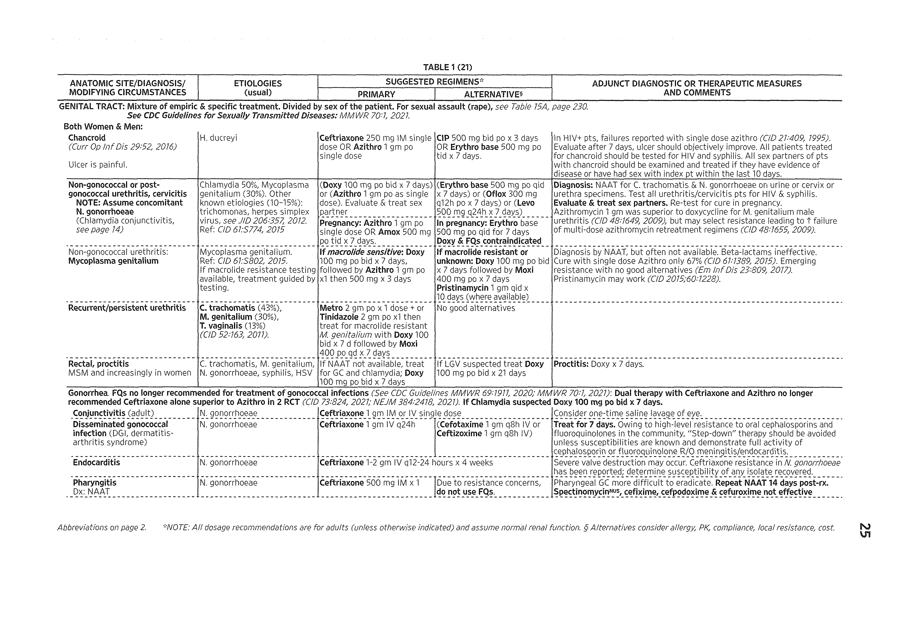
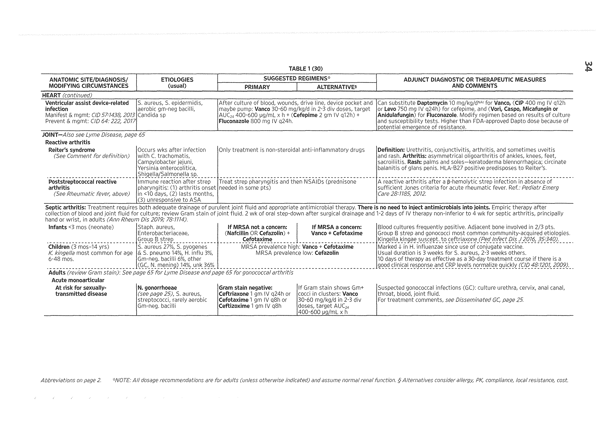
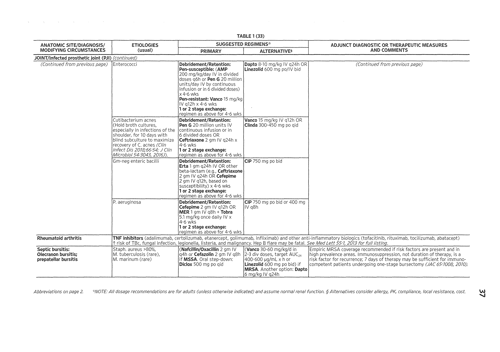

# The_Sanford_Guide_to_Antimicrobial_Therapy

## Page 1

00TABLE 1 (14)

ANATOMIC SITE/DIAGNOSIS/ MODIFYING CIRCUMSTANCES

ETIOLOGIES (usual)

SUGGESTED REGIMENS’-ADJUNCT DIAGNOSTIC OR THERAPEUTIC MEASURES AND COMMENTSPRIMARY | ALTERNATIVES

FOOT

"Diabetic foot"—Two thirds of patients have triad of neuropathy, deformity and pressure-induced trauma. IDSA Guidelines CID 54:e132, 2012.

Ulcer without inflammationColonizing skin floraNo antibacterial therapy.General:Mild infectionS. aureus (assume MRSA),S. agalactiae (Gp 8), S. pyogenes predominate

Oral therapy:(Amox-clav extended release 2000/125 po bid + TMP-SMX- DS 1-2 tabs po bid) or [(CIP 750 mg po bid or Levo 750 mg po q24h or Moxi 400 mg po q24h) + (Linezolid 600 mg po bid)]

1. Glucose control, eliminate pressure on ulcer2. Assess for peripheral vascular disease3. Caution in use of TMP-SMX in patients with diabetes, as many have risk factors for hyperkalemia (e.g., advanced age, reduced renal function, concomitant medications).4. Improved outcomes in healing of diabetic foot ulcer with negative- pressure wound therapy (See Curr Opin Infect Dis 29445, 2016 for review).Principles of empiric antibacterial therapy:

1. Obtain culture; cover for MRSA in moderate, more severe infections pending culture data, local epidemiology.2. Severe limb and/or life-threatening infections require initial parenteral therapy with predictable activity vs. Gm-positive cocci including MRSA, coliforms & other aerobic Gm-neg. rods, & anaerobic Gm-neg. bacilli. Other alternatives exist & may be appropriate for individual patients.3. Risk of associated osteomyelitis is increased if ulcer area >2 cm , positive probe to bone (CID 2016,63:944), ESR >70 and abnormal plain x-ray. MRI is best imaging modality.

2

Moderate infection.Osteomyelitis See Comment.

As above, plus coliforms possible

Oral: As aboveParenteral therapy [based on prevailing susceptibilities]: (Amp-sulb 3 gm IV q6h or Erta 1 gm IV q24h) + Vanco 15-20 mg/kg IV q8-12h to achieve preferred target AUC24 400-600 pg/mL x hr until MRSA is excluded.

Dosages in footnotes1'Extensive local inflammation plus systemic toxicity.

As above, plus anaerobic bacteria. Role of enterococci unclear.

Parenteral therapy: Vanco 15-20 mg/kg IV q8-12h to achieve preferred target AUC24 400-600 pg/mL x hr + Pip-tazo 3.375 gm IV q6h (or 4.5 gm IV q8h or 4-hour infusion of 3.375 gm qSh) ORVanco as above + (IMP 0.5 gm IV q6h or MER 1 gm IV q8h) Dosages in footnote*Assess for arterial insufficiency!

Onychomycosis: See Table 11, page 148, fungal infectionsPuncture woundSee J Am Podiatr Med Assoc. 2020 Nov 2;20-206.

P. aeruginosa, S. aureus, Strept

Cleanse. Tetanus booster. Observe.See Osteomyelitis, page 5.1-2% evolves to osteo.

GALLBLADDER

Cholecystitis, cholangitis, biliary sepsis, or common duct obstruc­tion (partial: 2n<1 to tumor, stones, stricture).

Enterobacteriaceae 68%, enterococci 14%, bacteroides 10%, Clostridium sp. 7%, rarely Candida

(Pip-tazo or ERTA) I (P Ceph 3*  + Metro)If life-threatening: or (Aztreonam* + Metro)IMP or MER or DORI |or (CIP* + Metro) or MoxiDosages in footnote** Add Vanco for empiric activity vs. enterococci

• Establish adequate biliary drainage, surgical, percutaneous or ERCP- placed stent, in more severely ill patients. No benefit to continuation of antibiotics after surgery in pts with acute calculous cholecystitis (JAMA 3312--145, 2014).• Increasing EQ resistant £ co// limits utility of EQ regimens for empiric therapy. Choice should be guided by local susceptibility profiles.• Avoid Amp-sulb due to high levels of resistance among £ coli isolates.

4 Vanco 15-20 mg/kg IV q8-12h to achieve preferred target AUC24 level of 400-600 pg/mL x hr, Parenteral p-lactam/₽-lactamase inhibitors; Amp-sulb 3 gm IV q6h, Pip-tazo 3.375 gm IV q6h or 4.5 gm IV q8h or 4 hr infusion of 3.375 gm q8h; carbapenems: Doripenem 500 mg (1-hr infusion) q8h, ERTA 1 gm IV q24h, IMP 0.5 gm IV q6h, MER1 gm IV q8h, Dapto 6 mg per kg IV q24h, Linezolid 600 mg IV q12h, Aztreonam 2 gm IV q8h. CIP 400 mg IV q12h, Levo 750 mg IV q24h, Moxi 400 mg IV q24h, Metro 1 gm IV loading dose & then 0.5 gm IV q6h or 1 gm IV q12h.Abbreviations on page 2. *NOTE: AH dosage recommendations are for adults (unless otherwise indicated) and assume normal renal function. § Alternatives consider allergy, PK, compliance, local resistance, cost.

## Page 2

TABLE 1 (15)

ANATOMIC SITE/DIAGNOSIS/ MODIFYING CIRCUMSTANCES

ETIOLOGIES (usual)

SUGGESTED REGIMENS*ADJUNCT DIAGNOSTIC OR THERAPEUTIC MEASURES AND COMMENTSPRIMARYALTERNATIVES

GASTROINTESTINAL

Gastroenteritis—Empiric Therapy (laboratory studies not performed or culture, microscopy, toxin results NOT AVAILABLE) NEJM370:16,2014-, IDSA Guideline (Diarrhea): СЮ 2017,65:1963 & e45.

Premature infant with necrotizing enterocolitis

Associated with intestinal flora

Treatment should cover broad range of intestinal bacteria using drugs appropriate to age and local susceptibility patterns, rationale as in diverticulitis/peritonitis, page 24.

Pneumatosis intestinalis, if present on x-ray confirms diagnosis. Bacteremia-peritonitis in 30-50%. If Staph, epidermidis isolated, add vanco (IV). For review and general management, see NEJM 364-255, 2011.Mild diarrhea1-2 unformed stools per day

Bacterial (see Severe, below), viral (norovirus), parasitic.Viral usually causes mild to moderate disease.For traveler's diarrhea, see page 22

Fluids only + lactose-free diet, avoid caffeineRehydration: For po fluid replacement, see Cholera, page 21.Antimotility (Do not use if fever, bloody stools, or suspicion of HUS): Loperamide (Imodium) 4 mg po, then 2 mg after each loose stool to max. of 16 mg per day. Bismuth subsalicylate (Pepto-Bismol) 2 tablets (262 mg) po qid.Hemolytic uremic syndrome (HUS): Risk in children infected with E. coli 0157:H7 is 8-10%. Early treatment with TMP-SMX or FQs t risk of HUS.Norovirus: Etiology of over 90% of non-bacterial diarrhea (+ nausea/ vomiting). Lasts 12-60 hrs. Hydrate. No effective antiviral.Other potential etiologies (parasitic): Cryptosporidia—no treatment in immunocompetent host. Cyclospora—usually chronic diarrhea, responds to TMP-SMX (see Table 13A).Klebsiella oxytoca identified as cause of antibiotic-associated hemorrhagic colitis (cytotoxin positfoefo NEJM 355-2418, 2006.

Moderate diarrhea3-5 unformed stools per day

Antimotility agents (see Comments) + fluids

Severe diarrhea (>6 unformed stools/day, &/or temp >101°F, tenesmus, blood, or fecal leukocytes). NOTE: Severe afebrile bloody diarrhea should T suspicion of Shiga-toxin E. coli O157:H7 & others (MMWR 58 (RR-12):1, 2009).

Shigella, salmonella, C. jejuni, Shiga toxin + E. coli, toxin-positive C. difficile, Klebsiella oxytoca, E. histolytica, Vibrio sp.For typhoid fever, see page 68

(CIP 500 mg po q12h or Levo 500 mg q24h) x 3-5 days Azithro 1000 mg po once or 500 mg q 24h x 3 days preferred for Campylobacter and disease acquired in Southeast Asia.If C. difficile is suspected (e.g., recent antibiotic use) add Fidaxomicin 200 bid x 10 days or Vanco 125 mg po qid x 10-14 days. Metro 500 mg po tid no longer treatment of choice for C. difficile but may be effective in milder cases.

TMP-SMX-DS po bid x 3-5 days.Campylobacter resistance to TMP-SMX is common in the tropics.C. diff recommendations changed: See CID 73:755, 2021 or Med Let 63:137, 2021

If recent antibiotic therapy (C. difficile toxin colitis possible) promptly test stool for C. diff. toxinGastroenteritis—Specific Therapy (

If culture negative, probablyNorovirus (Norwalk) other virus (EID 17:1381, 2011) - seeNorovirus, page 200

NOTE: WBC >15,000 suggestive of C. difficile in hospitalized patient.

esults of culture, microscopy, toxin assay AVAILABLE) Ref.: NEJM 370-'1532, 2014; IDSA infectious diarrhea guideline (CID 2017,65:1963).Aeromonas/Plesiomonas IciP 750 mg po bid x 3 days. ITMP-SMX DS tab 1 po bid lAeromonas ref: Eur J Clin Microbiol ID. 36:1393, 2017.

1 |x3days 1Amebiasis (Entamoeba histolytica, Cyclospora, Cryptosporidia and Giardia), see Table 13ACampylobacter jejuniHistory of fever in 53-83%. Self-limited diarrhea in normal host.

Azithro 500 mg po q24h x 3 days OR 1000 mg po one dose

Erythro stearate 500 mg po qid x 5 days or CIP 500 mg po bid (CIP resistance increasing) (CID 2017;65:1624).

Post-Campylobacter Guillain-Barre; assoc. 15% of cases. Reactive arthritis another potential sequelae. See Traveler's diarrhea, page 22.

Campylobacter fetusDiarrhea uncommon.More systemic disease in debilitated hosts.Don't treat immunocompetent.

IMP 500 mg IV q 6 orMER1 gm IV q8

AMP 100 mg/kg/day IV div q6h or Gent 5 mg/kg IV q 24. Erta 1 gm q24

Draw blood cultures. In bacteremic pts, FQ resistance common in C. fetus. Meropenem inhibits C. fetus at low concentrations in vitro. Clinical review: CID 58:1579, 2014.

Abbreviations on page 2. -’NOTE: AH dosage recommendations are for adults (unless otherwise indicated) and assume norma! renal function. § Alternatives consider allergy, PK, compliance, local resistance, cost.

## Page 3

ОTABLE 1 (16)

ANATOMIC SITE/DIAGNOSIS/ETIOLOGIESSUGGESTED REGIMENS"ADJUNCT DIAGNOSTIC OR THERAPEUTIC MEASURESMODIFYING CIRCUMSTANCES(usual)PRIMARY| ALTERNATIVESAND COMMENTS

Abbreviations on page 2. -NOTE: AH dosage recommendations are for adults (unless otherwise indicated) and assume normal renal function. § Alternatives consider allergy, PK, compliance, local resistance, cost.

GASTROINTESTINAL/Gastroenteritis—Specific Therapy (results of culture, microscopy, toxin assay AVAILABLE) (continued)

Differential diagnosis of toxin­producing diarrhea:

• C difficile• Klebsiella oxytoca• S. aureus• Shiga toxin producing

£ coH (STEC)• Enterotoxigenic B. fragiHs

IDSA Guidelines (C. diff):CID 2018,66:987

C. difficile toxin positive antibiotic-associated colitis. Probiotics: Cochrane review found moderate quality evidence the probiotics prevents C. diff. associated diarrhea (Cochrane Database Syst Rev. 2017 Dec 19;12:CD006095).po meds okay; WBC <15,000; no increase in serum creatinine.

Fidaxomicin 200 mg po bid x 10 days or Vanco 125 mg po qid x 10-14 days

See CommentD/C antibiotic if possible; avoid antimotility agents, hydration, enteric isolation.Recent review suggests antimotility agents can be used cautiously in certain pts with mild disease who are receiving rx (CID 48:598, 2009). Relapse in 10-20%. Note: Metro 500 mg tid no longer recommended as first-line therapy.po meds okay; Sicker; WBC >15,000; >50% increase in baseline creatinine

Fidaxomicin 200 mg po bid x 10 days or Vanco 125 mg po qid x 10 days.For oral use of IV Vanco, see Table 10A, page 124.

Fidaxomicin 200 mg po bid x 10 days

Vanco superior to metro in sicker pts. Relapse in 10-20%. Fidaxomicin had lower rate of recurrence than Vanco for diarrhea with non-NAP1 strains (N Eng! J Med 364:422, 2011). Bezlotoxumab 1 dose IV + standard rx reduced relapse rate 11-14% (NEJM 2017, 376:305).

CID 73M55, 2021;Med Lett 63:137, 2021

Post-treatment relapse.Ideally use a regimen not used previously.

Fidaxomicin 200 mg po bid x 10 days or Vanco 125 mg po qid x 10-14 days, then immediately start taper (See Comments)

Fidaxomicin 200 mg po bid x 10 days then 200 mg po qod x 20 days

Vanco taper (all doses 125 mg po): week 1 - tid, week 2 - bid week 3 - q24h week 4 - q48h, week 5 - q72h. Ref: CID 2017;653624.Fecal transplant efficacious but safety warnings: transmission of MDR bacteria, COVID-19 (CID 73:e1621, 2021). Bezlotoxumab, anti C. diff toxin В approved and recommended in 2021 IDSA focused guidelines, decreases recurrence 10% but very expensive CID 68:699, 2019. If Metro used for initial therapy can use standard 10-day course of Vanco.Post-op ileus; severe disease with toxic megacolon (CID 61:934, 2015).

Metro 500 mg IV q8h + Vanco 500 mg q6h via nasogastric tube (or naso-small bowel tube) + vanco 500 mg q6h retention enema. See comment for dosage. No data on efficacy of Fidaxomicin in severe life-threatening disease.

For vanco instillation into bowel, add 500 mg vanco to 500 mL of saline. NOTE: IV vanco not effective. Indications for colectomy, see ICHE31:431,2010.

Enterohemorrhagic E. coli (EHEC): 0157:H7 & 0104:H4 & others. Hemolytic uremic syndrome complicates 6-9% (see Comment)

Treatment:1. If afebrile, bloody diarrhea:

a. Hydrationb. Avoid antiperistaltic drugsc. No antibiotics2. If febrile, bloody diarrhea, risk of bacteremia: Azithro 500 mg IV/po once daily x 3 d

Risk of antibiotic therapy is HUS due to Shiga toxin production.HUS = renal failure, hemolytic anemia, thrombocytopenia. Restrict antibiotics to patients with increased risk of, or documentation of, bacteremia due to EHEC. Ref: CID 623251 & 1259, 2016.

Klebsiella oxytoca— antibiotic- associated diarrhea

Responds to stopping antibioticSuggested that stopping NSAIDs helps. Ref: NEJM355:2418, 2006.

Listeria monocytogenesUsually self-limited. Value of oral antibiotics (e.g., AMP or TMP-SMX) unknown, but their use might be reasonable in populations at risk for serious listeria infections.

Cause of food-associated febrile gastroenteritis. Not detected in standard stool cultures. Populations at T risk of severe systemic disease: pregnant women, neonates, the elderly, and immunocompromised hosts.Salmonella, non-typhi—For typhoid (enteric) fever,

If asymptomatic or illness mild, antimicrobial therapy not indicated. Treat if: age <1 yr or >50 yrs, immunocompromised, vascular grafts or prosthetic joints, bacteremic, hemoglobinopathy, or hospitalized with fever and severe diarrhea (see typhoid fever, page 68).

(Continued on next page)

see page 68Fever in 71-91%, history of bloody stools in 34%

(CIP 500 mg bid) or (Levo 500 mg q24h) x 7-10 days (14 days if immunocompromised). If infection acquired in Asia, avoid FQ and treat with Azithro or Ceftriaxone.

Azithro 500 mg po once daily x 7 days (14 days if immunocompromised).

T resistance to TMP-SMX and chloro. Ceftriaxone, cefotaxime usually active if IV therapy required (see footnote7 on page 28, for dosage). CIP: susceptible strains, MIC <0.06 pg/mL (CUn Infect Dis 553107, 2012). Increasing resistance to FQ, particularly in Asia.Primary treatment of enteritis is fluid and electrolyte replacement.

## Page 4

TABLE 1 (17)

ANATOMIC SITE/DIAGNOSfS/ MODIFYING CIRCUMSTANCES

ETIOLOGIES (usual)

SUGGESTED REGIMENS-ADJUNCT DIAGNOSTIC OR THERAPEUTIC MEASURES AND COMMENTSPRIMARYALTERNATIVESGASTROINTESTINAL/Gastroenteritis—Specific Therapy (results of culture, microscopy, toxin assay AVAILABLE) (continued)

(Continued from previous page)Shigella

Fever in 58%, history of bloody stools 51%

CIP 750 mg po q12-24h or lAzithro 500 mg po once daily Levo 500 mg q24h x 3 days |x3daysPockets of resistance (see Comment)Peds doses: Azithro 10 mg/kg/day once daily x 3 days.For severe disease, Ceftriaxone 50-75 mg/kg per dayx 2-5 days. CIP suspension 10 mg/kg bid x 5 days.

Immunocompromised children & adults: Treat for 7-10 days. CDC recommends avoiding CIP if MIC >0.12 pg/mL (CDC Health Alert Network, Apr 18, 2017). Pockets of resistance reported, especially to FQ in Asia. Resistance more common in international travelers and immunocompromised; clusters of resistance to FQ, Azithro, Ceftriaxone in MSM. For most individuals, treatment not necessary. May be associated with traveler's diarrhea, where one dose of treatment may be sufficient.Spirochetosis (Brachyspira pilosicoli)

Benefit of treatment unclear. Susceptible to Metro, Ceftriaxone, and Moxi.

Anaerobic intestinal spirochete that colonizes colon of domestic & wild animals plus humans. Called enigmatic disease due to uncertain status (Digest Dis & Sci 58:202, 2013).Vibrio cholerae (toxigenic - 01 & 039)Treatment decreases duration of disease, volume losses, & duration of excretion

Primary therapy is rehydration. Select antibiotics based on susceptibility of locally prevailing isolates. Options include: Doxy 300 mg po single dose, Azithro 1 gm po single dose, Tetra 500 mg po qid x 3 days, Erythro 500 mg po qid x 3 days.

Pregnancy:Azithro 1 gm po single dose OR Erythro 500 mg po qid x 3 daysPeds: Azithro 20 mg/kg po as single dose; for other age­specific alternatives, see CDC website http:// www.cdc.gov/haiticholera/ hep goingtohaiti.htm

Antimicrobial therapy shortens duration of illness, but rehydration is paramount. When IV hydration is needed, use Ringer's lactate. Switch to po repletion with Oral Rehydration Salts (ORS) as soon as able to take oral fluids. ORS are commercially available for reconstitution in potable water. If not available, WHO suggests a substitute can be made by dissolving y2 teaspoon salt and 6 level teaspoons of sugar per liter of potable water (h ttp://www. who. in t/cho/era/technical/en/).

Vibrio parahaemolyticus, V. mimicus, V. fluvialis

Antimicrobial rx does not shorten course. Hydration.Shellfish exposure common. Treat severe disease: FQ, Doxy, 3rd gen Ceph

Vibrio vulnificusUsual presentation is skin lesions & bacteremia; life­threatening

Adult: (Doxy or Minocycline 100 mg IV/po bid) + (Ceftriaxone 2 gm IV once daily or Ceftaz 1 gm IV q8h). Peds: Doxy 4.4 mg/kg/day div bid (max 200 mg/day). Alternatives: Levo or CIP. Ref: Epidemiol Infect. 142:878, 2014.

Yersinia enterocoliticaFever in 68%, bloody stools in 26%

No treatment unless severe. If severe, Doxy 100 mg IV bid + (Tobra or Gent 5 mg/kg per day once q24h). TMP-SMX or FQs are alternatives.

Mesenteric adenitis pain can mimic acute appendicitis. Lab diagnosis difficult: requires "cold enrichment" and/or yersinia selective agar. Desferrioxamine therapy increases severity, discontinue if pt on it. Iron overload states predispose to yersinia.Gastroenteritis—Specific Risk Grou

Anoreceptive intercourse

Proctitis (distal 15 cm only)

ps-Empiric Therapy

Herpes viruses, gonococci, chlamydia, syphilis. See Genital Tract, page 25ColitisShigella, salmonella, Campylobacter, E. histolytica (see Table 13A)See specific Gtpathogens, Gastroenteritis, above.HIV-1 infected (AIDS):>10 days diarrhea

G. lambliaAcid fast: Cryptosporidium parvum or hominis, Cyclospora cayetanensisOther: Cystisospora belli, microsporidia (Enterocytozoon bieneusi, Septata intestinalis)

See Table 13A

Neutropenic enterocolitis or "typhlitis"

(CID 56:711, 2013) (World JGastroenterol 23:42, 2017)

Mucosal invasion byClostridium septicum and others. Occasionally caused by C. sordellii or P. aeruginosa

Bowel rest and Pip-tazo4.5 gm IV q6h or IMP 500 mgIV q6h or MER 2 gm IV q8h

Cefepime 2 gm IV q8h + Metro 500 mg IV q8h

Need surgical consult. Surgical resection controversial but may be necessary. NOTE: Resistance of Clostridia to clindamycin reported. Pip-tazo, IMP, MER, DORI should cover most pathogens.

Abbreviations on page 2. "NOTE: AH dosage recommendations are for adults (unless otherwise indicated) and assume normal renal function. § Alternatives consider allergy, PK, compliance, local resistance, cost.

## Page 5

TABLE 1 (18)

ANATOMIC SITE/DIAGNOSIS/ MODIFYING CIRCUMSTANCES

ETIOLOGIES (usual)

SUGGESTED REGIMENS*PRIMARY | ALTERNATIVES

ADJUNCT DIAGNOSTIC OR THERAPEUTIC MEASURES AND COMMENTS

GASTROINTESTINAL/Gastroenteritis—Specific Risk Groups-Empiric Therapy (continued)

Traveler's diarrhea, self- medication. Patient often afebrile

Acute: 60% due to diarrheagenic E. coli; shigella, salmonella, or Campylobacter. C. difficile, amebiasis (see Table 13A).If chronic: cyclospora, crypto­sporidia, giardia, isospora

Adult: Azithro 1000 mg po once or 500 mg po q24h for 3 daysCIP 500 mg po bid x 3 days ORLevo 500 mg po q24h for 1-3 days OROflox 300 mg po bid for 3 days ORRifaximin 200 mg po tid for 3 days ORRifamycin SV 2 tabs bid x 3 daysPeds: Azithro 10 mg/kg/day as a single dose for 3 days orCeftriaxone 50 mg/kg/day as single dose for 3 days.Avoid FQs.Pregnancy: Use Azithro. Avoid FQs.For loperamide, see Comment.

Antimotility agent: For non-pregnant adults with no fever or blood in stool, add loperamide 4 mg po x 1, then 2 mg po after each loose stool to a maximum of 16 mg per day.Rifaximin approved only for ages 12 and older. Works only for diarrhea due to non-invasive E. coli; do not use if fever or bloody stool.Rifamycin SB: adult only; for E. coli. Do not use if fever or bloody diarrhea. Ref: NEJM 3618560, 2009; C/in Micro inf21744, 2015.NOTE: Self-treatment with FQs associated with acquisition of resistant Gm-neg bacilli (CID 60:837, 847, 872, 2015). Increasing resistance of Campylobacter to FQ, particularly in Asia. Azithro now first line choice.

Prevention of Traveler's diarrhea

Preventative treatment of traveler's diarrhea is not routinely indicated.Preferred approach in the current recommendation is Azithro 1000 mg once + Imodium with first loose stool.Consider CIP 500 mg po daily for short trips with vital missions that cannot be disrupted and in immunocompromised patients and those with HIV and CD4 <200. As an alternative during the first 3 weeks (if activities are essential): Rifaximin 200 mg po bid, Ann Intern Med 142:805, 2005; Ann intern Med 142-’861, 2005.Such prophylactic use is not an FDA approved indication.

5 Bismuth preparations: (1) In U.S., bismuth subsalicylate (Pepto-Bismol) 262 mg tabs; adult dose for helicobacter is 2 tabs (524 mg) qid. (2) Outside U.S., colloidal bismuth subcitrate (De-Nol) 120 mg chewable tablets; dose is 1 tablet qid. In the U.S., bismuth subcitrate is available in combination cap only (Pylera: each cap contains bismuth subcitrate 140 mg + Metro 125 mg + Tetracycline 125 mg), given as 3 caps po 4x daily for 10 days together with a twice daily PPI.Abbreviations on page 2. -NOTE: All dosage recommendations are for adults (unless otherwise indicated) and assume normal renal function. § Alternatives consider allergy, PK, compliance, local resistance, cost.

Gastrointestinal Infections by Anatomic Site: Esophagus to Rectum

EsophagitisCandida albicans, HSV, CMVSee Table 11A and Table 14A.Duodenal/Gastric ulcer; gastric cancer, MALT lymphomas (not 2°NSAIDs)Comparative effectiveness & tolerance of treatment Review: NEJM 3808158, 2018

Helicobacter pyloriPrevalence of pre-treatment resistance increasing, especially clarithro (AAC 2017,61:e02530-16).Ask about previous antibiotics and try to avoid prior antibiotic given.Where available treatment should be guided by susceptibility testing or PCR typing of Clarith R; all H. pylori + should be treated. Test & treat without EGD if age <45 yrs.

Quadruple therapy: (Bismuth subsalicylate 2 tabs qid + Tetra 500 mg qid + Metro 500 mg tid + PPI) x 14 days.For doses, see footnote5 & Comments

(PPI + Amox 1000 mg bid + metro 500 mg bid + Clarithro 500 mg bid) x 14 days.Newer combination treatments: Talicia and PyleraIn Japan: combination of Vonoprazen + Clarithro (Inter Med 59853, 2020)

Comment: Any one of these proton pump inhibitors (PPI) may be used: omeprazole 20 mg bid, Lansoprazole 30 mg bid, esomeprazole 20 mg bid, pantoprazole 40 mg bid, rabeprazole 20 mg bid. In many locations, 20% failure rates with previously recommended triple regimens (PPI + Amox + Clarithro). Exercise caution regarding potential interactions with other drugs, contraindications in pregnancy and warnings for other special populations. Dx: Stool antigen—Monoclonal EIA >90% sens. & 92% specific. Other tests: if endoscoped, rapid urease &/or histology &/or culture; serology less sens & spec; urea breath test, but some office-based tests underperform. Testing ref: BMJ 344:44, 2012.Test of cure: Repeat stool antigen and/or urea breath test >8 wks post-treatment.Treatment outcome: Failure rate of triple therapy 20% due to clarithro resistance.

Small intestine:Whipple's disease

(NEJM 356:55, 2007;Ln!D 8879, 2008)Treatment: JAC 69-219, 2014. See Infective endocarditis, culture-negative, page 32.

Tropheryma whipplei(Doxy 100 mg po bid + Hydroxychloroquine 200 mg po tid) x 1 year, then Doxy 100 mg po bid for life (Peds dose, see Comment)

Immune reconstitution inflammatory response (IRIS) reactions occur: Thalidomide therapy may be better than steroids for IRIS reaction (J Infect 6079, 2010)

In vitro susceptibility testing and collected clinical experience (JAC 69219, 2014). In vitro resistance to TMP-SMX plus frequent clinical failures & relapses. Frequent in vitro resistance to carbapenems. Ceftriaxone demonstrates high MICs against intracellular organisms in vitro (AAC48:747, 2004). Peds: Doxy considered safe regardless of age for duration of 21 days or less: 4.4 mg/kg div bid (AAP Redbook 2018).

## Page 6

TABLE 1 (19)

ANATOMIC SITE/DIAGNOSIS/ETIOLOGIESSUGGESTED REGIMENS*ADJUNCT DIAGNOSTIC OR THERAPEUTIC MEASURESMODIFYING CIRCUMSTANCES(usual)PRIMARYALTERNATIVESAND COMMENTS

GASTROINTESTINAL/Gastrointestinal Infections by Anatomic Site: Esophagus to Rectum (continued)

Appendicitis, acuteAerobic & anaerobic gram­negative bacilli

Uncomplicated, no apparent pc

If decision is not to perform appendectomy but treat with antibiotics. CT scan shows no evidence of appendicolith, perforation or abscess. Suggested antibacterial therapy:Adult: Erta 1 gm IV q24h Pediatric: Erta 15 mg/kg IV bid (max daily 1 gm)

Perforation, peritonitis, shockEmergency surgery: MER 1 gm + Metro 500 mg IV q8h (See C

rforation

Surgery:Adult: Ceftriaxone 2 gm IV q24h + Metro 500 mg IV q8h Pediatric: Ceftriaxone 75 mg/kg IV q24h (max daily 2 gm) + Metro 10 mg/kg IV q8h (max dose 500 mg; max 1500 mg/day).With this approach, most patients were able to be discharged with no antibiotic therapy within a mean (+SD) of 23.5 (20) hrs (J Ped Surgery 2015:50:1566).Can further streamline: Ceftriaxone 50 mg/kg/dose every 24hrs (max 2 gm/day) + Metro 30 mg/kg/ dose q24h (max 1500 mg/dose if > to 80 kg or max of 1000 mg / dose if < 80 kg). Efficacious and cost-saving (J Ped Infect Dis 2017;6:57-64).PK/PD justification of once daily metronidazole; studies in human volunteers: Antimicrob Agents Chemother 2004;48-‘4597

IV q8h or CIP 400 mg IV q8h omments for other options)

Goal: Activity vs. both aerobic & anaerobic bacteria. Active vs; anaerobes: Metro. Active vs. aerobic gram neg bacilli: AG, P Ceph 2/3/4, Aztreonam, Cip, Levo, Ceftaz-avi. Active vs. both: Pip-tazo, Amox-clav, carbapenems, eravacydine, Moxi, Delaflox. Refs: Non-operative rx of uncomplicated appendicitis (J Trauma Acute Care Surg 86:722, 2019; JAMA 32:1245 & 1259, 2018). Note: No firm guidance on dose for Metro: range 500 mg q6-8h to 30 mg/kg IV once daily (max 1500 mg).Note: Amox-clav may reduce FQ harm without impacting efficacy (Ann Intern Med 174737, 2021)

Abbreviations on page 2. '-NOTE: AH dosage recommendations are for adults (unless otherwise indicated) and assume normal renal function. § Alternatives consider allergy, PK, compliance, local resistance, cost.w

## Page 7

TABLE 1 (20)

ANATOMIC SITE/DIAGNOSIS/ETIOLOGIESSUGGESTED REGIMENS"ADJUNCT DIAGNOSTIC OR THERAPEUTIC MEASURESMODIFYING CIRCUMSTANCES(usual)PRIMARY| ALTERNATIVESAND COMMENTS

GASTROINTESTINAL/Gastrointestinal Infections by Anatomic Site: Esophagus to Rectum (continued)

Diverticulitis, perirectal abscess, peritonitis

Also see Peritonitis, page 51

NEJM 2018)379:1635

Enterobacteriaceae, occasionally P. aeruginosa, Bacteroides sp., enterococci

Outpatient rx—mild diverticuli Amox-clav 875/125 mg po bid If beta-lactam allergic or intolerant: [(TMP-SMX-DS tab po bid) or (CIP 750 mg po bid or Levo 750 mg po q24h)] + Metro 500 mg q6h.Duration of treatment varies based on clinical response. Usually Treat for 7-10 days. Can customize duration by trending serum procalcitonin serum levels. Treat until PCT level is <0.5 ng/mlInpatient, mild-moderate disesSurgical consultation advisablePip-tazo 4.5 gm IV over 30 min as a loading dose. Then, 4 hrs later, start 3.375 gm IV infused over 4 hrs. Repeat 4 hr infusion q8hErta 1 gm IV q24hMoxi 400 mg IV q24h (resistance of Bacteroides group^maybejncreasing) Severe life-threatening diseas IMP 500 mg IV q6h or MER 1 gm IV q8h or Dori 500 mg q8h (1-hr infusion).

For Ceftolo-tazo & Ceftaz-avi dosing, see Peritonitis, page 51.Severe penicillin/cephalosporir q6h to q8h) + [Metro (500 mg [(CIP 400 mg IV q12h) or (Lev<

tis, drained perirectal abscess:

Moxi 400 mg po q24h Duration varies with clinical response. Usually 7-10 days

se[(CIP 400 mg IV q12h) or (Levo 750 mg IV q24h)] + (Metro 500 mg IV q6h or 1 gm IV q12h)Moxi 400 mg IV q24hCefepime 2 gm IV q12h + Metro 1 gm IV q12hAmox-clav 1000 mg-200 mg IV q8h (non-US)

a, ICU patient:

AMP + Metro + (CIP 400 mg IV q12h or Levo 750 mg IV q24h) OR [AMP 2 gm IV q6h + Metro 500 mg IV q6h +Aminoglycoside6(see Table IOC, page 134))

allergy: (Aztreonam 2 gm IVIV q6h) or (1 gm IVq12h)]OR 750 mg IV q24h) + Metro],

Must "cover" both Gm-neg. aerobic & Gm-neg. anaerobic bacteria. Drugs active only vs. anaerobic Gm-neg. bacilli: clinda, metro. Drugs active only vs. aerobic Gm-neg. bacilli: APAG6, P Ceph 2/3/4 (see Table ЮА, page 118), aztreonam, CIP, Levo. Drugs active vs. both aerobic/anaerobic Gm-neg. bacteria: cefoxitin, cefotetan, TC-CL, Pip-tazo, Amp-sulb, ERTA, DORI, IMP, MER, Moxi, & tigecycline.Resistance (B. fragilis): Metro, Pip-tazo rare. Resistance to FQ increased in enteric bacteria, particularly if any FQ used recently.Concomitant surgical management important, esp. with moderate-severe disease. Role of enterococci remains debatable. Probably pathogenic in infections of biliary tract. Probably need drugs active vs. enterococci in pts with valvular heart disease.Tigecycline: Black Box Warning: All cause mortality higher in pts treated with tigecycline (2.5%) than comparators (1.8%) in meta-analysis of clinical trials.Note: Amox-clav may reduce FQ harm without impacting efficacy (Ann Intern Med 174:737, 2021)

6 Aminoglycoside = antipseudomonal aminoglycosidic aminoglycoside, e.g., Amikacin, Gentamicin, Tobramycin, PlazomicinAbbreviations on page 2. '-NOTE: AH dosage recommendations are for adults (unless otherwise indicated) and assume normal renal function. § Alternatives consider allergy, PK, compliance, local resistance, cost.

## Page 8

TABLE 1 (21)

ANATOMIC SITE/DIAGNOSIS/ MODIFYING CIRCUMSTANCES

ETIOLOGIES (usual)

SUGGESTED REGIMENS*ADJUNCT DIAGNOSTIC OR THERAPEUTIC MEASURES AND COMMENTSPRIMARYALTERNATIVESGENITAL TRACT: Mixture of empiric See CDC GuidelineBoth Women & Men:

Chancroid(Curr Op Inf Dis 29:52, 2016)

Ulcer is painful.

& specific treatment. Divided b s for Sexually Transmitted Dise

H. ducreyi

у sex of the patient. For sexua ases: MMWR 70:1, 2021.

Ceftriaxone 250 mg IM single dose OR Azithro 1 gm po single dose

assault (rape), see Table 15A,

CiP 500 mg bid po x 3 days OR Erythro base 500 mg po tid x 7 days.

page 230.

In HIV+ pts, failures reported with single dose azithro (CID 21-'409, 1995). Evaluate after 7 days, ulcer should objectively improve. All patients treated for chancroid should be tested for HIV and syphilis. All sex partners of pts with chancroid should be examined and treated if they have evidence of disease or have had sex with index pt within the last 10 days.Non-gonococcal or post- gonococcal urethritis, cervicitis

NOTE: Assume concomitant N. gonorrhoeas(Chlamydia conjunctivitis, see page 14)

Chlamydia 50%, Mycoplasma genitalium (30%). Other known etiologies (10-15%); trichomonas, herpes simplex virus, see J!D 206:357, 2012. Ref: CID 61:5774, 2015

(Doxy 100 mg po bid x 7 days) or (Azithro 1 gm po as single dose). Evaluate & treat sex partner

(Erythro base 500 mg po qid x 7 days) or (Oflox 300 mg q12h po x 7 days) or (Levo 500 mg q24h x 7 days)

Diagnosis: NAAT for C. trachomatis & N. gonorrhoeae on urine or cervix or urethra specimens. Test all urethritis/cervicitis pts for HIV & syphilis.Evaluate & treat sex partners. Re-test for cure in pregnancy.Azithromycin 1 gm was superior to doxycycline for M. genitalium male urethritis (CID 485649, 2009), but may select resistance leading to t failure of multi-dose azithromycin retreatment regimens (CID 48:1655, 2009).Pregnancy: Azithro 1 gm po single dose OR Amox 500 mg po tid x 7 days.

In pregnancy: Erythro base 500 mg po qid for 7 days Doxy & FQs contraindicatedNon-gonococcal urethritis:Mycoplasma genitalium

Mycoplasma genitalium.Ref: CID 61:5802, 2015.If macrolide resistance testing available, treatment guided by testing.

\f macrolide sensitive: Doxy 100 mg po bid x 7 days, followed by Azithro 1 gm po x1 then 500 mg x 3 days

If macrolide resistant or unknown: Doxy 100 mg po bid x 7 days followed by Moxi 400 mg po x 7 days Pristinamycin 1 gm qid x 10 days (where available)

Diagnosis by NAAT, but often not available. Beta-lactams ineffective. Cure with single dose Azithro only 67% (CID 61:1389, 2015). Emerging resistance with no good alternatives (Em Inf Dis 23-'8O9, 2017).Pristinamycin may work (CID 2015;60:1228).

Recurrent/persistent urethritisC. trachomatis (43%), M. genitalium (30%), T. vaginalis (13%) (CID 52:163, 2011).

Metro 2 gm po x 1 dose + or Tinidazole 2 gm po x1 then treat for macrolide resistant M. genitalium with Doxy 100 bid x 7 d followed by Moxi 400 po qd x 7 days

No good alternatives

Rectal, proctitisMSM and increasingly in women

C. trachomatis, M. genitalium, N. gonorrhoeae, syphilis, HSV

If NAAT not available, treat for GC and chlamydia; Doxy 100 mg po bid x 7 days

If LGV suspected treat Doxy 100 mg po bid x 21 days

Proctitis: Doxy x 7 days.

Gonorrhea FQs no longer recomm recommended Ceftriaxone alone s

Conjunctivitis (adult)

ended for treatment of gonococ jperior to Azithro in 2 RCT (CID

N. gonorrhoeae

cal infections (See CDC Guidelines MMWR 69:1911, 2020; MM 73:824, 2021; NEJM 384:2418, 2021). If Chlamydia suspected Ceftriaxone 1 gm IM or IV single dose

147? 700, 2021): Dual therapy with Ceftriaxone and Azithro no longer Doxy 100 mg po bid x 7 days.Consider one-time saline lavage of eye.Disseminated gonococcal infection (DGI, dermatitis­arthritis syndrome)

N. gonorrhoeaeCeftriaxone 1 gm IV q24h(Cefotaxime 1 gm q8h IV orCeftizoxime 1 gm q8h IV)

Treat for 7 days. Owing to high-level resistance to oral cephalosporins and fluoroquinolones in the community, "Step-down" therapy should be avoided unless susceptibilities are known and demonstrate full activity of cephalosporin or fluoroquinolone R/O meningitis/endocarditis.EndocarditisN. gonorrhoeaeCeftriaxone 1-2 gm IV q12-24 hours x 4 weeksSevere valve destruction may occur. Ceftriaxone resistance in N. gonorrhoeae has been reported; determine susceptibility of any isolate recovered.PharyngitisDx: NAAT

N. gonorrhoeaeCeftriaxone 500 mg IM x 1Due to resistance concerns, do not use FQs.

Pharyngeal GC more difficult to eradicate. Repeat NAAT 14 days post-rx.SpectinomycinNUS, cefixime, cefpodoxime & cefuraxime not effective

Abbreviations on page 2. '-NOTE: AH dosage recommendations are for adults (unless otherwise indicated) and assume normal renal function. § Alternatives consider allergy, PK, compliance, local resistance, cost.UT

## Page 9

NJCNTABLE 1 (22)

ANATOMIC SITE/DIAGNOSIS/ETIOLOGIESSUGGESTED REGIMENS* |ADJUNCT DIAGNOSTIC OR THERAPEUTIC MEASURESMODIFYING CIRCUMSTANCES(usual)PRIMARY| ALTERNATIVES |AND COMMENTS

GENITAL TRACT/Both Women & Men/Gonorrhea (continued)

Urethritis, cervicitis, proctitis (uncomplicated)2020 CDC Guidelines:MMWR 69:1911.Diagnosis: Nucleic acid amplifi­cation test (NAAT) on vaginal swab, urine or urethral swab MMWR 64(RR-3):1, 2015

N. gonorrhoea© (50% of pts with urethritis, cervicitis have concomitant C. trachomatis -- treat for both unless NAAT indicates single pathogen).

Ceftriaxone 500 mg IM x 1Rx failure: Ceftriaxone 1 gm IM x 1; treat partner; NAAT for test of cure 1 wk post-treatmentSevere Pen/Ceph allergy: (Gent 240 mg IM + Azithro 2 gm po x 1 dose) OR (Gemi 320 mg + Azithro 2 gm po x 1 dose) (CID 59:1083, 2014) (nausea in >20%)

Screen for syphilis.Other alternatives for GC (Test of Cure recommended one week after Rx for ALL of these approaches listed below):

• Oral cephalosporin use is no longer recommended as primary therapy owing to emergence of resistance, MMWR 61-590, 2012.• Other single-dose cephalosporins: ceftizoxime 500 mg IM, cefotaxime 500 mg IM, cefoxitin 2 gm IM + probenecid 1 gm po.

PregnancyCeftriaxone 500 mg IM xl; if Chlamydia not excluded Azithro 1 gm po x1Granuloma inguinale(Donovanosis)

Klebsiella (formerly Calymmatobacterium) granulomatis

Azithro 1 gm po q wk x 3 wks TMP-SMX one DS tablet bid x 3 wks OR Erythro 500 mg po qid x 3 wks OR C1P 750 mg po bid x 3 wks OR Doxy 100 mg po bid x 3 wks

Clinical response usually seen in 1 wk. Rx until all lesions healed, may take 4 wks. Treatment failures & recurrence seen with Doxy & TMP-SMX.Relapse can occur 6-18 months after apparently effective Rx.If improvement not evidence in first few days, some experts add Gent1 mg/kg IV q8h.Herpes simplex virusSee Table 14A, page 195Human papilloma virus (HPV)See Table 14A, page 200Lymphogranuloma venereum

Ref: CID 61:5865, 2015

Chlamydia trachomatis, serovars. L1, L2, L3

Doxy 100 mg po bid x 21 daysErythro 500 mg po qid x 21 days or Azithro 1000 mg po q wk x 3 wks (clinical data lacking)

Dx based on serology; biopsy contraindicated because sinus tracts develop. Nucleic acid ampli tests for C. trachomatis will be positive. In MSM, presents as fever, rectal ulcer, anal discharge.

Phthirus pubis (pubic lice, "crabs") & scabies

Phthirus pubis & Sarcoptes scabiei

See Table 13A, page 185

Syphilis CDC 2021 ST! guidelines

Early: primary, secondary, or latent <1 yr. Screen with treponema-specific antibody or RPR/VDRL, see JCM 50:2 & 148, 2012; CID 58:1116, 2014.

Chancre is painless.

AMWR 70:1, 2021. Diagnosis: C! T. pallidum

NOTE: Test all pts with syphilis for HIV; test all HIV patients for latent syphilis.

Screen MSM and/or HIV pts every 3-12 mos Pregnancy: screen all (JAMA 2018)320:911)

D 71 (Suppl 1):S1, 2020', treatm

Benzathine pen G (BicillinL-A) 2.4 million units IM x 1 (See Comment)

ent: JAMA 312:1905, 2014; ma

(Doxy 100 mg po bid x14 days) or (Tetra 500 mg po qid x 14 days) or (Ceftriaxone 1 gm IM/IV q24h x IQ-14 days). Follow-up mandatory.

Ceftriaxone efficacy (CID 2017)65:1683)

Doxy considered safe regardless of age for rx <21 days (AAP Redbook 2018)

nagement CID 61:S818, 2015. Overview: Lancet 389:1550, 2017.

If early or congenital syphilis, quantitative VDRL at 0, 3, 6,12 & 24 mos after rx. If 1° or 2° syphilis, VDRL should 4 2 tubes at 6 mos, 3 tubes 12 mos, & 4 tubes 24 mos. Update on congenital syphilis (MMWR 64(RR-3):1, 2015). Early latent: 2 tubes 4- at 12 mos. With 1°, 50% will be RPR seronegative at 12 mos, 24% neg. FTA/ABS at 2-3 yrs (An!M 1144005, 1991). If titers fail to fall, examine CSF; if CSF (+), treat as neurosyphilis; if CSF is negative, retreat with benzathine Pen G 2.4 mu IM weekly x 3 wks. If no other options: Azithro 2 gm po x 1 dose (equivalent to Benzathine pen 2.4 M x 1 dose in early syphilis (J Infect Dis 201:1729, 2010). Azithro-resistant syphilis documented in California, Ireland, & elsewhere.NOTE: Use of benzathine procaine penicillin is inappropriate!!

Abbreviations on page 2. "NOTE: Ail dosage recommendations are for adults (unless otherwise indicated) and assume normal renal function. § Alternatives consider allergy, pk, compliance, local resistance, cost.

## Page 10

TABLE 1 (23)

ANATOMIC SITE/DIAGNOSIS/ MODIFYING CIRCUMSTANCES

ETIOLOGIES (usual)

SUGGESTED REGIMENS*ADJUNCT DIAGNOSTIC OR THERAPEUTIC MEASURES AND COMMENTSPRIMARYALTERNATIVE®GENITAL TRACT/Both Women & Men/Syphilis (continued)

More than 1 yr's duration (latent of indeterminate duration, cardiovascular, late benign gumma)

For penicillin desensitization method, see Table 7, page 94 and MMWR 64(RR-3):1, 2015

Benzathine Pen G (Bicillin L-A) 2.4 million units IM q week x 3 = 7.2 million units total

Doxy 100 mg po bid x 28 days or Tetra 500 mg po qid x 28 days; Ceftriaxone 1 gm IV or IM daily for 10-14 days MAY be an alternative; consult an ID specialist

No published data on efficacy of alternatives. Indications for LP (CDC): neurologic symptoms, treatment failure, any eye or ear involvement, other evidence of active syphilis (aortitis, gumma, iritis).Neurosyphilis (NEJM 3814358, 2019).

Neurosyphilis—Very difficult to treat. Includes ocular (retro­bulbar neuritis) syphilis All need CSF exam.

Pen G 18-24 million units per day either as continuous infusion or as 3-4 million units IV q4h x 10-14 days.

(Procaine Pen G 2.4 million units IM q24h + probenecid 0.5 gm po qid) both x 10- 14 days (C!D 7T267, 2020)

Ceftriaxone 2 gm (IV or IM) q24h x 14 days (Lancet Inf Dis 2T1441, 2021). For penicillin allergy: either desensitize to penicillin or obtain infectious diseases consultation. Serologic criteria for response to rx: 4-fold or greater 4 in VDRL titer over 6-12 mos.HIV infection (AIDS) CDC STD guidelines: 70:1, 2021

Treatment same as HIV uninfected with closer follow-up. Treat early neurosyphilis for 10-14 days regardless of CD4 count: MMWR 56:625, 2007.

See Syphilis discussion in CDC Guidelines MMWR 64(RR-3):1, 2015. Treat for neurosyphilis if CSF VDRL negative but >20 CSF WBCs (STD 39:291, 2012).Pregnancy and syphilisSame as for non-pregnant, some recommend 2™ dose (2.4 million units) Benzathine Pen G 1 wk after initial dose esp. in 3™ trimester or with 2° syphilis

Skin test for penicillin allergy. Desensitize if necessary, as parenteral pen G is only therapy with documented efficacy!

Monthly quantitative VDRL or equivalent. If 4-fold T, re-treat. Doxy, tetracycline contraindicated. Erythro not recommended because of high risk of failure to cure fetus.

Congenital syphilis(Update on Congenital Syphilis:MMWR 64(RR-3):1, 2015)

T. pallidumAqueous crystalline Pen G 50,000 units/kg per dose IV q12h x 7 days, then q8h for 10 days total.

Procaine Pen G50,000 units/kg IM q24h for 10 days

Another alternative: Ceftriaxone <30 days old, 75 mg/kg 1 V/1 M q24h (use with caution in infants with jaundice) or >30 clays old 100 mg/kg IV/IM q24h. Treat 10-14 days. If symptomatic, ophthalmologic exam indicated.If more than 1 day of rx missed, restart entire course. Need serologic follow-up!Warts, anogenitalSee Table 14A, page 200Women:

Amnionitis, septic abortionData on antibiotic rx poor (Cochrane Database (12) CD0010976, 2014)

Bacteroides, esp. Prevotella bivia; Group B, A streptococci; Enterobacteriaceae;C. trachomatis. RarelyU. urealyticum, Mycoplasma sp.

Pip-tazo 4.5 gm IV over 30 minutes loading dose, then, starting 4 hrs later, 3.375 gm IV over 4 hrs and repeat q8hIf critically ill: MER1-2 gm IV loading dose, then 0.5-1 gm IV q8h

Other potential empiric regimens:IMP 0.5 gm IV q6h or Erta 1 gm IV q24h Amp-sulb 3 gm IV q6h (up to 50% of £ coli are now resistant in some locations) Clindamycin 900 mg IV q8h + Ceftriaxone 2 gm IV q24h. NOTE: one-third of Group В streptococci are resistant to Clindamycin

D&C of uterus. In septic abortion, Clostridium perfringens may cause fulminant intravascular hemolysis. In postpartum patients with enigmatic fever and/or pulmonary emboli, consider septic pelvic vein thrombophlebitis /see Vascular sep tic pelvic vein thrombophlebitis, page 75). Add doxy for C. trachomatis, Ureaplasma or Mycoplasma.Review: Frontiers Pharm 8-'97, 2017.

NOTE: in US and Europe, 1/3 of Grp В Strep resistant to clindamycin.

Abbreviations on page 2. '-NOTE: AH dosage recommendations are for adults (unless otherwise indicated) and assume normal renal function. § Alternatives consider allergy, PK, compliance, local resistance, costNJ

## Page 11

00TABLE 1 (24)

ANATOMIC SITE/DIAGNOSIS/ETIOLOGIESSUGGESTED REGIMENS-ADJUNCT DIAGNOSTIC OR THERAPEUTIC MEASURESMODIFYING CIRCUMSTANCES(usual)PRIMARY| ALTERNATIVESAND COMMENTS

GENITAL TRACT/Women (continued) Updated CPC Guidelines: MMWR 704, 2021

Cervicitis, mucopurulentTreatment based on results of nucleic acid amplification test

N. gonorrhoeaeTreat for Gonorrhea, page 26Criteria for diagnosis: 1) (muco) purulent endocervical exudate and/or 2) sustained endocervical bleeding after passage of cotton swab. >10 WBC/ hpf of vaginal fluid is suggestive. Intracellular gram-neg diplococci are specific but insensitive. If in doubt, send swab or urine for culture, EIA or nucleic acid amplification test and treat for both.

Chlamydia trachomatisTreat for non-gonococcal urethritis, page 25. If due toMycoplasma gemtanum, less i Keiy to respond to doxyand emerging resistance to both azithro and FQ.

Endomvometritis/seotic oelvic ohlebitis

Early postpartum (1st 48 hrs) (usually after C-section)

Bacteroides, esp. Prevotella bivia; Group B, A streptococci; Enterobacteriaceae;C. trachomatis

Severe: Pip-tazo or MERStrep TSS: Ceftriaxone + ClindaMild: Amox-clav 875/125 po bid Associated C. trachomatis: add Doxy

Dosage: see footnote'’

See Comments under Amnionitis, septic abortion, above

Late postpartum (48 hrs to 6 wks) (usually after vaginal delivery)

Chlamydia trachomatis, M. hominis

Doxy 100 mg IV or po q12h times 14 daysTetracyclines not recommended in nursing mothers; discontinue nursing. M. hominis sensitive to tetra, clinda, not erythro.

Fitzhugh-Curtis syndromeC. trachomatis, N. gonorrhoeae

Treat as for pelvic inflammatory disease immediately below. Perihepatitis (violin-string adhesions). Sudden onset of RUQ pain. Associated with salpingitis. Transaminases elevated in <30% of cases.Pelvic actinomycosis; usually tubo-ovarian abscess

A. Israelii most commonAMP 200 mg/kg/day in 3-4 divided doses x 4-6 wks then Pen VK 2-4 gm/day in 4 divided doses x 6-12 mo

Doxy or Ceftriaxone or Clinda Complication of intrauterine device (IUD). Remove IUD. Can use Pen G 10-20 million units/day IV instead of AMP x 4-6 wks.

Pelvic Inflammatory Disease (PID

Outpatient rx: limit to pts with temp <38°C, WBC <11,000 per mm3, minimal evidence of peritonitis, active bowel sounds & able to tolerate oral nourishment

NEJM 372:2039, 2015;CDC Guidelines MMWR 64(RR-3):1, 2015

, salpingitis, tubo-ovarian absc N. gonorrhoeae, chlamydia, bacteroides, Enterobacteria­ceae, streptococci, especially S. agalactiae Less commonly:G. vaginalis, Haemophilus influenzae, cytomegalovirus (CMV), M. genitalium, U. urealyticum

>ss

Outpatient rx: [(Ceftriaxone 500 mg IM or IV x 1) (+ Metro 500 mg po bid x 14 days) + (Doxy 100 mg po bid x14 days)]. OR (Cefoxitin 2 gm IM with Probenecid 1 gm po both as single dose) plus (Doxy 100 mg po bid with Metro 500 mg bid—both times 14 days)

Inpatient regimens: [(Cefotetan 2 gm IV q12h orCefoxitin 2 gm IV q6h) + (Doxy 100 mg IV/po q12h)]

Another alternative parenteral regimen:Amp-sulb 3 gm IV q6h + Doxy 100 mg IV/po q12h. Recommended treatments don't cover M. genitalium so if no response after 7-10 days consider M. genitalium NAAT and treat with Moxi 400 mg/day 14 days.

Remember: Evaluate and treat sex partner. FQs not recommended due to increasing resistance MMWR 64(RR-3):1, 2015& www.cdc.gov/std/ treatment).

Suggest initial inpatient evaluation/therapy for pts with tubo-ovarian abscess.

For inpatient regimens, continue treatment until satisfactory response for > 24-hr before switching to outpatient regimen.

(Clinda 900 mg IV q8h) + (Gent 2 mg/kg loading dose, then 1.5 mg/kg q8h or 4.5 mg/ kg once per day), then Doxy 100 mg po bid x14 days

7 P Ceph 2 (Cefoxitin 2 gm IV q6-8h, Cefotetan 2 gm IV q12h, Cefuroxime 750 mg IV q8h); Amp-sulb 3 gm IV q6h; Pip-tazo 4.5 gm load, then 4-hr infusion of 3.375 gm q8h; Doxy 100 mg IV/po q12h;

Clinda 450-900 mg IV q8h; Aminoglycoside (Gent, see 7aZ>/e 10C, page 134); P Ceph 3 (Cefotaxime 2 gm IV q8h, Ceftriaxone 2 gm IV q24h); Dori 500 mg IV q8h (1-hr infusion); Erta 1 gm IV q24h; IMP 0.5 gm IV q6h; MER1-2 gm IV q8h; Azithro 500 mg IV q24h; Linezolid 600 mg IV/po q12h; Vanco 30-60 mg/kg/d in 2-3 div doses, target AUC24 400-600 pg/mL x h.Abbreviations on page 2. '-NOTE: AH dosage recommendations are for adults (unless otherwise indicated) and assume normal renal function. § Alternatives consider allergy, PK, compliance, local resistance, cost.

## Page 12

TABLE 1 (25)

ANATOMIC SITE/DIAGNOSIS/ETIOLOGIESSUGGESTED REGIMENS*ADJUNCT DIAGNOSTIC OR THERAPEUTIC MEASURESMODIFYING CIRCUMSTANCES(usual)PRIMARYALTERNATIVESAND COMMENTS

GENITAL TRACT/Women (continued)

Vaginitis (MMWR 70:1, 2021)

Candidiasis

Pruritus, thick cheesy discharge, pH <4.5 See Table 11 A, page 144

Candida albicans 80-90%.C. glabrata, C. tropicalis may be increasing—they are less susceptible to azoles

Oral azoles: Fluconazole 150 mg po x 1; Itraconazole 200 mg po bid x 1 day.For milder cases, Topical Therapy with non­prescription agent usually is successful (e.g., clotrimazole, butoconazole, miconazole, or tioconazole) as creams or vaginal suppositories.

Butoconazole, Clotrimazole, Miconazole, Tioconazole or Terconazole (all intravaginal): variety of strengths - from 1 dose to 7-14 days (See Table 11 A, page 144)

Nystatin vag. tabs times 14 days less effective. Other rx for azole-resistant strains: gentian violet, boric acid.If recurrent candidiasis (4 or more episodes per yr): 6 mos. suppression with: fluconazole 150 mg po q week or itraconazole 100 mg po q24h or clotrimazole vag. suppositories 500 mg q week.

TrichomoniasisCopious foamy discharge, pH >4.5

Treat sexual partners— see Comment

Trichomonas vaginalisDx: NAAT & PCR available & most sensitive; wet mount not sensitive.Ref: JCM 54:7, 2016.

Metro 500 mg po bid x 7 days for women OR 2 gm single dose for men. 7 days more effective in RCT, If HIV+ always give 7-day course OR Tinidazole 2 gm po single dose or Secnidazole 2 g packet x1 Pregnancy: See Comment

For rx failure: Re-treat with metro 500 mg po bid x 7 days; if 2nd failure: metro 2 gm po q24h x 3-5 days.If still failure, Tinidazole 2 gm po q24h x 5 days

Treat male sexual partners: Metro 2 gm x 1 dose or SecnidazoleNearly 20% men with NGU are infected with trichomonas (JID 188:465, 2003).For alternative option in refractory cases, see CID 33:1341, 2001.Pregnancy: No data indicating metro teratogenic or mutagenic.For discussion of treating trichomonas, including issues in pregnancy, see MMWR 70:1, 2021 (CDC Guidelines).

Bacterial vaginosis (BV)

Malodorous vaginal discharge, pH >4.5No rec to screen during pregnancy(JAMA 2020,323:1286)

Etiology unclear: associated with Gardnerella vaginalis, mobiluncus, Mycoplasma hominis, Prevotella sp., & Atopobium vaginae et al.

Metro 0.5 gm po bid x 7 days or Metro vaginal gel8 (1 applicator intravaginally) Ix/day x 5 days OR2% Clinda vaginal cream 5 gm intravaginally at bedtime x 7 days

Clinda 0.3 gm bid po x 7 days or Clinda ovules 100 mg intravaginally at bedtime x 3 days. Secnidazole 2 gm packet (granules on applesauce, yogurt, pudding) x 1 dose over 30 min.

Treatment of male sex partner not indicated unless balanitis present.Pregnancy: Oral Metro or oral Clinda 7-day regimens (see CDCSTD Guidelines: MMWR 64(RR-3):1, 2015). If recurrent BV, can try adding boric acid to suppressive regimen: Metro 0.5 gm po bid x 7 days, then vaginal boric acid gelatin capsule 600 mg hs x 21 days, followed by Metro vaginal gel 2x/week x 16 weeks (Sex Trans Dis 36-732, 2009). Post gel rx, Lactin-V (probiotic) reduced recurrence rate (p 0.01) (NEJM 382-1906, 2020).

8 1 applicator contains 5 gm of gel with 37.5 mg metronidazoleAbbreviations on page 2. -NOTE: AH dosage recommendations are for adults (unless otherwise indicated) and assume norma! renal function. § Alternatives consider allergy, PK, compliance, local resistance, cost.

Men:

Balanitis [Candida 40%, Group В strep, [Metro 2 gm po x 1 dose OR Fluconazole 150 mg po x 1 dose [Exclude circinate balanitis (Reiter's syndrome); (non-infectious) responds{gardnerella |OR Itra 200 mg po bid x 1 day. [to hydrocortisone cream.EpMidyrno-orchitis'(MMWR TO'-i, 2021)" ............ ............ .............. ............ ........ ........ ........

Age <35 yearsN. gonorrhoeae, Chlamydia trachomatis

(Ceftriaxone 500 mg IM x 1 + Doxy 100 mg po bid x 10 days) + bed rest, scrotal elevation, analgesics.

Enterobacteriaceae occasionally encountered. Test all pts age <35 yrs for HIV and syphilis.Age >35 years or MSM (insertive partners in anal intercourse)

Enterobacteriaceae (conforms)

Levo 500-750 mg IV/po once daily for 10-14 days. If STI unlikely, low local resistance, TMP-SMX1 DS bid x 10-14 days. Amp-sulb, P Ceph 3, Pip-tazo (Dosage: see footnote’ on page 28) for MSM can be mixed GC/chlamydia with enterics so treat with FQ AND Ceftriaxone 500 mg IM x1) Also: bed rest, scrotal elevation, analgesics

Midstream pyuria and scrotal pain and edema.NOTE: Do urine NAAT (nucleic acid amplification test) to ensure absence of N. gonorrhoeae with concomitant risk of FQ-resistant gonorrhoeae or of chlamydia if using agents without reliable activity.Other causes include: mumps, brucella, ТВ, intravesicular BCG, B. pseudomallei, coccidioides, Behcet's disease.Non-gonococcal urethritisSee page 25 (MMWR 70:1, 2021)

NJМ3

## Page 13

HEART

TABLE 1 (26)

ANATOMIC SITE/DIAGNOSIS/ MODIFYING CIRCUMSTANCES

ETIOLOGIES (usual)

SUGGESTED REGIMENS*ADJUNCT DIAGNOSTIC OR THERAPEUTIC MEASURES AND COMMENTSPRIMARYALTERNATIVES

GENITAL TRACT/Men (continued)

Prostatitis-Review: CID 50:1641, Acute

Uncomplicated (with risk of STD; age <35 yrs)

2010. See Guidelines 2015 http.y

N. gonorrhoeae,C. trachomatis

(/onlinelibrary. wiley.com/doi/10.1111/bJu. 13101/epdf

Ceftriaxone 500 mg IM x 1 dose or Cefixime 400 mg po x 1 dose; then Doxy 100 mg po bid x 10 days

FQs no longer recommended for gonococcal infections. Test for HIV. In AIDS pts, prostate may be focus of Cryptococcus neoformans.

Uncomplicated with low risk of STD

Enterobacteriaceae (coliforms)

FQ (dosage: see Epididymo-orchitis, >35yrs, above) or TMP-SMX 1 DS tablet (160 mg TMP) po bid x 10-14 days (minimum). Some recommend 3-6 weeks.

Treat as acute urinary infection, 14 days (not single dose regimen). If uncertain, do NAAT for C. trachomatis and N. gonorrhoeae.

Chronic bacterialEnterobacteriaceae 80%, enterococci 15%, P. aeruginosa

CIP 500 mg po bid x 4 wks OR Levo 750 mg po q24h x 4 wks.

TMP-SMX-DS 1 tab po bid x 1-3 mos(Fosfomycin: see Comment)

With treatment failures consider infected prostatic calculi. Fosfomycin penetrates prostate; case report of success with 3 gm po q24h x 12-16 wks (CID 61:1141, 2015) or 3 gm q3d x 6 wks (AAC 60:1854, 2016).Chronic prostatitis/chronic pain syndrome

The most common prostatitis syndrome. Etiology is unknown.

a-adrenergic blocking agents are controversial (А ШМ 133:367, 2000).

Pt has sx of prostatitis but negative cultures and no cells in prostatic secretions.Rev.: JAC46:157, 2000. In randomized double-blind study, CIP and an alpha-blocker of no benefit (An!M 141:581 & 639, 2004).HAND (Bites: See Skin)

Paronychia

Nail biting, manicuringStaph, aureus (maybe MRSA)Incision & drainage; cultureTMP-SMX-DS 1-2 tabs po bidSee Table 6 for alternatives. Occasionally-candida, gram-negative rods.Contact with saliva— dentists, anesthesiologists, wrestlers

Herpes simplex (Whitlow)Acyclovir 400 mg tid po x 10 days

Famciclovir or Valacyclovir, see Comment

Gram stain and routine culture negative.Famcidovir/valacydovir for primary genital herpes; see Table 14A, page 195Dishwasher (prolonged water immersion)

Candida sp.Clotrimazole (topical)Avoid immersion of hands in water as much as possible.

Abbreviations on page 2. *NOTE: AH dosage recommendations are for adults (unless otherwise indicated) and assume normal renal function. § Alternatives consider allergy, PK, compliance, local resistance, cost.

Infective endocarditis—Native Yalyer-empirical rx awaiting cultures—No IV illicit drugs

Valvular or congenital heart disease but no modifying circumstances

See Table 15C, page 234 for prophylaxis

Diagnostic criteria include evid< definite emboli, and echocardio For antimicrobial prophylaxis, s Viridans strep 30-40%, "other" strep 15-25%, enterococci 5-18%, staphylococci 20-35% (including coag-neg staphylococci- СЮ 46:232, 2008).

ence of continuous bacteremia graphic (transthoracic or trans, ее Table 15C, page 234.

Vanco 30-60 mg/kg/d in 2-3 div doses, target AUC2.5 400-600 pig/mL x h +Ceftriaxone 2g 24h ORVanco 30-60 mg/kg/d in 2-3 div doses, target AUCM 400-600 pg/mL x h + Gent 1 mg/kg q8h IV/IM

(multiple positive blood culture esophageal) evidence of vaivuk

Substitute Dapto 10 mg/kg IV q24h (or q48h for CrCI<30 mL/min) for Vanco

>s), new murmur (worsening of old murmur) of valvular insufficiency, rr vegetations. Refs.: Circulation 132:1435, 2015.

Gent dose is for CrCI of 80 mL/min or greater; even low-dose Gentamicin for only a few days carries risk of nephrotoxicity (CID 48-713, 2009). Peak levels need not exceed 4 pg/mL and troughs should be <1 pg/mL. Modify therapy based on identification of specific pathogen as soon as possible to obtain best coverage and to avoid toxicities.

Infective endocarditis—Native valve

Viridans strep, S. bovis(S. gallolyticus) with pen GMIC sO.12 mcg/mL

«—culture positive Ref: Circulati

Viridans strep, S. bovis (S. gallolyticus subsp. gallolyticus)

on 132:1435, 2015.

(Pen G 12-18 million units/ day IV, divided - q4hx 4 wks) OR (Ceftriaxone2 gm IV q24h x 4 wks)

[(Pen G or Ceftriaxone 2 gm IV q24h) + Gent 3 mg per kg IV q24h] x 2 wks.

4-wks regimen preferred for most patients. Avoid 2-wks regimen for patients age >65 years, those with cardiac or extracardiac abscess, creatinine clearance of <50 mL/min, impaired eighth cranial nerve function, or Abiotrophia, Granulicatella, or Gemella spp infection.Vancomycin 15 mg/kg q12h x 4 weeks, dose adjusted to achieve trough concentrations of 10-15 pg/mL for patients allergic to or intolerant of Pen or Ceftriaxone.

## Page 14

TABLE 1 (27)

ANATOMIC SITE/DIAGNOSIS/ MODIFYING CIRCUMSTANCES

ETIOLOGIES (usual)

SUGGESTED REGIMENS*ADJUNCT DIAGNOSTIC OR THERAPEUTIC MEASURES AND COMMENTSPRIMARYALTERNATIVES

HEART/Infective endocarditis—Nativ e valve—culture positive (continued) Ref: Circulation 132:1435, 2015.

Viridans strep, S. bovis (S. gallolyticus) with pen G MIC >0.12 to <0.5 mcg/mL

Viridans strep, S. bovis (S. gallolyticus subsp. gallolyticus)

Pen G 24 million units/day IV (divided q4h) x 4 wks + Gent 3 mg/kg IV q24h x 2 wks

Vanco 15-20 mg/kg q12h x 4 wks, target А1)СИ 400-600 pg/mL x h

If the isolate is Ceftriaxone susceptible (MIC <0.5 pg/mL), then Ceftriaxone x 4 wks alone is an option.

For viridans strep or S. bovis with pen G MIC a0.5 mcg/mL

NOTE: Inf. Dis. consultation suggested

Viridans strep, S. bovis, nutritionally variant streptococci(new names are: Abiotrophia sp. & Granulicatella sp.)

[(Pen G 24 million units per 24h IV, divided q4h x 4 wks) + (Gent 3 mg/kg/d in 2-3 divided doses x 4 wks)]OR (AMP 12 gm/day IV, divided q4h + Gent as above x 4 wks)

Vanco 15-20 mg/kg q12h x 4 wks, target AUC24 400-600 pg/mL x h

For streptococci with Ceftriaxone MIC <0.5 pg/mL, Ceftriaxone 2 gm q24h can be substituted for ampicillin or penicillin.For gentamicin given 1 mg/kg q8h target peak serum concentration of 3-4 pg/mL and trough serum concentration of <1 pg/mL.

Enterococci, penicillin and aminoglycoside susceptible

E. faecalisE. faecium

Pen sensitive and synergy with Gent positive: (Amp 12 gm/day IV divided q4h + Ceftriaxone 2 gm IV q12h) x 6 weeksPen G 24 million units/day IV divided q4h + Gent 1 mg/kg q8h IV x 4-6 weeks (6-week course for patients with > 3 months of symptoms or for prosthetic valve infection) Amp 12 gm/day IV, divided q4h + Gent 1 mg/kg q8h IV x 4-6 weeks (6-weeks for patients with > 3 months of symptoms or for prosthetic valve infection)

(AMP 2 gm IV q4h + Ceftriaxone 2 gm IV q12h) x 6 wksPenicillin-intolerant patient only: (Vanco 30 mg/kg/d IV in 2 divided doses + Gent 1 mg/kg IV q8h) x 6 wks

Native valve: 4 wks Pen or AMP + Gent if symptoms <3 mo; 6 wks if symptoms >3 mo; prosthetic valve: 6 wks.Vanco target AUC24 400-600 pg/mL x h.Adjust dose of Gent to achieve peak serum cone, of 3-4 pg/mL and trough of <1 pg/mLAMP + Ceftriaxone preferred for patients with creatinine clearance<50 mL/min or who develop such on gent regimen.Vanco + Gent toxic: consider pen desensitization.

Enterococci, Penicillin susceptible. Gentamicin resistant (MIC >500 pg/mL), streptomycin susceptible (MIC <1500 pg/mL)

E. faecalisE. faecium

(AMP 2 gm IV q4h +Ceftriaxone 2 gm IV ql2h) x 6 wks

[(AMP 2 gm IV q4h or Pen G 24 million units) + streptomycin 15 mg/kg IV q24h] x 4-6 wks

Must confirm streptomycin MIC for synergy if strep combo used.AMP + Ceftriaxone regimen preferred, if creatinine clearance <50 mL/min, concern for impaired eighth nerve function.

Enterococci, Penicillin, aminoglycoside, Vancomycin resistant

E. faecalisE. faecium

Dapto 8-12 mg/kg IV q24h + AMP 2 gm IV q4h

Linezolid 600 mg IV/po q12hQuinupristin-Dalfopristin 7.5 mg/kg IV q8h (via central line for E. faecium, not active vs E. faecalis).Duration of therapy >8 weeks, expert consultation strongly advised. Valve replacement often required for cure.Infective endocarditis, Gram-negative bacilli

Enterobacteriaceae orP. aeruginosa

Optimal therapy unknown, infectious diseases consult recommended: an aminoglycoside (Tobra if P. aeruginosa) + (Cefepime or MER) is a reasonable option.

Choice of agents based on in vitro susceptibilities, fluoroquinolone an option instead of aminoglycoside, but few data.

Infective endocarditis, fungalCandida sp. Aspergillus

Optimal therapy unknown, infectious diseases consultation recommended; an azole or echinocandin is a reasonable empirical choice. High failure rate with medical therapy alone, consider early surgery

Abbreviations on page 2. *NOTE:  AH dosage recommendations are for adults (unless otherwise indicated) and assume normal renal function. § Alternatives consider allergy, PK, compliance, local resistance, cost.

## Page 15

TABLE 1 (28)

ANATOMIC SITE/DIAGNOSIS/ETIOLOGIESSUGGESTED REGIMENS*ADJUNCT DIAGNOSTIC OR THERAPEUTIC MEASURESMODIFYING CIRCUMSTANCES(usual)PRIMARYALTERNATIVESAND COMMENTS

HEART/Infective endocarditis—Nathyalye-cjilt.y.re. positive (continued)Staphylococcal endocarditis Aortic &/or mitral valve infection—MSSASurgery indications: see Comment page 30.

Staph, aureus, methicillin-sensitive

Nafcillin/Oxacillin 2 gm IV q4h x 4-6 wks

Cefazolin 2 gm IV q8hx 4-6 wks) ORVanco 30-60 mg/kg/d in 2-3 div doses, target AUC24 400-600 pg/mL x h x 4-6 wks

If IgE-mediated penicillin allergy, 10% cross-reactivity to cephalosporins. Cefazolin and Nafcillin probably similar in efficacy and Cefazolin better tolerated (CID 65400, 2017; Ciin Micro Infect 24552, 2018). Presence of cefazolin inoculum effect may limit efficacy (Open Forum Infect Dis. 2018 May 23;5(6):ofy123).Aortic and/or mitral valve— MRSA

Staph, aureus, methicillin- resistant

Vanco 30-60 mg/kg/d in 2-3 div doses, target AUC24 400-600 pg/mL x h

Dapto 8-12 mg/kg q24h IV (Not FDA approved for this indication or dose)

For other alternatives, see Table 6, page 93.

Tricuspid valve infection (usually IVDUs): MSSA, uncomplicated

Staph, aureus, methicillin­sensitive

Nafcillin/Oxacillin 2 gm IV q4h x 2 wks (uncomplicated)

If penicillin allergy:Vanco 30-60 mg/kg/d in 2-3 div doses, target AUC,4 400-600 pg/mL x h x 4 wks ORDapto 8-12 mg/kg IV q24h x 4 wks ORCefazolin 2 gm IV q8h x 4 wks

2-week regimen not long enough if metastatic infection (e.g., osteo)or left-sided endocarditis.Dapto resistance can occur de novo, after or during vanco, or after/during dapto therapy.See Comments on MSSA above.

Tricuspid valve-MRSAStaph, aureus, methicillin- resistant

Vanco 30-60 mg/kg/d in 2-3 div doses, target AUC,4 400-600 pig/mL x h recommended for serious infections x 4-6 wks

Dapto 8-12 mg/kg IV q24h x 4-6 wks

Slow-growing fastidious Gm-neg. bacilli—any valve

НАСЕК group (see Comments).

Ceftriaxone 2 gm IV q24h x 4 wks OR CIP 400 mg IV q12h x 4 wks

Amp-sulb 3 gm IV q6h x 4 wks OR Levo 750 mg po/IV q24h x 4 wks OR Moxi 400 mg po/ IV q24h x 4 wks

НАСЕК (acronym for Haemophilus parainfluenza, Aggregatibacter, Actino­bacillus, Cardiobacterium, Eikenella, Kingella).AMP 2 gm IV q4h an option if growth of isolate in vitro is sufficient for reliable determination of ampicillin susceptibility.Bartonella species-any valveB. henselae, B. quintanaDoxy 100 mg IV/po bid x 6 weeks + Gent 3 mg/kg/day IV divided in 3 equal doses x 2 wks, then continue doxy for an additional 3 months unless valve resected, then 6 wks

If can't use gentamicin:Doxy 100 mg IV/po bid x 6 wks + RIF 300 mg IV/po bid x 2 wks, then continue doxy for an additional 3 months unless valve resected, then 6 wks

Dx: Immunofluorescent antibody titer >1:800; blood cultures only occ. positive, or PCR of tissue from surgery (J Clin Micro 57:e00114, 2019). B. quintana transmitted by body lice among homeless. Doxy considered safe regardless of age for rx <21 days (AAP Redbook 2018).

Infective endocarditis— "culture negative"

Fever, valvular disease, and ECHO vegetations + emboli and neg. I Etiology in 348 cases studied by serology, culture, histopath, & molecular detection: C. burnetii 48%, Bartonella sp. 28%, and rarely (Abiotrophia cultures. elegans (nutritionally variant strep), Mycoplasma hominis, Legioneila pneumophila, Tropheryma whipplei—together 1%), & rest without[etiology identified (most on antibiotic).Infective endocarditis—Prosthetic valve—empiric therapy (cultures pending) S. aureus now most common etiology (JAMA 297:1354, 2007).

Early (<2 mos post-op)S. epidermidis, S. aureus. Rarely, Enterobacteriaceae, diphtheroids, fungi

Vanco 30-60 mg/kg/d in 2-3 div doses, target AUC24 400-600 pig/mL x h + Gent 1 mg/kg IV q8h + RIF 600 mg po q24h

Early surgical consultation advised especially if etiology is S. aureus, evidence of heart failure, presence of diabetes and/or renal failure, or concern for valve ring abscess. Early valve surgery not associated with improved 1 year survival in patients with S. aureus prosthetic valve infection (CID 60741, 2015).Late (>2 mos post-op)S. epidermidis, viridans strep, enterococci, S. aureus

Abbreviations on page 2. *NOTE:  AH dosage recommendations are for adults (unless otherwise indicated) and assume normal renal function. § Alternatives consider allergy, PK, compliance, local resistance, cost.

## Page 16

TABLE 1 (29)

ANATOMIC SITE/DIAGNOSIS/ETIOLOGIESSUGGESTED REGIMENS*ADJUNCT DIAGNOSTIC OR THERAPEUTIC MEASURESMODIFYING CIRCUMSTANCES(usual)PRIMARY| ALTERNATIVE?AND COMMENTS

HEART (continued)

Infective endocarditis— Prosthetic valve-positive blood cultures Surgical consultation advised:

Indications for surgery: severe heart failure, S. aureus infection, prosthetic dehiscence, resistant organism, emboli due to large vegetat/ол (See AHA guidelines; Circulation 132:1435, 2015).

Staph, epidermidis(Vanco 30-60 mg/kg/d in 2-3 div doses, target AUG..400-600 pg/mL x h + RIF 300 mg po q8h) x 6 wks + Gent 1 mg/kg IV q8h x 14 days.

If S. epidermidis is susceptible to nafci 1 lin/oxaciIlin in vitro, then substitute nafcillin (or oxacillin) for vanco.Some clinicians prefer to wait 2-3 days after starting vanco/ gent before starting RIF, to decrease bacterial density and thus minimize risk of selecting rifampin-resistant subpopulations.Staph, aureusMethicillin sensitive: (Nafcillin/Oxacillin 2 gm IV q4h + RIF 300 mg po q8h) x 6 wks + Gent 1 mg per kg IV q8h x 2 wks. Methicillin resistant: (Vanco 30-60 mg/kg/d in 2-3 div doses, target AUG., 400-600 pg/mL x h + RIF 300 mg po q8h) x 6 wks + Gent 1 mg per kg IV q8h x 2 wks.Viridans strep, enterococciSee infective endocarditis, native valve, culture positive, page 30. Treat for 6 weeks.Enterobacteriaceae or P. aeruginosa

[(Cefepime 2 gm IV q8h or MER 1 gm IV q8h) or (Pip-tazo 4.5 gm IV q6h) + Tobra 1.5-2 mg/kg IV q8h]

In theory, could substitute CIP for aminoglycoside, but no clinical data and resistance is common. Select definitive regimen based on susceptibility results.Candida, aspergillusTable 11, page 142High mortality. Valve replacement plus antifungal therapy standard therapy but some success with antifungal therapy alone.Infective endocarditis—Q fever

Emerg Infect Dis 21:1183, 2015JCM 52:1637, 2014

Coxiella burnetiiDoxy 100 mg po bid + hydroxychloroquine 600 mg/day for at least 18 mos (Mayo CHn Proc 83:574, 2008).Pregnancy: Need tong term TMP-SMX (see CID 45-548, 2007).

Dx: IFA > 800 phase 1 IgG plus evidence of endocarditis or vasculopathy or signs of chronic Q fever OR positive Coxiella burnetii PCR of blood or tissue. Possible chronic Q fever = IFA > 800 phase 1 IgG. Treatment duration: 18 mos for native valve, 24 mos for prosthetic valve.Monitor serologically for 5 yrs.Pacemaker/defibrillator infectionsS. aureus (40%),S. epidermidis (40%), Gram-negative bacilli (5%), fungi (5%).

MRSA/MRSE: Device removal + Vanco 30-60 mg/kg/d in 2-3 div doses, target AUC24 400-600 pg/mL x h.MSSA/MSSE: Nafcillin/ Oxacillin 2 gm IV q4h OR Cefazolin 2 gm IV q8h

MRSA/MRSE: Device removal + Dapto 8-10 mg per kg IV q24hMA1

Duration of rx after device removal: For "pocket" or subcutaneous infection, 10-14 days; if lead-assoc. endocarditis, 4-6 wks depending on organism. Device removal and absence of valvular vegetation assoc, with significantly higher survival at 1 yr (74444 3074727, 2012). British guidelines: JAC70:325, 2015. Prophylaxis: Antibiotic eluting envelope (Tyrx) reduced infection of implantable devices (NEJM 380:1895, 2019).

Pericarditis, bacterialStaph, aureus, Strep, pneu­moniae, Group A strep, Enterobacteriaceae

[Vanco 30-60 mg/kg/d in 2-3 div doses, target AUC24 400-600 pg/mL x h + (Ceftriaxone 2 gm q24h OR Cefepime 2 gm IV q8h)J (Dosage, see footnote'1)

Vanco + CIP 400 mg q12h (see footnote'1)

Drainage required if signs of tamponade.Adjust regimen based on results of organism ID and susceptibility. Use Nafcillin, Oxacillin, or Cefazolin for confirmed MSSA infection.

Rheumatic fever with carditisRef: Ln 366:155, 2005

Post-infectious sequelae of Group A strep infection (usually pharyngitis)

ASA, and usually prednisone 2 mg/kg po q24h for symptomatic treatment of fever, arthritis, arthralgia. May not influence carditis.

Clinical features: Carditis, polyarthritis, chorea, subcutaneous nodules, erythema marginatum. Prophylaxis: see page 68.ASA dose: 80-100 mg/kg/day (pediatric), 4-8 gm/day (adult).Eradication of group A streptococcus also recommended: Child, Penicillin V, 250 mg po tid x 10 days; adult, Penicillin V 500 mg po tid x 10 days.

’ Aminoglycosides (see Table IOC, page 134), IMP 0.5 gm IV q6h, MER 1 gm IV q8h, Nafcillin or Oxacillin 2 gm IV q4h, Pip-Tazo 3.375 gm IV q6h or 4.5 gm q8h, Amp-sulb 3 gm IV q6h, P Ceph 1 (cephalothin

2 gm IV q4h or cefazolin 2 gm IV qSh), C1P 750 mg po bid or 400 mg IV bid, Vanco 30-60 mg/kg/d in 2-3 div doses, target AUC24 400-600 pg/mL x h, RIF 600 mg po q24h, Aztreonam 2 gm IV q8h, Cefepime2 gm IV q12hAbbreviations on page 2. -NOTE: AH dosage recommendations are for adults (unless otherwise indicated) and assume normal renal function. § Alternatives consider allergy, PK, compliance, local resistance, cost. WW

## Page 17

TABLE 1 (30)

ANATOMIC SITE/DIAGNOSIS/ MODIFYING CIRCUMSTANCES

ETIOLOGIES (usual)

SUGGESTED REGIMENS-PRIMARY | ALTERNATIVES

ADJUNCT DIAGNOSTIC OR THERAPEUTIC MEASURES AND COMMENTS

HEART (continued)

Ventricular assist device-related infectionManifest & mgmt: CID 57:1438, 2013Prevent & mgmt: CID 64:222, 2017

S. aureus, S. epidermidis, aerobic gm-neg bacilli, Candida sp

After culture of blood, wounds, drive line, device pocket and maybe pump: Vanco 30-60 mg/kg/d in 2-3 div doses, target AUC24 400-600 pg/mL x h + (Cefepime 2 gm IV q12h) + Fluconazole 800 mg IV q24h.

Can substitute Daptomycin 10 mg/kg/dN4! for Vanco, (CIP 400 mg IV q12h or Levo 750 mg IV q24h) for cefepime, and (Vori, Caspo, Micafungin or Anidulafungin) for Fluconazole. Modify regimen based on results of culture and susceptibility tests. Higher than FDA-approved Dapto dose because of potential emergence of resistance.JOINT—Also see Lyme Disease, page

Reactive arthritis

Reiter's syndrome

(See Comment for definition)

65

Occurs wks after infection with C. trachomatis, Campylobacter jejuni, Yersinia enterocolitica, Shigella/Salmonella sp.

Only treatment is non-steroidal anti-inflammatory drugsDefinition: Urethritis, conjunctivitis, arthritis, and sometimes uveitis and rash. Arthritis: asymmetrical oligoarthritis of ankles, knees, feet, sacroiliitis. Rash: palms and soles—keratoderma blennorrhagica; circinate balanitis of glans penis. HLA-B27 positive predisposes to Reiter's.

Poststreptococcal reactive arthritis

(See Rheumatic fever, above)

Immune reaction after strep pharyngitis: 0) arthritis onset in <10 days, (2) lasts months, (3) unresponsive to ASA

Treat strep pharyngitis and then NSAIDs (prednisone needed in some pts)

A reactive arthritis after a p-hemolytic strep infection in absence of sufficient Jones criteria for acute rheumatic fever. Ref.r Pediatr Emerg Care 28:1185, 2012.

Septic arthritis: Treatment require; collection of blood and joint fluid fo hand or wrist, in adults (Ann Rheur

Infants <3 mos (neonate)

both adequate drainage of pur r culture; review Gram stain of n Dis 2019; 78:1114).

Staph, aureus, Enterobacteriaceae, Group В strep

jlent joint fluid and appropriate antimicrobial therapy. There i oint fluid. 2 wk of oral step-down after surgical drainage and

If MRSA not a concern: I If MRSA a concern: (Nafcillin OR Cefazolin) + Vanco + CefotaximeCefotaxime |

no need to inject antimicrobials into joints. Empiric therapy after 1-2 days of IV therapy non-inferior to 4 wk for septic arthritis, principally

Blood cultures frequently positive. Adjacent bone involved in 2/3 pts. Group В strep and gonococci most common community-acquired etiologies. Kingella kingae suscept, to ceftriaxone (Ped Infect Dis J 2016, 35:340).Children (3 mos-14 yrs)K. kingella most common for age 6-48 mos.

S. aureus 27%, S. pyogenes & S. pneumo 14%, H. influ 3%, Gm-neg. bacilli 6%, other (GC, N. mening) 14%, unk 36%

MRSA prevalence high: Vanco + Cefotaxime MRSA prevalence low: Cefazolin

Marked 4, in H. influenzae since use of conjugate vaccine.Usual duration is 3 weeks for S. aureus, 2-3 weeks others.10 days of therapy as effective as a 30-day treatment course if there is a good clinical response and CRP levels normalize quickly (CID 484201, 2009).Adults (review Gram stain): See page 65 for Lyme Disease and page 65 for gonococcal arthritis

Acute monoarticular

At risk for sexually- transmitted disease

N. gonorrhoeae(see page 25), S. aureus, streptococci, rarely aerobic Gm-neg. bacilli

Gram stain negative: Ceftriaxone 1 gm IV q24h or Cefotaxime 1 gm IV q8h or Ceftizoxime 1 gm IV q8h

If Gram stain shows Gm+ cocci in clusters: Vanco 30-60 mg/kg/d in 2-3 div doses, target AUC24 400-600 pg/mL x h

Suspected gonococcal infections (GC): culture urethra, cervix, anal canal, throat, blood, joint fluid.For treatment comments, see Disseminated GC, page 25.

Abbreviations on page 2. -NOTE: AH dosage recommendations are for adults (unless otherwise indicated) and assume normal renal function. § Alternatives consider allergy, PK, compliance, local resistance, cost.

## Page 18

TABLE 1 (31)

ANATOMIC SITE/DIAGNOSIS/ MODIFYING CIRCUMSTANCES

ETIOLOGIES (usual)

SUGGESTED REGIMENS*PRIMARY | ALTERNATIVES

ADJUNCT DIAGNOSTIC OR THERAPEUTIC MEASURES AND COMMENTS

JOINT/Septic arthritis/Adults/Acute monoarticular (continued)

Not at risk for sexually- transmitted disease

S. aureus, streptococci, Gm-neg. bacilli

Gram stain shows Gram-pos. cocci:Vanco 30-60 mg/kg/d in 2-3 div doses, target AUC24 400-600 pg/mL x hGram stain shows Gram-neg bacilli:Cefepime 2 gm q8h IV OR Meropenem 1 gm q8h IVGram stain neg:Vanco 30-60 mg/kg/d in 2-3 div doses, target AUC24 400-600 pg/mL x h + [Ceftriaxone 1 gm IV q24h OR Cefepime 2 gm q8h IV q8h (preferred for possible healthcare-associated infection)]

For treatment duration, see Table 3, page 79

Differential includes gout and chondrocalcinosis (pseudogout). Look for crystals in joint fluid.Adjust regimen based on culture and susceptibility.NOTE: See Table 6 for MRSA treatment.

Chronic monoarticularBrucella, nocardia, mycobacteria, fungi

See specific bacteria! organism (Table 2) and/or mycobacteria (Table 12)

See Brucellosis, page 67

Polyarticular, usually acuteGonococci, B. burgdorferi (Lyme), acute rheumatic fever; viruses, e.g., hepatitis B, rubella vaccine, parvo B19, staph and strep may also cause polyarticular infections

Gram stain usually negative for GC. If sexually active, culture urethra, cervix, anal canal, throat, blood, joint fluid, and then: Ceftriaxone 1 gm IV q24h.No STD risk, Gram stain negative: Vanco + Ceftriaxone OR Cefepime.

GC may be associated with pustular/hemorrhagic skin lesions and tenosynovitis; treat with Ceftriaxone for 7 days and with Azithromycin 1 gm po x1 OR Doxycycline 100 mg po twice daily for 7 days if GC proven or suspected.Consider Lyme disease if exposure areas known to harbor infected ticks (seepage 65); usually large joint.Vanco+ CIP or Levo also an option if low STD risk.Expanded differential includes gout, pseudogout, reactive arthritis (HLA-B27 pos.).Septic arthritis, post intra-articular injection

MSSE/MRSE 40%, MSSA/ MRSA 20%, P. aeruginosa, Propionibacteria, AFB

NO empiric therapy. Arthroscopy for culture/sensitivity, crystals, washout

Treat based on culture results x 14 days (assumes no foreign body present).

Abbreviations on page 2. "‘NOTE: AH dosage recommendations are for adults (unless otherwise indicated) and assume norma! renal function. § Alternatives consider allergy, PK, compliance, local resistance, cost.VI

## Page 19

TABLE 1 (32)

ANATOMIC SITE/DIAGNOSIS/ETIOLOGIESSUGGESTED REGIMENS*ADJUNCT DIAGNOSTIC OR THERAPEUTIC MEASURESMODIFYING CIRCUMSTANCES(usual)PRIMARY| ALTERNATIVESAND COMMENTS

JOINT (continued)

Infected prosthetic joint (PJI)

• Suspect infection if sinus tract or wound drainage; acutely painful prosthesis; chronically painful prosthesis; or high ESR/CRP assoc, w/painful prosthesis.• Empiric therapy is NOT recommended. Treat based on culture and sensitivity results.• 3 surgical options:

1) debridement and prosthesis retention (if sx <3 wks or implantation <30 days);2) 1 stage, direct exchange;3) 2 stage: debridement, removal, reimplantation• IDSA Guidelines:

CiD56:e1, 2013.

(Continued on next page)

MSSA/MSSEDebridement/Retention: (Nafcillin/Oxacillin 2 gm IV q4h + RIF 300 mg po bid) OR (Cefazolin 2 gm IV q8h + RIF 300 mg po bid) x 2-6 wks followed by [(CIP 750 mg po bid OR Levo 750 mg po q24h) + RIF 300 mg po bid] for 3-6 months (shorter duration for total hip arthroplasty) 1-stage exchange: IV/po regimen as above for 3 mos 2-stage exchange: regimen as above for 4-6 wks

(Dapto 8-10 mg/kg IV q24h OR Linezolid 600 mg po/IV bid) + RIF 300 mg po bid

• Confirm isolate susceptibility to fluoroquinolone and rifampin:

for fluoroquinolone-resistant isolate consider using other active highly bioavailable agent, e.g., TMP-SMX, Doxy, Minocycline, Amoxicillin- Clavulanate, Clindamycin, or Linezolid.• Enterococcal infection: addition of aminoglycoside optional.» P. aeruginosa infection: consider adding aminoglycoside if isolate is susceptible, (but if this improves outcome unclear).« Prosthesis retention most important risk factor for treatment failure (Ciin Microbiol Infect 16:1789, 2010). (Linezolid 600 mg + Rifampin 300 mg) may be effective as salvage therapy if device removal not possible (Antimicrob Agents Chemother 55:4308, 2011)• If prosthesis is retained, consider long-term, suppressive therapy, particularly for staphylococcal infections: depending on in vitro susceptibility options include TMP-SMX, Doxycycline, Minocycline, Amoxicillin, Ciprofloxacin, Cephalexin.• Culture yield may be increased by sonication of prosthesis (Л/ Eng! J Med 357:654, 2007).• Other treatment consideration: Rifampin is bactericidal vs. biofilm­producing bacteria. Never use Rifampin alone due to rapid development of resistance. Rifampin 300 mg po/IV bid + Fusidic acidNUS 500 mg po/IV tid is another option (CHn Micro inf 12(S3):93, 2006).• Watch for toxicity if Linezolid is used for more than 2 weeks of therapy.• Role of longer durations of therapy or chronic suppressive therapy in Gram-negative or Pseudomonas PJI not established.• Alpha-defensin immunoassay (Synovasure) with a sensitivity -0.8-0.9 and specificity ~0.9-0.95 may be a useful biomarker for diagnosis of PJI.» Observational study of 156 pts, 35.6% given FQ vs. 3% given non-FQ treatment required cessation of the FQ due to AEs (СЮ 73:850 & 857, 2021).

(Continued on next page)

MRSA/MRSEDebridement/Retention: (Vanco 30-60 mg/kg/d in 2-3 div doses, target AUCa 400-600 pg/mL x h + RIF 300 mg po bid) x 2-6 weeks followed by [(CIP 750 mg po bid OR Levo 750 mg po q24h) + RIF 300 mg po bid] for 3-6 months (shorter duration for total hip arthroplasty) 1-stage exchange: IV/po regimen as above for 3 mos 2-stage exchange: regimen as above for 4-6 wks

(Dapto 8-10 mg/kg IV q24h OR Linezolid 600 mg po/IV bid) + RIF 300 mg po bid

Streptococci (Grps А, В, C, D, viridans, other)

Debridement/Retention(Poorer outcomes with retention compared with removal and exchange, CID64:1742, 2017): Pen G20 million units IV continuous infusion q24h or in 6 divideddoses OR Ceftriaxone 2 gmIV q24h x 4-6 wks1 or 2 stage exchange:regimen as above for 4-6 wks

Vanco 15 mg/kg IV q12h

Abbreviations on page 2. -NOTE: AH dosage recommendations are for adults (unless otherwise indicated) and assume normal renal function. § Alternatives consider allergy, PK, compliance, local resistance, cost.

## Page 20

TABLE 1 (33)

ANATOMIC SITE/DIAGNOSIS/ETIOLOGIESSUGGESTED REGIMENS-ADJUNCT DIAGNOSTIC OR THERAPEUTIC MEASURESMODIFYING CIRCUMSTANCES(usual)PRIMARY| ALTERNATIVESAND COMMENTS

JOINT/Infected prosthetic joint (PM) (continued)

(Continued from previous page)EnterococciDebridement/Retention: Pen-susceptible: (AMP200 mg/kg/day IV in divided doses q6h or Pen G 20 million units/day IV by continuous infusion or in 6 divided doses) x 4-6 wksPen-resistant: Vanco 15 mg/kgIV q12h x 4-6 wks1 or 2 stage exchange:regimen as above for 4-6 wks

Dapto 8-10 mg/kg IV q24h OR Linezolid 600 mg po/IV bid

(Continued from previous page)

Cutibacterium acnes (Hold broth cultures, especially in infections of the shoulder, for 10 days with blind subculture to maximize recovery of C. acnes (CHn Infect Dis 2018;66;54; J CHn Microbiol 54:3043, 2016)).

Debridement/Retention:Pen G 20 million units IV continuous infusion or in 6 divided doses ORCeftriaxone 2 gm IV q24h x 4-6 wks1 or 2 stage exchange: regimen as above for 4-6 wks

Vanco 15 mg/kg IV q12h OR Clinda 300-450 mg po qid

Gm-neg enteric bacilliDebridement/Retention: Erta 1 gm q24h IV OR other beta-lactam (e.g., Ceftriaxone 2 gm IV q24h OR Cefepime 2 gm IV q12h, based on susceptibility) x 4-6 wks 1 or 2 stage exchange: regimen as above for 4-6 wks

CIP 750 mg po bid

P. aeruginosaDebridement/Retention: Cefepime 2 gm IV q12h OR MER1 gm IV q8h + Tobra 5.1 mg/kg once daily IV x 4-6 wks1 or 2 stage exchange: regimen as above for 4-6 wks

CIP 750 mg po bid or 400 mg IV q8h

Rheumatoid arthritisTNF inhibitors (adalimumab, certolizumab, etanercept, golimumab, infliximab) and other anti-inflammatory biologies (tofacitinib, rituximab, tocilizumab, abatacept) T risk of TBc, fungal infection, legionella, listeria, and malignancy. Hep В flare may be fatal. See Med Lett 554, 2013 for full listing.Septic bursitis: Olecranon bursitis; prepatellar bursitis

Staph, aureus >80%, M. tuberculosis (rare), M. marinum (rare)

(Nafcillin/Oxacillin 2 gm IV q4h or Cefazolin 2 gm IV q8h if MSSA. Oral step-down: Didox 500 mg po qid

(Vanco 30-60 mg/kg/d in 2-3 div doses, target AUC24 400-600 pg/mL x h or Linezolid 600 mg po bid) if MRSA. Another option: Dapto 6 mg/kg IV q24h

Empiric MRSA coverage recommended if risk factors are present and in high prevalence areas. Immunosuppression, not duration of therapy, is a risk factor for recurrence; 7 days of therapy may be sufficient for immuno­competent patients undergoing one-stage bursectomy (JAC654008, 2010).

Abbreviations on page 2. -NOTE: AH dosage recommendations are for adults (unless otherwise indicated) and assume normal renal function. § Alternatives consider allergy, PK, compliance, local resistance, cost.

## Page 21

COTABLE 1 (34)

ANATOMIC SITE/DIAGNOSIS/ETIOLOGIESSUGGESTED REGIMENS*ADJUNCT DIAGNOSTIC OR THERAPEUTIC MEASURESMODIFYING CIRCUMSTANCES(usual)PRIMARYALTERNATIVESAND COMMENTS

KIDNEY & BLADDER (Reviewed in Л/

Acute Uncomplicated Cystitis & Py

CystitisDiagnosis: dysuria, frequency, urgency, suprapubic pain & no vaginal symptomsSee AAC 60:2860, 7535& 7536, 2016

ature Rev 13:269, 2015; IDSA Gtilonephritis in Women

E. coli (75-95%)P. mirabilisK. pneumoniaeS. saprophyticusPresence of enterococci, Grp В streptococcus, otherS. epidermidis suggests contaminationOften no need for culture if uncomplicated

ide/ines CID 52: e103, 2011)

Nitrofurantoin (Macrobid) 100 mg po bid x 5 d OR TMP-SMX DS 1 tab po bid x 3 days (Avoid TMP-SMX if 20% or more local E. coli are resistant) OR

Fosfomycin 3 gm po x 1 dose (less effective than nitrofurantoin in RCT, JAMA 2018,319:1771 & 1781)

• CIP 250 mg bid or extended release 500 mg q24h x 3 days• Levo 250 mg q24h x 3 days• Amox-clav 875/125 mg bid x 5-7 days• Cephalexin 500 mg bid x 5-7 days• Cefdinir 300 mg bid x 3-7 days• Pivmecillinam (NUS)

400 mg bid for 3-7 days

• Pyridium (phenazopyridine) may hasten resolution of dysuria.• Beta lactams are less effective.• Nitrofurantoin & Fosfomycin active vs. ESBLs; however, if pyelonephritis avoid these drugs due to low renal concentrations.• Outpatient therapy of UTIs due to MDR bacteria:

- Fosfomycin & nitrofurantoin usually active.- Increasing TMP-SMX & FQ resistance (AAC2016,60:2680).- Beta-lactams least efficacious.- Ref: CID 2016,63:960.

PyelonephritisDiagnosis: fever, CVA, pain, nausea/vorniting

Same as for Cystitis, above. Need urine culture & sensitivity testing

LOW RISK for resistant bacteria: (CIP 500 mg po bid OR CIP-ER1000 mg po once daily OR Levo 750 mg po once daily) x 5-7 days OR Ceftriaxone 1 gm IV qd x 10 days (can transition to po FQ or TMP-SMX 1 DS bid if suscept)HIGH RISK for MDR bacteria consider Erta 1 gm IV qd or, if critically ill and/or had recent Pseudomonas infection, MER 1 gm IV q8h

Low risk for resistant bacteria: Erta 1 gm IV q24 or Gent 5 mg/kg IV qd. When transitioning to po, if FQ or TMP-SMX not an option, consider oral B-lactams to complete 14 days (may be less effective): Cefixime 400 mg po qd (Emerg Med J 2002; 19:19) Amox-clav 875 mg/125 mg po bid

• When tolerating po fluids, can transition to oral therapy; drug choice based on culture/sens results.• Consider imaging (US / CT) if critical illness, new renal failure, history of nephrolithiasis, ureteral colic, obstructive uropathy, urine pH >7.0, or failure to respond to appropriate therapy.• HIGH-RISK for resistant bacteria include prior highly resistant bacteria in urine, recent inpatient health-care facility stay, obstructive uropathy, recent fluoroquinolone or B-lactam exposure, recent travel to Asia, Middle East or Africa in past 3 months).• Review of pyelonephritis (N Eng! J Med 2018,378:48).

Pregnancy: Asymptomatic bacteriuria & cystitisDrug choice based on culture / sensitivity results; do follow-up culture one week after last dose of antibiotic

E. coli (70%) Klebsiella sp. Enterobacter sp. Proteus sp.Grp В Streptococcus

Nitrofurantoin (Macrobid) (but not in 3rd trimester) 100 mg po q12h x 5-7 days OR Amox-clav 500 mg po q8h x 3-7 days OR Cephalexin 500 mg po bid x 3-7 days

TMP-SMX DS (but not in 1« trimester or at term) 1 tab po q12h x 3 days ORCefpodoxime 100 mg po q12h x 3-7 days

• Treatment recommended to avoid progression to cystitis or pyelonephritis.• Untreated bacteriuria associated with increased risk of low birth wt, preterm birth & increased perinatal mortality.• If post-treatment culture positive, re-treat with different drug of longer course of same drug.• Avoid nitrofurantoin in 3rt trimester due to risk of hemolytic anemia in newborn.Pregnancy: Acute pyelonephritisDiagnosis: CVA pain, fever, nausea/vomiting in 2П<,/3,С| trimester. See Comment

Same as for Cystitis, above Regimens are empiric therapy (see Comment)

Moderately ill. Ceftriaxone1 gm IV q24h OR Cefepime 1 gm IV q12h. If Pen-allergic, Aztreonam 1 gm IV qSh (no activity vs. Gram-pos cocci)

Severely ill: Pip-Tazo3.375 gm IV q6h ORMER 500 mg IV q8h OR Erta 1 gm IV q24h

• Differential dx includes: placental abruption & infection of amniotic fluid.• Try to avoid FQs and AGs during pregnancy.» Switch to po therapy after afebrile x 48 hrs.• Treat for 10-14 days.• If pyelo recurs, re-treat. Once asymptomatic continue suppressive therapy for duration of pregnancy: Nitrofurantoin 50-100 mg po qhs OR Cephalexin 250-500 mg po qhs.

Abbreviations on page 2. -NOTE: Ail dosage recommendations are for adults (unless otherwise indicated) and assume normal renal function. § Alternatives consider allergy, PK, compliance, local resistance, cost.

